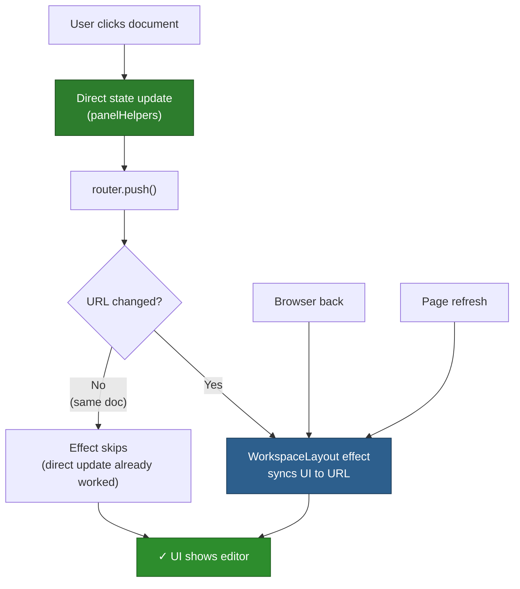
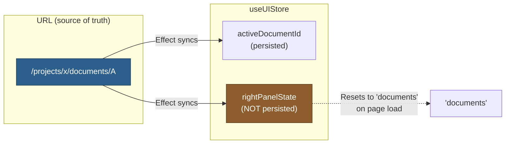
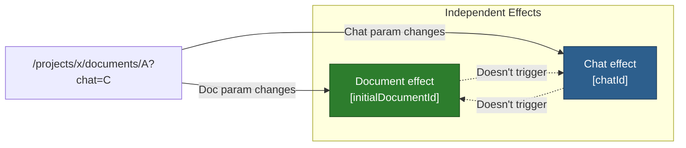

# Navigation Pattern

## Two-Pronged Approach



**Why two prongs:**
1. Direct updates → instant UI feedback, handles same-URL clicks
2. URL effect → syncs on back/forward/refresh

## Critical Pattern: getState()

**❌ Bad** - Effect re-runs on state changes (race condition):
```typescript
const { activeDocumentId } = useUIStore(/* subscribes */)

useEffect(() => {
  if (activeDocumentId !== initialDocumentId) {
    setActiveDocument(initialDocumentId)  // Triggers re-render → effect runs again!
  }
}, [initialDocumentId, activeDocumentId])  // State in deps
```

**✅ Good** - Effect runs only on URL changes:
```typescript
useEffect(() => {
  const store = useUIStore.getState()  // Read without subscribing

  if (store.activeDocumentId !== initialDocumentId) {
    store.setActiveDocument(initialDocumentId)
  }
}, [initialDocumentId])  // Only URL param
```

## State Management



**Why rightPanelState isn't persisted:** URL is source of truth; effect syncs it on mount.

## Future: Chat Independence



Navigating between documents won't reload chat data.

## Common Issues

| Issue | Cause | Fix |
|-------|-------|-----|
| Can't reopen current doc after toggle | `openDocument()` missing direct state update | Add state updates before `router.push()` |
| Browser back shows tree not editor | State in effect deps → race condition | Use `getState()`, remove state from deps |
| Chat reloads on doc navigation | Chat effect depends on doc URL | Separate effects with own dependencies |

## Implementation

**Core files:**
- `frontend/src/core/lib/panelHelpers.ts:24-62` - Direct state updates
- `frontend/src/app/projects/[id]/components/WorkspaceLayout.tsx:54-102` - URL sync effect
- `frontend/src/core/stores/useUIStore.ts` - State store
