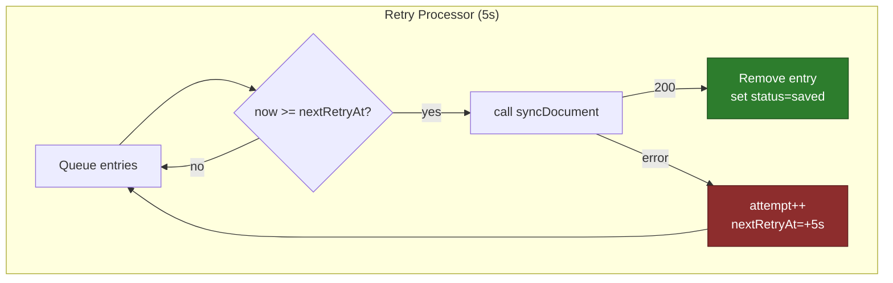

# Frontend Sync System (Minimal)

## Why
- Remove races, keep UX snappy, and make failure modes obvious.
- Render newest by `updatedAt`; local wins on tie. Server timestamps become canonical once applied.

## How
- Loads: policy-based reconciliation (cache emit + server reconcile). See `frontend/src/core/lib/cache.ts:120` and `:205`.
- Saves: optimistic IDB write, then direct server sync; network errors enqueue transient retries. See `frontend/src/core/services/documentSyncService.ts:10`.
- Retries: in-memory, jittered backoff, inspectable snapshot. See `frontend/src/core/lib/retry.ts:1` and `frontend/src/core/lib/sync.ts:198`.

## Races Prevented
- Document load: intent flag `_activeDocumentId` guards post-await sets. See `frontend/src/core/stores/useEditorStore.ts:35`.
- Save: post-sync guard ensures we only apply to the currently active doc. See `frontend/src/core/stores/useEditorStore.ts:132`.
- Editor init: content only applies after `isInitialized` to avoid stale overwrites. See `frontend/src/features/documents/components/EditorPanel.tsx:84`.

## Failure Handling
- Network/5xx → retry; 4xx/validation → toast error, no retry. See `frontend/src/core/lib/errors.ts:73`.
- On new edits, cancel older retries so newer content wins. See `frontend/src/core/lib/sync.ts:103`.

## Observability
- `getRetryQueueState()` returns `{ id, attempt, nextAt }[]` for dev tooling. See `frontend/src/core/lib/sync.ts:202`.
- Scoped loggers: `makeLogger('sync'|'cache'|'editor-cache')`. See `frontend/src/core/lib/logger.ts`.

## Test Matrix (unit)
- RetryScheduler: success path, backoff retries, cancel, permanent failure.
- Cache policies: cache-emit + newest; tie→local; abort/network fallback.
- DocumentSyncService: optimistic put, server application, retry scheduling on server error, bubble validation.

Implementation references in tests: `frontend/tests/*.test.ts`.

## Diagrams

### Document Open (Reconcile Newest)

```mermaid
sequenceDiagram
    autonumber
    participant UI as "UI (openDocument)"
    participant Store as "useEditorStore.loadDocument"
    participant IDB as "IndexedDB (Dexie)"
    participant API as "Backend API"
    participant EC as "CodeMirrorEditor"

    UI->>Store: loadDocument(D)
    Store->>Store: set({_activeDocumentId:D,isLoading:true})
    par "Editor instance"
        UI->>EC: get editor for D
        alt "cache hit"
            EC-->>UI: editor(D), isFromCache=true
        else "miss"
            EC-->>UI: new editor(D), isFromCache=false
        end
    and "Data"
        Store->>IDB: get(D)
        alt "cached with content"
            IDB-->>Store: cachedDoc
            Store->>Store: set({activeDocument:cachedDoc})
        else "no content"
            Store-->>Store: note "no cache"
        end
        Store->>API: GET /api/documents/D (AbortController owned by store)
        alt "200 OK"
            API-->>Store: serverDoc
            Store->>Store: pick newer by updatedAt (local wins on tie)
            alt "server newer"
                Store->>IDB: put(serverDoc)
                Store-->>UI: activeDocument=serverDoc
            else "cache newer"
                Store-->>UI: activeDocument=cachedDoc
            end
        else "AbortError/Network"
            alt "cachedDoc exists"
                Store-->>UI: keep cachedDoc; isLoading=false
            else "no cache"
                Store-->>UI: set error -> ErrorPanel
            end
        end
    end
```

### Retry Processor (Background)


