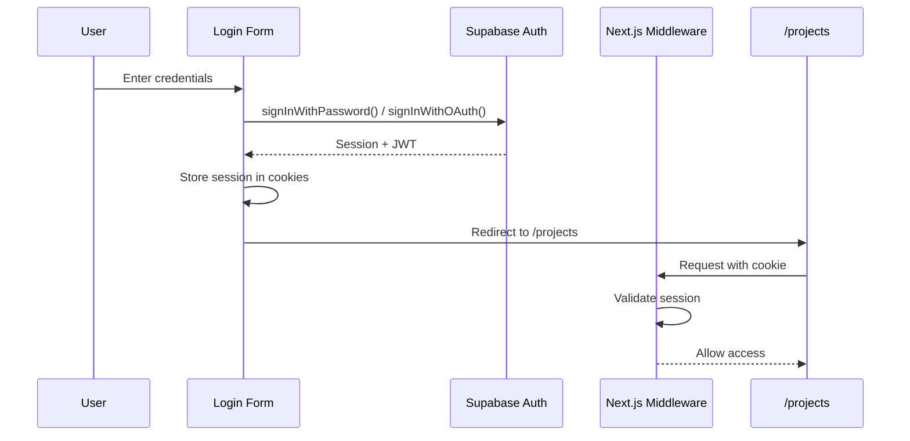
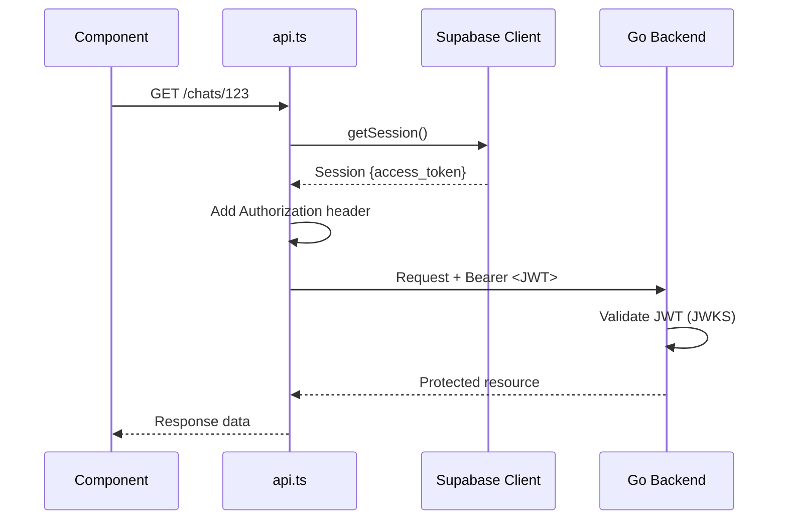
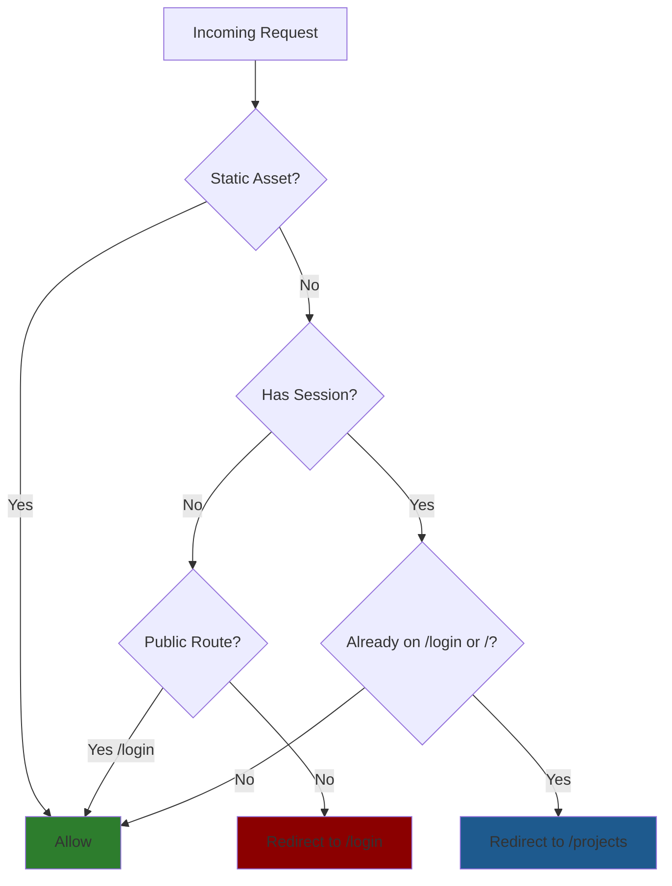

# Frontend Authentication Implementation

Supabase Auth integration for Next.js frontend with cookie-based sessions and automatic JWT injection.

## Architecture

### Login Flow



### API Request Flow



### Middleware Protection Flow



## Components

### 1. Supabase Clients

**Browser Client** (`src/core/supabase/client.ts`):
- Use in Client Components
- Reads `NEXT_PUBLIC_SUPABASE_*` env vars
- Fallback warnings if env vars missing

**Server Client** (`src/core/supabase/server.ts`):
- Use in Server Components and Route Handlers
- Cookie-based session management via `@supabase/ssr`
- Handles session refresh automatically

### 2. Middleware (Route Protection)

**File**: `src/proxy.ts`

Enforces authentication on all routes except:
- Static assets (`_next/static`, `_next/image`, `favicon.ico`)
- Public files (`/*.svg`, `/*.png`)

**Logic**:
- No session → Redirect to `/login` (except if already on `/login`)
- Has session on `/` or `/login` → Redirect to `/projects`
- Has session on protected routes → Allow access

### 3. API Integration

**File**: `src/core/lib/api.ts:21-27`

Automatic JWT injection:
```typescript
// Simplified reference - see actual implementation
const session = await supabase.auth.getSession()
headers.Authorization = `Bearer ${session.data.session.access_token}`
```

Every API call automatically includes JWT for backend authentication.

### 4. Login UI

**Form Component**: `src/features/auth/components/LoginForm.tsx`

Features:
- Email/password authentication
- GitHub OAuth button
- Loading states
- Error handling via toast notifications
- Redirects to `/projects` on success

**Page**: `src/app/login/page.tsx`

### 5. OAuth Callback Handler

**File**: `src/app/auth/callback/route.ts`

Handles OAuth provider redirects (e.g., GitHub):
1. Receives `code` query parameter
2. Exchanges code for session via `exchangeCodeForSession()`
3. Sets session cookie
4. Redirects to `/projects`

## Configuration

### Environment Variables

Required in `frontend/.env.local`:
```bash
NEXT_PUBLIC_SUPABASE_URL=https://your-project.supabase.co
NEXT_PUBLIC_SUPABASE_PUBLISHABLE_KEY=your-publishable-anon-key
```

See `frontend/.env.example` for template.

### Supabase Dashboard Setup

1. **Project URL**: Copy from Supabase project settings
2. **Anon Key**: Copy from Supabase API settings
3. **OAuth Providers**: Configure in Authentication > Providers
   - Enable GitHub provider
   - Set redirect URL: `https://your-app.com/auth/callback`

## Usage Patterns

### Access User Session in Client Components

```typescript
import { createBrowserSupabaseClient } from '@/core/supabase/client'

const supabase = createBrowserSupabaseClient()
const { data: { session } } = await supabase.auth.getSession()

if (session) {
  console.log('User ID:', session.user.id)
  console.log('Email:', session.user.email)
}
```

### Access User Session in Server Components

```typescript
import { createServerSupabaseClient } from '@/core/supabase/server'

const supabase = await createServerSupabaseClient()
const { data: { session } } = await supabase.auth.getSession()
```

### Protected Routes

All routes are automatically protected by middleware (`src/proxy.ts`). No additional code needed in components.

### Making Authenticated API Calls

API calls automatically include JWT - no action required:

```typescript
import { api } from '@/core/lib/api'

// JWT is automatically injected by api.ts
const chats = await api.chats.list(projectId)
```

## Security Considerations

- **Cookies**: HTTPOnly, Secure flags handled by `@supabase/ssr`
- **Token Storage**: JWTs in cookies (not localStorage)
- **HTTPS**: Required in production
- **XSS Prevention**: Framework-level protections (Next.js escaping)
- **CSRF**: Covered by SameSite cookie policy

## Testing

**Manual Testing Checklist**:
- [ ] Login with email/password
- [ ] Login with GitHub OAuth
- [ ] Protected route redirects to `/login` when not authenticated
- [ ] `/login` redirects to `/projects` when authenticated
- [ ] API calls receive 200 (not 401) when authenticated
- [ ] Logout clears session and redirects to `/login`

**OAuth Testing Locally**:
- Configure GitHub OAuth app with callback: `http://localhost:3000/auth/callback`
- Update Supabase dashboard with local callback URL

## References

- **Backend JWT Validation**: `_docs/technical/backend/auth/supabase-jwt-implementation.md`
- **Cross-Stack Overview**: `_docs/technical/auth-overview.md`
- **Supabase Auth Docs**: https://supabase.com/docs/guides/auth
- **@supabase/ssr**: https://supabase.com/docs/guides/auth/server-side/creating-a-client
- **Next.js Middleware**: https://nextjs.org/docs/app/building-your-application/routing/middleware
