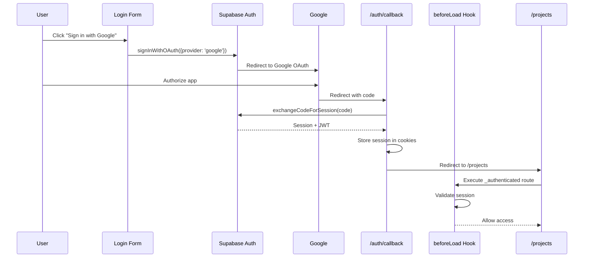
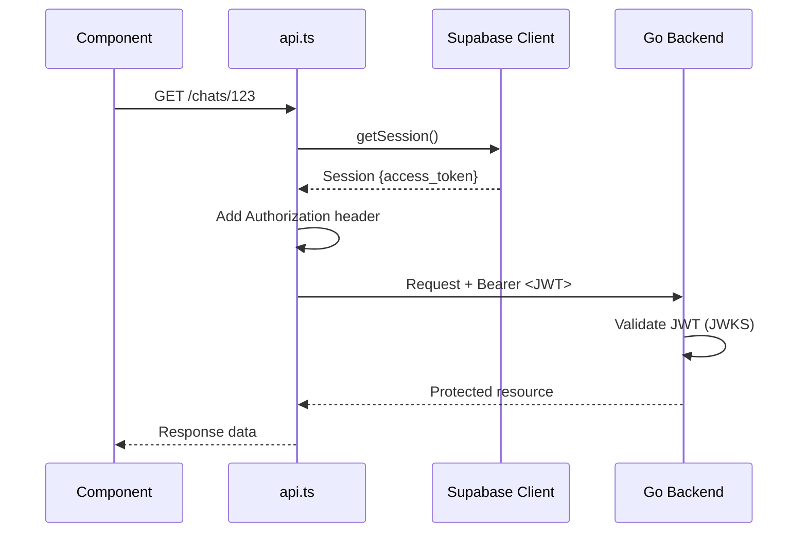
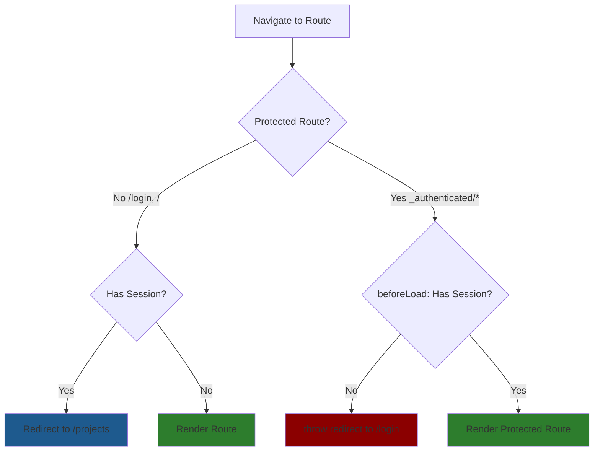

# Frontend Authentication Implementation

Supabase Auth integration for Vite + TanStack Router frontend with cookie-based sessions and automatic JWT injection.

## Architecture

### Google OAuth Login Flow



### API Request Flow



### Route Protection Flow (TanStack Router)



## Components

### 1. Supabase Client

**File**: `src/core/supabase/client.ts`

**Note**: Vite is client-only, so only browser client exists

- Reads `VITE_SUPABASE_*` env vars
- Cookie-based session management via `@supabase/ssr`
- Handles session refresh automatically
- Fallback warnings if env vars missing

### 2. Route Protection (`beforeLoad` Hooks)

**File**: `src/routes/_authenticated.tsx`

Layout route that wraps all protected routes with authentication check:

```typescript
export const Route = createFileRoute('/_authenticated')({
  beforeLoad: async ({ location }) => {
    const supabase = createClient()
    const { data: { session } } = await supabase.auth.getSession()

    if (!session) {
      throw redirect({
        to: '/login',
        search: { redirect: location.href },
      })
    }
  },
  component: () => <Outlet />,
})
```

**Logic**:
- No session → Redirect to `/login` with return URL
- Has session → Allow access to nested routes
- Public routes (`/login`, `/`) check session and redirect authenticated users to `/projects`

### 3. API Integration

**File**: `src/core/lib/api.ts:21-27`

Automatic JWT injection:
```typescript
// Simplified reference - see actual implementation
const session = await supabase.auth.getSession()
headers.Authorization = `Bearer ${session.data.session.access_token}`
```

Every API call automatically includes JWT for backend authentication.

### 4. Login UI

**Form Component**: `src/features/auth/components/LoginForm.tsx`

Features:
- Google OAuth button (Google only)
- Loading states
- Error handling via toast notifications
- Redirects to `/projects` on success

**Page**: `src/routes/login.tsx`

### 5. OAuth Callback Handler

**File**: `src/routes/auth/callback.tsx`

Handles Google OAuth redirects:
1. Receives `code` query parameter
2. Exchanges code for session via `exchangeCodeForSession()`
3. Sets session cookie
4. Redirects to `/projects`

## Configuration

### Environment Variables

Required in `frontend/.env.local`:
```bash
VITE_SUPABASE_URL=https://your-project.supabase.co
VITE_SUPABASE_ANON_KEY=your-publishable-anon-key
```

See `frontend/.env.example` for template.

### Supabase Dashboard Setup

1. **Project URL**: Copy from Supabase project settings
2. **Anon Key**: Copy from Supabase API settings
3. **OAuth Providers**: Configure in Authentication > Providers
   - Enable Google provider
   - Set redirect URL: `https://your-app.com/auth/callback`

## Usage Patterns

### Access User Session

```typescript
import { createClient } from '@/core/supabase/client'

const supabase = createClient()
const { data: { session } } = await supabase.auth.getSession()

if (session) {
  console.log('User ID:', session.user.id)
  console.log('Email:', session.user.email)
}
```

### Protected Routes

All routes under `_authenticated/` are automatically protected by the `beforeLoad` hook in `src/routes/_authenticated.tsx`. No additional code needed in components.

### Making Authenticated API Calls

API calls automatically include JWT - no action required:

```typescript
import { api } from '@/core/lib/api'

// JWT is automatically injected by api.ts
const chats = await api.chats.list(projectId)
```

## Security Considerations

- **Cookies**: HTTPOnly, Secure flags handled by `@supabase/ssr`
- **Token Storage**: JWTs in cookies (not localStorage)
- **HTTPS**: Required in production
- **XSS Prevention**: React automatic escaping
- **CSRF**: Covered by SameSite cookie policy

## Testing

**Manual Testing Checklist**:
- [ ] Login with Google OAuth
- [ ] Protected route redirects to `/login` when not authenticated
- [ ] `/login` redirects to `/projects` when authenticated
- [ ] API calls receive 200 (not 401) when authenticated
- [ ] Logout clears session and redirects to `/login`

**OAuth Testing Locally**:
- Configure Google OAuth app with callback: `http://localhost:3000/auth/callback`
- Update Supabase dashboard with local callback URL

## References

- **Backend JWT Validation**: `_docs/technical/backend/auth/supabase-jwt-implementation.md`
- **Cross-Stack Overview**: `_docs/technical/auth-overview.md`
- **Supabase Auth Docs**: https://supabase.com/docs/guides/auth
- **@supabase/ssr**: https://supabase.com/docs/guides/auth/server-side/creating-a-client
- **TanStack Router Docs**: https://tanstack.com/router
