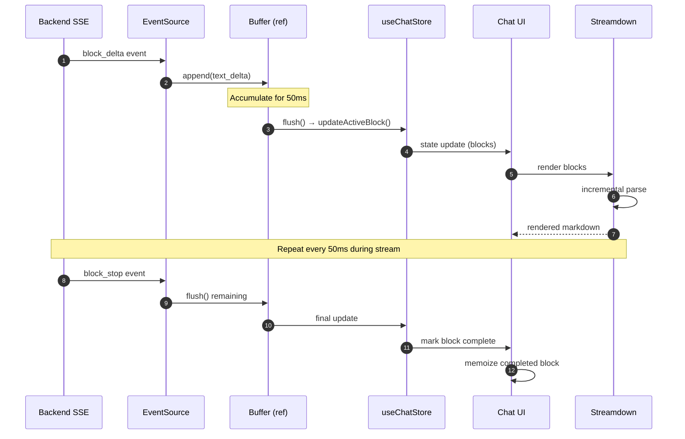

# Chat Rendering Implementation Guide

**Purpose:** Architecture patterns, implementation guidelines, and best practices for integrating Streamdown with Meridian's chat system.

**See also:**
- `chat-rendering.md` - Decision rationale and quick reference
- `architecture/chat-rendering-research.md` - Full research and alternatives
- `_docs/technical/llm/streaming/README.md` - Backend SSE architecture

## Architecture Overview

```mermaid
flowchart TB
    SSE[Backend SSE Stream] -->|TurnBlockDelta| Handler[SSE Event Handler]
    Handler -->|update| Store[useChatStore]
    Store -->|blocks[]| UI[Chat UI]
    UI -->|map blocks| Router{Block Type Router}

    Router -->|text| SD1[Streamdown]
    Router -->|thinking| TB[ThinkingBlock + Streamdown]
    Router -->|tool_use| TU[ToolUseBlock]
    Router -->|tool_result| TR[ToolResultBlock]

    SD1 --> Buffer[Buffer Ref<br/>50ms intervals]
    TB --> Buffer
    Buffer --> Render[UI Update]

    style SSE fill:#2d5f8d,stroke:#1a3f5a,color:#fff
    style SD1 fill:#2d7d2d,stroke:#1e4d1e,color:#fff
    style TB fill:#2d7d2d,stroke:#1e4d1e,color:#fff
    style Buffer fill:#8d6d2d,stroke:#5a441a,color:#fff
    style Render fill:#7d2d5f,stroke:#4d1a3f,color:#fff
```

## Installation

```bash
npm install streamdown
```

## Core Implementation Pattern

### Block Type Router

```typescript
// frontend/src/features/chats/components/AssistantTurn.tsx
import { Streamdown } from 'streamdown';
import { ThinkingBlock } from './ThinkingBlock';
import { ToolUseBlock } from './ToolUseBlock';
import { ToolResultBlock } from './ToolResultBlock';

interface AssistantTurnProps {
  turn: Turn;
}

export function AssistantTurn({ turn }: AssistantTurnProps) {
  return (
    <div className="flex flex-col gap-2">
      {turn.blocks?.map(block => {
        switch (block.block_type) {
          case 'text':
            return (
              <Card key={block.id} className="chat-message chat-message--ai">
                <Streamdown>{block.text_content || ''}</Streamdown>
              </Card>
            );

          case 'thinking':
            return (
              <ThinkingBlock key={block.id}>
                <Streamdown>{block.text_content || ''}</Streamdown>
              </ThinkingBlock>
            );

          case 'tool_use':
            return <ToolUseBlock key={block.id} data={block.content} />;

          case 'tool_result':
            return (
              <ToolResultBlock key={block.id} metadata={block.content}>
                {block.text_content && (
                  <Streamdown>{block.text_content}</Streamdown>
                )}
              </ToolResultBlock>
            );

          case 'web_search_use':
            return <WebSearchBlock key={block.id} data={block.content} />;

          case 'web_search_result':
            return <SearchResultBlock key={block.id} data={block.content} />;

          default:
            return null;
        }
      })}
    </div>
  );
}
```

### Streaming Buffer Strategy

**Problem:** SSE sends many small deltas rapidly (character-by-character or chunk-by-chunk).

**Solution:** Buffer updates in a ref, flush to state at 50ms intervals.

```typescript
// frontend/src/features/chats/hooks/useStreamingBuffer.ts
import { useRef, useEffect } from 'react';

interface BufferConfig {
  flushInterval?: number; // default: 50ms
  onFlush: (content: string) => void;
}

export function useStreamingBuffer({
  flushInterval = 50,
  onFlush
}: BufferConfig) {
  const bufferRef = useRef<string>('');
  const timerRef = useRef<NodeJS.Timeout | null>(null);

  const append = (delta: string) => {
    bufferRef.current += delta;

    // Schedule flush if not already scheduled
    if (!timerRef.current) {
      timerRef.current = setTimeout(() => {
        onFlush(bufferRef.current);
        bufferRef.current = '';
        timerRef.current = null;
      }, flushInterval);
    }
  };

  const flush = () => {
    if (timerRef.current) {
      clearTimeout(timerRef.current);
      timerRef.current = null;
    }
    if (bufferRef.current) {
      onFlush(bufferRef.current);
      bufferRef.current = '';
    }
  };

  // Cleanup on unmount
  useEffect(() => {
    return () => {
      if (timerRef.current) {
        clearTimeout(timerRef.current);
      }
    };
  }, []);

  return { append, flush };
}
```

**Usage in SSE handler:**

```typescript
// frontend/src/features/chats/hooks/useChatSSE.ts
export function useChatSSE(chatId: string) {
  const { append, flush } = useStreamingBuffer({
    flushInterval: 50,
    onFlush: (content) => {
      useChatStore.getState().updateActiveBlock(content);
    }
  });

  useEffect(() => {
    const eventSource = new EventSource(`/api/chats/${chatId}/stream`);

    eventSource.addEventListener('block_delta', (event) => {
      const delta: TurnBlockDelta = JSON.parse(event.data);

      if (delta.text_delta) {
        append(delta.text_delta); // Buffer the delta
      }
    });

    eventSource.addEventListener('block_stop', () => {
      flush(); // Flush remaining buffer
    });

    return () => {
      flush(); // Flush on cleanup
      eventSource.close();
    };
  }, [chatId]);
}
```

## Custom Components

### Syntax Highlighting

```typescript
// frontend/src/features/chats/components/CodeBlock.tsx
import { Streamdown } from 'streamdown';
import { Prism as SyntaxHighlighter } from 'react-syntax-highlighter';
import { vscDarkPlus } from 'react-syntax-highlighter/dist/esm/styles/prism';

export function ChatMessage({ content }: { content: string }) {
  return (
    <Streamdown
      components={{
        code({ node, inline, className, children, ...props }) {
          const match = /language-(\w+)/.exec(className || '');
          const language = match ? match[1] : 'text';

          return !inline ? (
            <SyntaxHighlighter
              style={vscDarkPlus}
              language={language}
              PreTag="div"
              {...props}
            >
              {String(children).replace(/\n$/, '')}
            </SyntaxHighlighter>
          ) : (
            <code className={className} {...props}>
              {children}
            </code>
          );
        }
      }}
    >
      {content}
    </Streamdown>
  );
}
```

### Thinking Block

```typescript
// frontend/src/features/chats/components/ThinkingBlock.tsx
import { useState } from 'react';
import { ChevronDown, ChevronRight, Brain } from 'lucide-react';

interface ThinkingBlockProps {
  children: React.ReactNode;
}

export function ThinkingBlock({ children }: ThinkingBlockProps) {
  const [isExpanded, setIsExpanded] = useState(false);

  return (
    <div className="thinking-block border border-purple-200 dark:border-purple-800 rounded-lg">
      <button
        onClick={() => setIsExpanded(!isExpanded)}
        className="flex items-center gap-2 w-full p-3 text-left hover:bg-purple-50 dark:hover:bg-purple-950"
      >
        {isExpanded ? <ChevronDown size={16} /> : <ChevronRight size={16} />}
        <Brain size={16} className="text-purple-600" />
        <span className="text-sm font-medium text-purple-700 dark:text-purple-300">
          Thinking...
        </span>
      </button>

      {isExpanded && (
        <div className="p-4 pt-0 text-sm text-gray-700 dark:text-gray-300">
          {children}
        </div>
      )}
    </div>
  );
}
```

## Memoization Strategy

**Critical:** Memoize completed messages to prevent re-parsing.

```typescript
// frontend/src/features/chats/components/MessageList.tsx
import { memo } from 'react';

// Memoize individual messages
const MemoizedMessage = memo(({ block }: { block: TurnBlock }) => {
  return (
    <div className="chat-message">
      <Streamdown>{block.text_content}</Streamdown>
    </div>
  );
}, (prev, next) => {
  // Only re-render if content changed
  return prev.block.text_content === next.block.text_content;
});

export function MessageList({ turn }: { turn: Turn }) {
  return (
    <div>
      {turn.blocks?.map(block => (
        <MemoizedMessage key={block.id} block={block} />
      ))}
    </div>
  );
}
```

## Performance Optimization

### Virtualization (for 100+ messages)

```typescript
// frontend/src/features/chats/components/ChatHistory.tsx
import { useVirtualizer } from '@tanstack/react-virtual';
import { useRef } from 'react';

export function ChatHistory({ turns }: { turns: Turn[] }) {
  const parentRef = useRef<HTMLDivElement>(null);

  const virtualizer = useVirtualizer({
    count: turns.length,
    getScrollElement: () => parentRef.current,
    estimateSize: () => 100, // Estimated message height
    overscan: 5, // Render 5 extra items above/below viewport
  });

  return (
    <div ref={parentRef} className="h-full overflow-auto">
      <div
        style={{
          height: `${virtualizer.getTotalSize()}px`,
          width: '100%',
          position: 'relative',
        }}
      >
        {virtualizer.getVirtualItems().map((virtualRow) => {
          const turn = turns[virtualRow.index];
          return (
            <div
              key={virtualRow.key}
              style={{
                position: 'absolute',
                top: 0,
                left: 0,
                width: '100%',
                transform: `translateY(${virtualRow.start}px)`,
              }}
            >
              <AssistantTurn turn={turn} />
            </div>
          );
        })}
      </div>
    </div>
  );
}
```

### Lazy Syntax Highlighting

```typescript
// Only load syntax highlighter for code blocks
import { lazy } from 'react';

const SyntaxHighlighter = lazy(
  () => import('react-syntax-highlighter').then(mod => ({ default: mod.Prism }))
);
```

## Data Flow



## Best Practices

### 1. Update Frequency
- **Optimal:** 30-100ms intervals
- **Implementation:** 50ms default (balanced)
- **Avoid:** Character-by-character updates (<30ms)

### 2. Empty Content Handling
- Empty string `""` is valid content
- Never use falsy checks: ✅ `content !== undefined` | ❌ `content`
- Server stores empty as `""`

### 3. Incomplete Markdown
- Streamdown handles unterminated syntax gracefully
- No need to preprocess or validate markdown during streaming
- Final `block_stop` event ensures completion

### 4. Memory Management
- Memoize completed messages by `block.id`
- Use virtualization for conversations >100 messages
- Clean up EventSource listeners on unmount

### 5. Error Handling
- Handle SSE reconnection (flush buffer, resync state)
- Graceful degradation if Streamdown fails
- Fallback to plain text rendering

## Testing Considerations

**Test scenarios:**
1. Rapid streaming (character-by-character)
2. Incomplete markdown during stream
3. 100+ message conversation
4. SSE disconnection/reconnection
5. Empty blocks
6. Mixed block types

**Performance metrics:**
- Re-render frequency (should be ~20/sec during streaming)
- Memory usage with 100+ messages
- Time to first meaningful paint

## Migration from Current Implementation

Current: `frontend/src/features/chats/components/ActiveChatView.tsx`

**Steps:**
1. Install Streamdown: `npm install streamdown`
2. Create `AssistantTurn.tsx` with block type router
3. Implement `useStreamingBuffer` hook
4. Update SSE handler to use buffering
5. Replace current rendering logic
6. Add memoization for completed messages
7. Test streaming performance

## References

**Code locations:**
- Turn types: `backend/internal/domain/models/llm/turn_block.go`
- SSE events: `backend/internal/handler/sse/chat_sse.go`
- Current chat UI: `frontend/src/features/chats/components/ActiveChatView.tsx`
- Chat store: `frontend/src/core/stores/useChatStore.ts`

**External:**
- Streamdown: https://github.com/vercel/streamdown
- Vercel AI SDK: https://ai-sdk.dev/
- React Virtual: https://tanstack.com/virtual/latest
