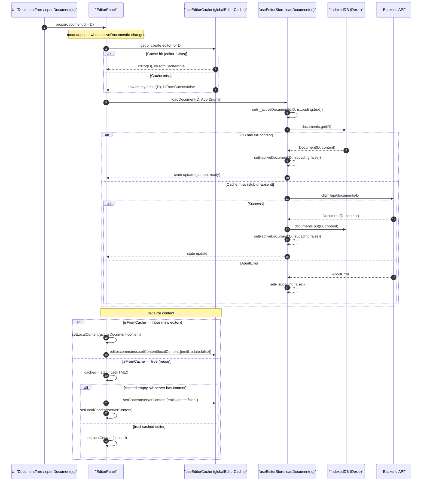
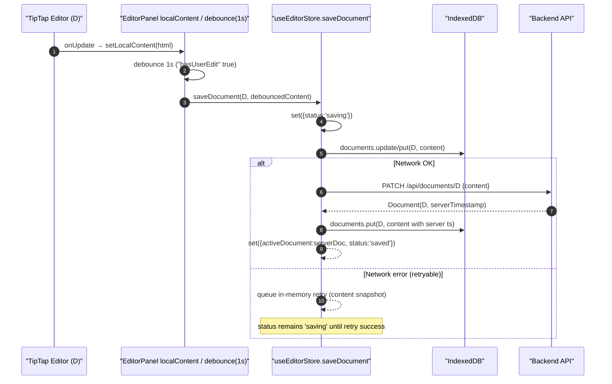
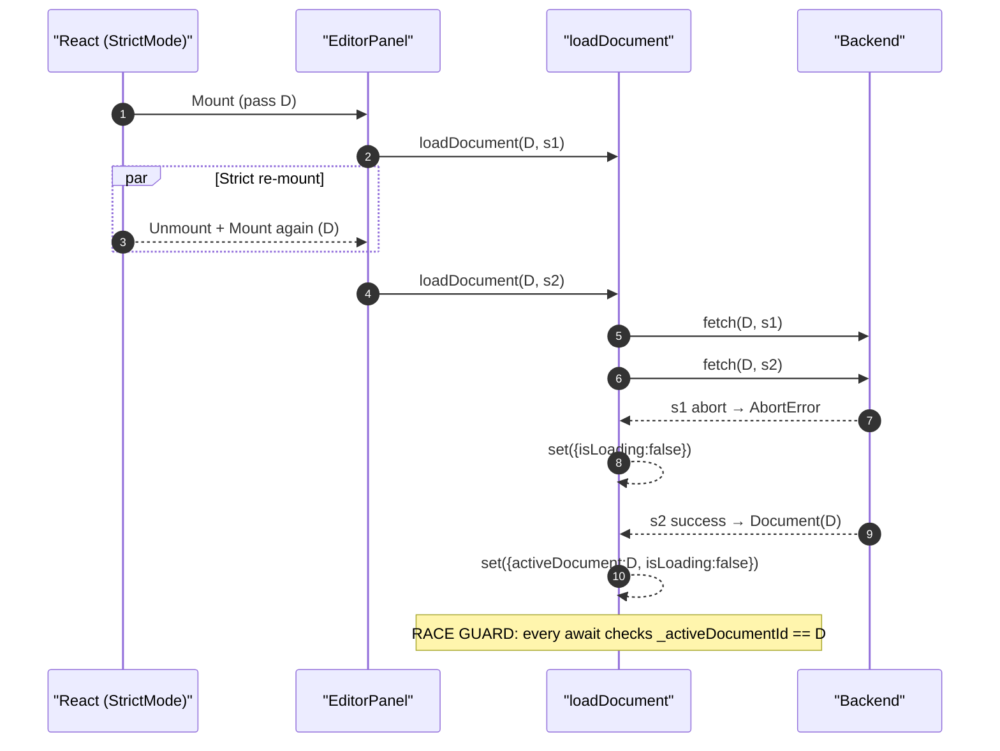
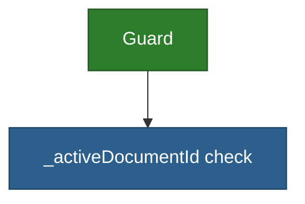
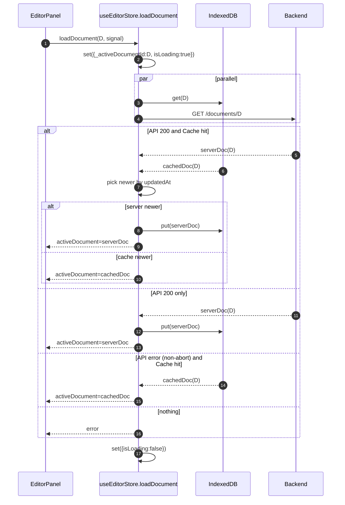

# Editor Caching and Document Loading

Purpose: map the exact data flow for opening, editing, and saving a document with the TipTap editor cache and IndexedDB cache, and call out edge cases that can cause “stuck loading” or “shows previous doc” symptoms.

See also: `_docs/technical/frontend/flows.md` for broader local‑first flows.

## Components Involved

- `EditorPanel` (view) — `frontend/src/features/documents/components/EditorPanel.tsx:31`
- `useEditorCache` (TipTap instance LRU) — `frontend/src/core/hooks/useEditorCache.ts:55`
- `useEditorStore.loadDocument` (cache‑first content) — `frontend/src/core/stores/useEditorStore.ts:25`
- `MeridianDB.documents` (IndexedDB via Dexie) — `frontend/src/core/lib/db.ts:1`
- API client — `frontend/src/core/lib/api.ts:180`

## Flow A — Open Document (cache‑first)



Color note: diagrams use defaults; UI nodes are conceptual. Dark‑mode safe colors applied in later focused diagrams.

## Flow B — Typing → Autosave → Sync



## Flow C — React Strict Mode + Abort Guards



Styling (dark‑mode safe):



## Edge Cases and Invariants

1) Strict Mode duplicate mounts
- Symptom: doubled "[Load] Starting load" + one "Aborted load".
- Status: Expected in dev; harmless. Guarded via AbortSignal and `_activeDocumentId`.
- Code: `useAbortController.ts:32`, `useEditorStore.ts:61, 86, 98, 115`.

2) Empty string content "" must save
- Symptom: clearing a document never saves.
- Root cause: falsy check on content.
- Fix: compare strings, don’t check truthiness.
- Code: `EditorPanel.tsx:118` (fixed).

3) Editor instance reuse shows wrong document
- Symptom: switching to B renders A’s content or stays on A.
- Potential causes:
  - The editor cache returns a stale instance for the wrong key (Map key mismatch).
  - EditorPanel holds onto the first editor because caller never re‑renders when `documentId` changes.
  - Content init order: editor fetched from cache before `activeDocument` updates; init logic must be idempotent.
- Current guards:
  - Cache key is `documentId`; effect in `useEditorCache` runs only on `documentId` change and sets state: `editor`, `isFromCache`. See `useEditorCache.ts:119-141`.
  - EditorPanel initializes a new editor with server content, or trusts cached content, with an extra check for "empty cached editor". See `EditorPanel.tsx:85-116`.
- Additional hardening (recommended):
  - Tag editor instances with their `documentId` and assert on reuse. If mismatch, destroy and recreate.
    - Implementation sketch: `editor.storage.__docId = documentId`; on cache hit, verify `cached.editor.storage.__docId === documentId`.
  - Make `editable` depend on the exact doc: `editable: !readOnly && activeDocument?.id === documentId && !isLoading`.

4) Skeleton stuck ("always loading")
- Symptom: Editor skeleton never exits after switching.
- Likely paths:
  - `loadDocument` aborted after setting `isLoading:true` but before setting `activeDocument`, and the follow‑up fetch never completes.
  - `activeDocument` doesn’t update because of stale `_activeDocumentId` (race) or because IDB returns undefined and API request is aborted on quick re‑switch.
- Guards to verify:
  - Abort catch sets `isLoading:false`. See `useEditorStore.ts:110-120`.
  - Every early return on race guard should also reset loading if nothing else will. Current returns exit before setting to false only on early read; pattern is mitigated by subsequent state updates, but worth double‑checking in logs.
  - EditorPanel shows content only when `activeDocument` is set; ensure `loadDocument` is called for the new `documentId` and not debounced away.

5) LRU eviction while active
- Risk: evicting the currently visible editor.
- Mitigation: `useEditorCache` uses `lastAccessed` and is only called on doc switch, so the active doc is the most recently accessed. Consider explicitly skipping eviction of the key just loaded.

6) Normalized emptiness
- TipTap may render empty as `"<p></p>"`; server stores `""`.
- Current handling: treat both as empty; only override cached editor if cached is empty and server has content. See `EditorPanel.tsx:96-106`.

## Proposed Invariants (to prevent regressions)

- I1: When `EditorPanel` receives `documentId=D`, the `useEditorCache` returns an editor whose logical owner is D. If not, recreate.
- I2: `loadDocument(D)` either sets `{activeDocument:D, isLoading:false}` or `{isLoading:false}` with an explicit AbortError path. No code path leaves `isLoading:true` for D once effects settle.
- I3: Empty string is a valid content value everywhere (no falsy checks).
- I4: The editor is only editable when `activeDocument?.id === documentId` and the store is not loading.

## Quick Checks to Diagnose “stuck on first doc”

1) Open A → type → switch to B → back to A. Capture console:
- Expect: one cache miss per new doc, subsequent hits; at most one AbortError per switch.

2) Add a runtime assertion in `useEditorCache` on cache hit:
```ts
// Pseudocode: inside cache-hit branch
const cached = globalEditorCache.get(documentId)
if (cached && (cached as any).editor.storage?.__docId && (cached as any).editor.storage.__docId !== documentId) {
  console.warn('[EditorCache] DocId mismatch, recreating editor', documentId)
  cached.editor.destroy()
  globalEditorCache.delete(documentId)
  // fall through to create
}
```

3) Temporarily gate `editable`:
```ts
editable: !editorReadOnly && activeDocument?.id === documentId && !isLoading
```

If the issue disappears, it was a timing mismatch during content init.

## Why this design

- Two caches serve different latency goals:
  - Editor cache preserves TipTap state (selection, history) for fast toggling.
  - IndexedDB cache avoids network during document open and enables offline work.
- Race guards keep correctness obvious: intent flag `_activeDocumentId` and AbortSignals ensure stale work is canceled.

## Revised: Reconcile by `updatedAt` (Server + Cache)

When opening a document, always try the server and compare with cache, then pick the newest:



Notes:
- Edit mode remains disabled until initialization completes in `EditorPanel`.
- This avoids overwriting the server with empty content when the editor mounts.
- No automatic "local newer → push"; syncing still happens via autosave or explicit save.

## References (code)

- `frontend/src/core/hooks/useEditorCache.ts:55, 88-114, 119-141, 149-171`
- `frontend/src/features/documents/components/EditorPanel.tsx:31, 80-116, 118-147`
- `frontend/src/core/stores/useEditorStore.ts:25, 48-104, 140-206`
- `frontend/src/core/lib/sync.ts:56-111, 205-268`
- `frontend/src/core/lib/db.ts:1-38`
- `frontend/src/core/lib/api.ts:180-219`
