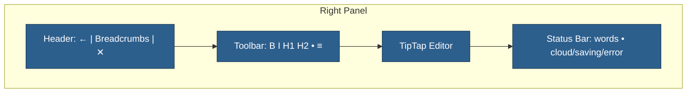

# Editor UI Overview

This summarizes the completed editor layout and points to the implementation.

## Layout Structure

## References

### Components
- Header: `frontend/src/features/documents/components/EditorHeader.tsx`
- Title (inline rename): `frontend/src/features/documents/components/EditorTitle.tsx`
- Toolbar: `frontend/src/features/documents/components/EditorToolbar.tsx`
- Status: `frontend/src/features/documents/components/EditorStatusBar.tsx`
- Panel container: `frontend/src/features/documents/components/EditorPanel.tsx`

### Navigation
- Panel helpers: `frontend/src/core/lib/panelHelpers.ts`
- URL sync: `frontend/src/app/projects/[id]/components/WorkspaceLayout.tsx`
- UI state: `frontend/src/core/stores/useUIStore.ts`
- **Pattern doc**: `architecture/navigation-pattern.md`

## Behavioral Notes
- Header shows breadcrumbs (built from tree) and panel controls
- Editor stays read‑only until the document is fully initialized
- Status reflects save lifecycle (saving/saved/error)
- Navigation uses two-pronged approach (direct state + URL sync)

