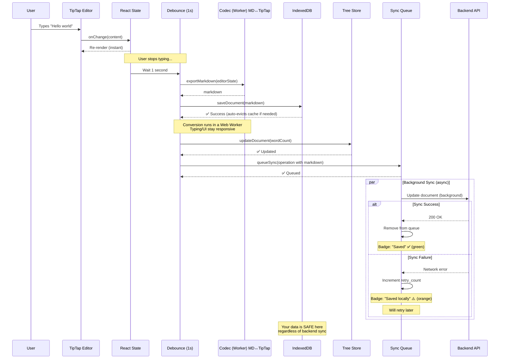
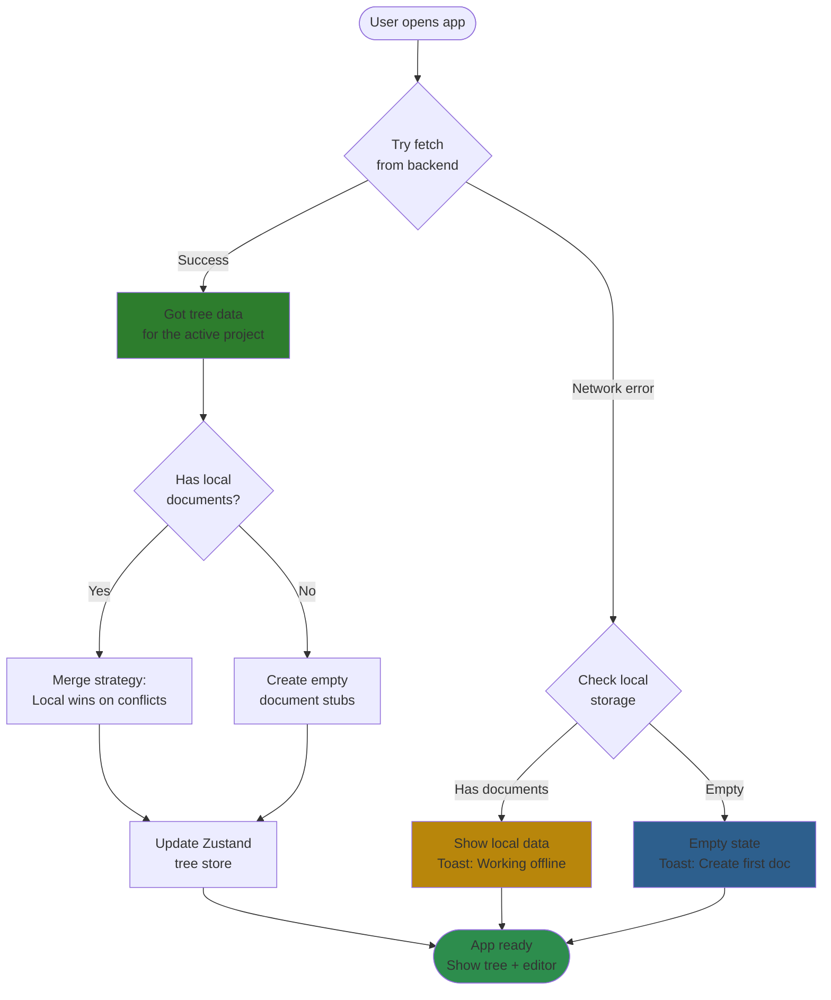
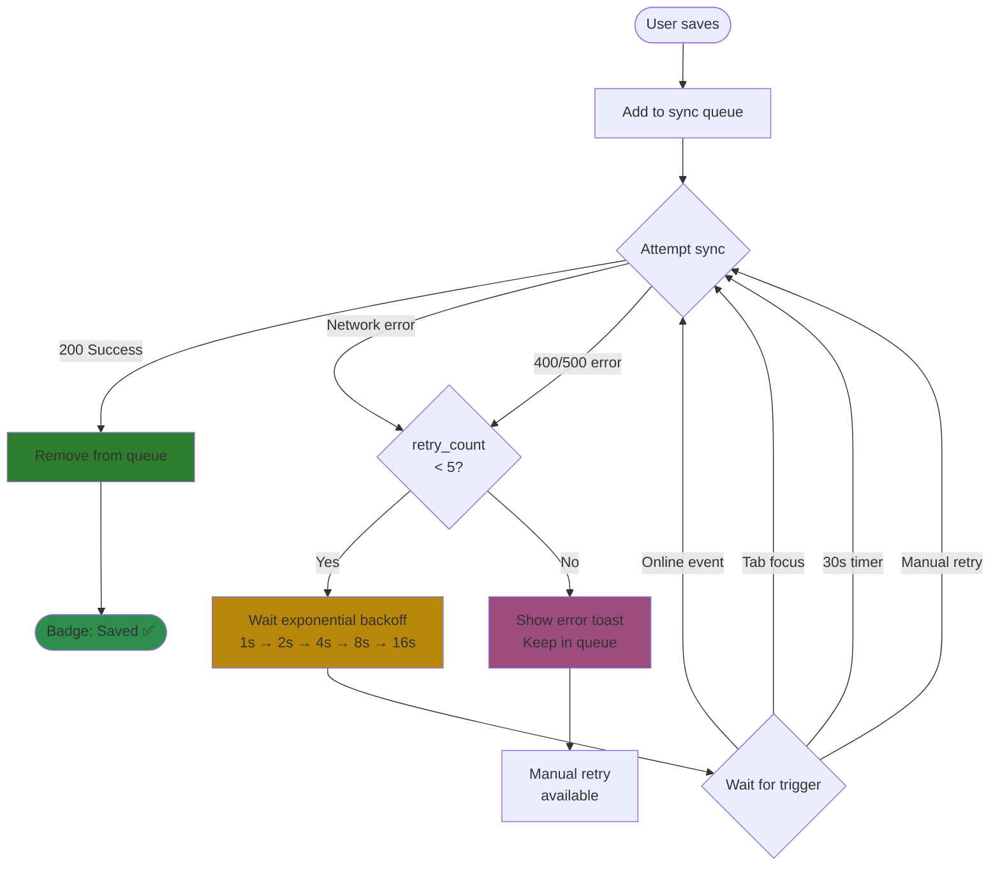
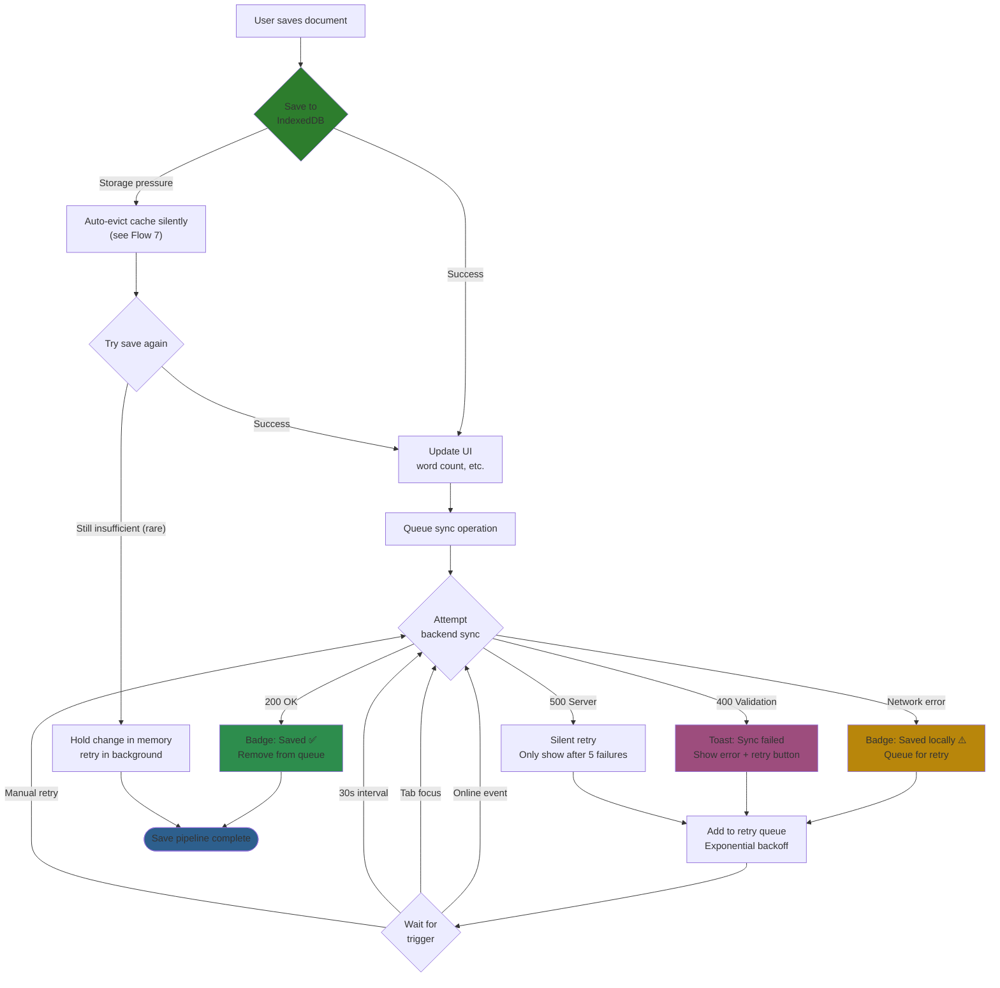
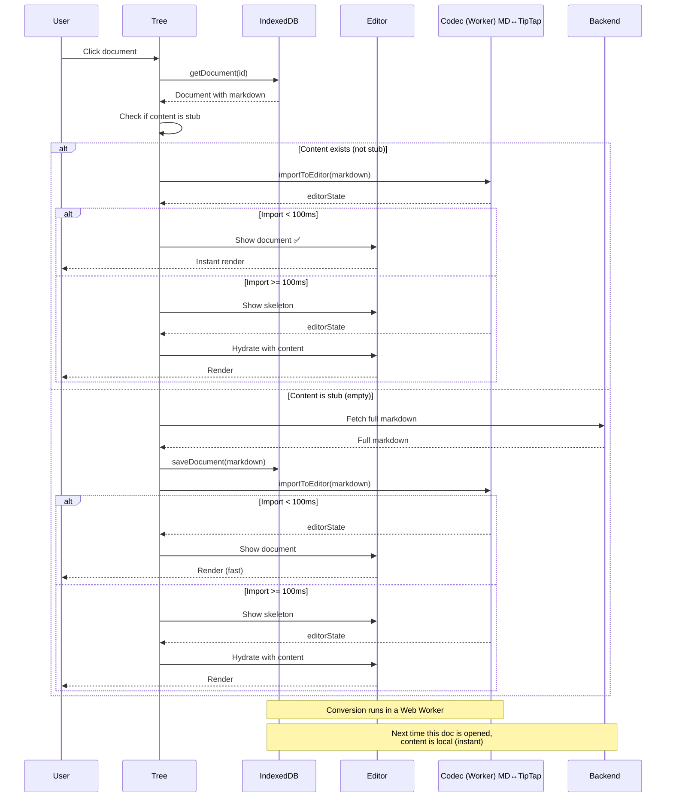
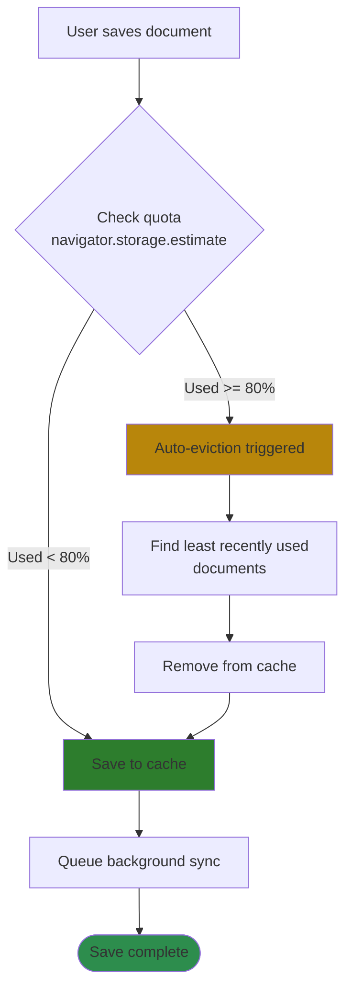

# Local-First Architecture Flows

## Purpose

This document defines the core data flows for Meridian's local-first architecture through visual diagrams. **This is the primary design document** - implementation guides reference these flows.

Use this document to:
- Understand end-to-end data flow
- Validate design decisions
- Identify edge cases and gaps
- Guide implementation priorities

## Flow Diagrams

1. **Auto-Save Flow** - What happens when user types
2. **Session Bootstrap Flow** - App startup sequence
3. **Data Layer Architecture** - Where data lives
4. **Sync Queue Processing** - Retry logic
5. **Error Handling Paths** - All failure scenarios
6. **Document Open Flow** - Lazy loading content
7. **Quota Management & Auto‑Eviction (Cache)** - Handling storage limits

---

## Flow 1: Auto-Save Flow

**What happens when user types in the editor**



**Key points:**
- Step 3-5: Local save (IndexedDB + Zustand) succeeds; if storage pressure is detected, a silent auto‑eviction runs first to free space (see Flow 7)
- Step 6-7: Background sync can fail and never blocks the user
- Data remains safe in IndexedDB even if backend is down
- Sync retries automatically with exponential backoff
- Canonical content format is Markdown; the editor uses TipTap internally. Conversions happen on save/load via a small codec.

---

## Flow 2: Session Bootstrap Flow

**What happens when user opens the app**



**Key points:**
- Try backend first (best case: fresh data)
- Backend returns **complete tree** (ALL documents across all projects)
- Most documents are **stubs** (metadata only, no content cached locally yet)
- Document content is **lazy-loaded** on first open (see Flow 6)
- Fall back to local gracefully (offline works)
- Empty state only if no backend AND no local data
- Local wins on conflicts (single-device assumption)

---

## Flow 3: Data Layer Architecture

**Where data lives and how it flows**

```mermaid
graph TB
    subgraph "UI Layer"
        Editor[TipTap Editor]
        Tree[Document Tree]
        Dialogs[Dialogs/Modals]
    end

    subgraph "State Layer"
        ReactState[React State<br/>localContent]
        TreeStore[Zustand Tree Store<br/>folders, documents metadata]
        UIStore[Zustand UI Store<br/>activeDocId, expandedFolders]
    end

    subgraph "Persistence Layer (Local)"
        LocalStorage[localStorage<br/>Tree + UI state<br/>~5MB limit]
        IndexedDB[IndexedDB via Dexie<br/>Markdown content<br/>Sync queue<br/>50MB-10GB quota]
    end

    subgraph "Sync Layer"
        SyncQueue[Sync Queue<br/>Pending operations]
        SyncRunner["Background Sync Runner<br/>(implementation-agnostic)"]
    end

    subgraph "Backend (Optional)"
        API[Backend API<br/>Persistence only]
    end

    Editor -->|"Read"| IndexedDB
    Editor -->|"Write debounced"| IndexedDB
    Tree -->|"Read"| TreeStore

    TreeStore -.->|"Persist"| LocalStorage
    UIStore -.->|"Persist"| LocalStorage

    IndexedDB -->|"On save"| SyncQueue
    SyncQueue -->|"Background"| SyncRunner
    SyncRunner -.->|"HTTP"| API

    API -.->|"Session load"| TreeStore
    API -.->|"Session load (markdown)"| IndexedDB

    classDef primary fill:#1a5490,stroke:#333,stroke-width:2px,color:#fff
    classDef storage fill:#2d8d4d,stroke:#333,stroke-width:2px,color:#fff
    classDef sync fill:#b8760b,stroke:#333,stroke-width:2px,color:#fff
    classDef backend fill:#6d6d6d,stroke:#333,stroke-width:2px,color:#fff

    class IndexedDB,LocalStorage storage
    class TreeStore,UIStore primary
    class "SyncQueue,SyncRunner sync silently<br/>(see Flow 7)"
    class API backend
```

**Key points:**
- Solid lines = primary data flow
- Dashed lines = background/optional
- IndexedDB holds Markdown document content and the sync queue
- Zustand + localStorage persist only tree and UI metadata (never full document content)
- Backend is optional (app works offline)

---

## Flow 4: Sync Queue Processing

**How retry logic works**



**Retry triggers:**
- Immediate after save
- Tab focus (user returns)
- Online event (network restored)
- 30 second interval (if pending items)
- Manual retry button (user clicks)

**Backoff schedule:**
- Attempt 1: Immediate
- Attempt 2: 1 second
- Attempt 3: 2 seconds
- Attempt 4: 4 seconds
- Attempt 5: 8 seconds
- Attempt 6+: 16 seconds (capped)
- Max retries: 5 (then manual only)

---

## Flow 5: Error Handling Paths

**All failure scenarios and recovery**



**Error types:**
- **Quota/storage pressure:** Silent auto‑eviction; no user messaging. In extreme cases, the current change is temporarily held in memory and retried.
- **Network error:** Common offline, silent retry with badge update
- **Validation error (400):** Show specific error + retry button
- **Server error (500):** Silent retry, only alert after 5 failures

---

## Flow 6: Document Open Flow

**Lazy loading document content on first open**



**Key points:**
- Session bootstrap creates metadata stubs (not full content)
- First open of a document fetches Markdown from backend
- Markdown is cached in IndexedDB for next time
- Subsequent opens are instant (local read)
- If backend fails, user can still create/edit other documents

---

## Flow 7: Quota Management & Auto‑Eviction (Cache)

**Handling IndexedDB quota limits**

Note: Quota handling is silent. The app evicts cached items automatically; no user messaging is shown. Detailed events can appear in a debug view. Auto‑eviction strategy can be expanded in Phase 1.5.



**Key points:**
- Treat IndexedDB as a cache; backend holds the system of record
- Trigger auto‑eviction around high‑usage thresholds (for example, 80%)
- Evict by age first (e.g., 30+ days inactive), then by least‑recently‑used until usage drops below a safe band
- Never evict the active document or any item with pending unsynced changes
- Eviction is silent; no user‑facing warnings. Strategy can evolve in Phase 1.5.
 - Assumption for MVP: eviction normally frees enough space; remaining failures are exceptional.

Implementation details are intentionally omitted here for simplicity.

**Trade-offs:**
- ✅ Prevents quota errors gracefully
- ✅ User keeps working without interruption
- ✅ Safe to delete—backend has complete copy
- ✅ Age-based strategy keeps recently used documents cached
- ⚠️ Old documents must be re-fetched from backend if accessed again (acceptable performance trade-off)

---

## Design Decisions

### Core Principles

1. **Backend is complete, local is authoritative:** Backend has all project documents (system of record) but may be stale. Local IndexedDB is a partial cache (recently accessed documents) and is authoritative on conflicts—local changes always win.
2. **Never block user:** All backend operations are async and non-blocking
3. **Transparent failures:** Sync failures show status but don't prevent work
4. **Automatic retry:** Failed syncs retry with exponential backoff
5. **Quota management:** Auto‑evict cached documents when approaching limits (safe because backend has complete copy)
6. **Single-device assumption:** No conflict resolution in Phase 1 (local always wins)

### Data Storage Strategy

| Data Type | Storage | Role |
|-----------|---------|------|
| Document content (Markdown) | IndexedDB | Partial cache of full content; authoritative locally, synced to backend as Markdown |
| Tree structure metadata | Zustand + localStorage | Small, fast metadata (names, ids, relationships) |
| UI state | Zustand + localStorage | Small UI preferences and navigation state |
| Sync queue | IndexedDB | Pending operations for background retry (payload includes Markdown) |

Quota considerations (Phase 1.5): monitor storage usage and handle near‑quota conditions gracefully; auto‑eviction strategy can expand beyond the MVP.

### Performance Notes

- localStorage is synchronous and suitable only for tiny values; we use it exclusively for minimal metadata and UI preferences.
- IndexedDB is asynchronous and optimized for larger payloads; with a 1000ms debounce on editor writes, user typing is never blocked by disk I/O.
- Reads for already‑cached documents are effectively instant for UX purposes; first‑open may fetch from the backend (see Flow 6).
- Conversions MD↔︎TipTap occur on save/load. For MVP we do them eagerly at boundaries and do not persist derived editor state; consider adding a derived cache post‑MVP if needed.

### Content Format & Converters

- Canonical content format across network and storage: Markdown.
- Editor engine: TipTap (ProseMirror). The editor state is internal and transient.
- Converters:
  - Import: Markdown → TipTap on document open.
  - Export: TipTap → Markdown on debounced save and before sync.
- Post‑MVP option: cache derived editor state keyed by a hash of Markdown to speed cold opens without changing the canonical format.

### Debounce Timing

| Operation | Debounce | Reason |
|-----------|----------|--------|
| Document content edits | 1000ms | Balance responsiveness with performance (resets on each keystroke) |
| Folder/document rename | 0ms | Quick operation, sync immediately |
| Folder/document move | 0ms | Structural change, sync immediately |
| Delete operations | 0ms | Important change, sync immediately |

### Retry Policy

- Max retries: 5 attempts
- Backoff: Exponential (1s → 2s → 4s → 8s → 16s)
- Triggers: Immediate, online event, tab focus, 30s interval, manual
- After max retries: Keep in queue, show error, allow manual retry

### Merge Strategy (Session Bootstrap)

When backend and local both have data:
- **Tree structure:** Backend wins (fresher view of folder hierarchy)
- **Document metadata:** Backend wins if no pending sync
- **Document content:** Local wins if pending sync exists
- **Sync queue:** Never overwritten (always preserved)

### Rollback Policy

- Content edits: never rollback on backend errors; keep local changes and retry in background.
- Structural operations (rename, move, delete): rollback local change on validation or conflict errors and show the server message; allow retry.

### Browser Eviction

- Browsers may clear non‑persistent storage (including IndexedDB) under system storage pressure.
- When this happens, treat it as a fresh cache: reload metadata from the backend and re‑fetch document content on demand.
- Unsynced edits are at risk if eviction occurs before a successful server sync; minimize the unsynced window.

---

## Post‑MVP

Questions and exploratory topics have been moved to a separate future‑planning document for iteration after MVP.

---

## Implementation Status

**Phase 1 (MVP):**
- [ ] Flow 1: Auto-save with debounce
- [ ] Flow 2: Session bootstrap
- [ ] Flow 3: Data layer setup (Dexie + Zustand)
- [ ] Flow 4: Sync queue with retry
- [ ] Flow 5: Error handling
- [ ] Flow 6: Lazy document loading

**Phase 1.5 (Polish):**
- [ ] Quota management & auto‑eviction (silent in MVP)
- [ ] Multi-tab handling
- [ ] Offline indicator
- [ ] Sync status dashboard
- [ ] Manual sync trigger
- [ ] Queue size monitoring

**Phase 2+ (Collaboration):**
- [ ] Conflict resolution
- [ ] Real-time sync (WebSockets)
- [ ] Multi-device coordination
- [ ] Operational transforms

---

## References

See the frontend setup quickstart and the backend API contracts documentation for related guidance.
