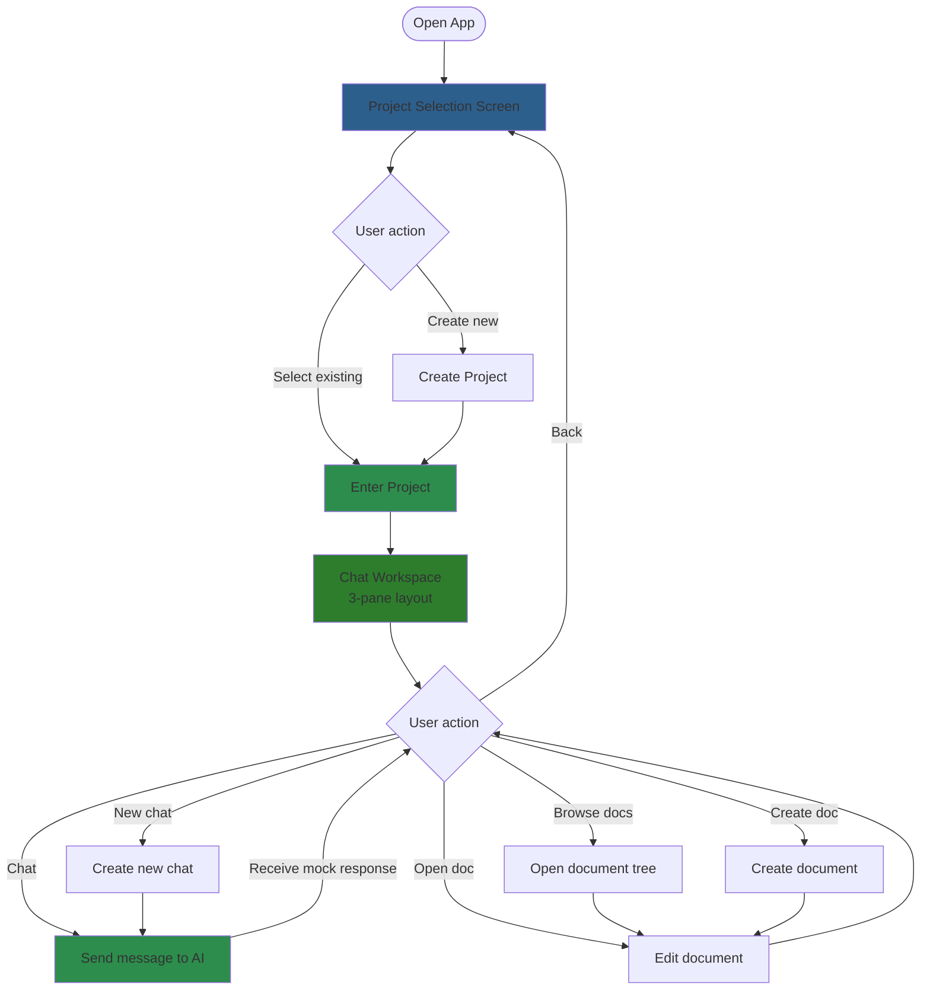
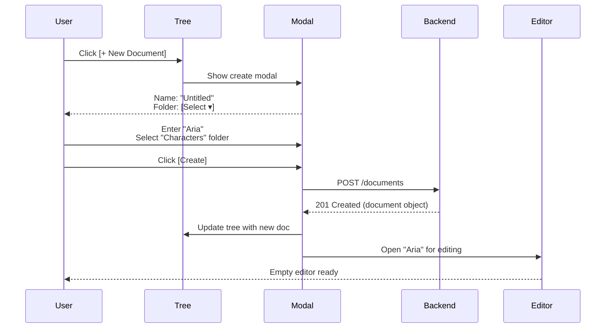

# MVP 0 (Prototype) UI Design

## Purpose

This document defines the UI for Meridian's **prototype phase** (MVP 0) - the full chat-first interface with **mock AI responses**. The goal is to validate the complete user experience, UI interactions, and local-first architecture before adding real LLM integration.

**What this is**: Complete 3-pane chat-first UI with hardcoded AI responses

**What this is NOT yet**: Real LLM integration, embeddings, RAG, AI suggestion system with three-way merge

## Scope

### Included in MVP 0

✅ **Project Selection**
- View all projects
- Create new project
- Enter project workspace

✅ **Chat Interface (Mock AI)**
- 3-pane layout (Chat List | Active Chat | Documents/Editor)
- Send messages to chat
- Receive hardcoded/pattern-based AI responses
- Chat history stored in backend
- Create new chats
- Switch between chats

✅ **Document Management**
- Folder tree navigation
- Create/rename/move/delete documents
- Create/rename/delete folders
- Full document CRUD

✅ **Document Editor**
- TipTap rich text editor
- Markdown-first storage
- Auto-save with debounce (from flows.md)
- Local-first sync queue

✅ **Local-First Architecture**
- IndexedDB for document content
- Zustand + localStorage for tree state
- Background sync to backend
- Offline support
- All flows from flows.md

### Explicitly Excluded (MVP 1+)

❌ Real LLM API integration (OpenAI, Anthropic, etc.)
❌ AI suggestion system with three-way merge
❌ Document creation from chat (AI can suggest, but doesn't actually create)
❌ RAG / embeddings / semantic search
❌ Multi-modal layouts (only chat-first for MVP 0)

## User Flow



## Project Selection Screen

**Same as MVP 1** - see mvp-1-ui.md for full spec.

```
┌────────────────────────────────────────┐
│          [Meridian Logo]               │
│                                        │
│      Recent Projects                   │
│                                        │
│  ┌──────────────────────────────────┐  │
│  │  📚 Fantasy Novel                │  │
│  │     2 hours ago • 15 documents   │  │
│  └──────────────────────────────────┘  │
│                                        │
│  ┌──────────────────────────────────┐  │
│  │  📖 Sci-Fi Series                │  │
│  │     Yesterday • 43 documents     │  │
│  └──────────────────────────────────┘  │
│                                        │
│      ─── All Projects ───              │
│                                        │
│  Fantasy Novel                         │
│  Sci-Fi Series                         │
│                                        │
│  [+ New Project]                       │
│                                        │
└────────────────────────────────────────┘
```

### Backend Requirements

**New API endpoints needed**:
```
GET    /api/projects                   # List all projects
POST   /api/projects                   # Create new project
GET    /api/projects/:id               # Get project details
PATCH  /api/projects/:id               # Rename project
DELETE /api/projects/:id               # Delete project (future)
```

**Project model**:
```typescript
interface Project {
  id: string
  name: string
  createdAt: Date
  updatedAt: Date
  documentCount?: number  // Computed from documents
}
```

**Backend schema** (add to schema.sql):
```sql
CREATE TABLE projects (
  id UUID PRIMARY KEY DEFAULT gen_random_uuid(),
  name VARCHAR(255) NOT NULL,
  created_at TIMESTAMP DEFAULT CURRENT_TIMESTAMP,
  updated_at TIMESTAMP DEFAULT CURRENT_TIMESTAMP
);

-- Update documents table to reference projects
ALTER TABLE documents ADD COLUMN project_id UUID REFERENCES projects(id);
CREATE INDEX idx_documents_project ON documents(project_id);
```

## Document Workspace Layout

### 3-Pane Chat-First Layout (Default)

**Full layout** - same as MVP 1, but with mock AI responses.

```
┌──────────┬─────────────────┬──────────────┐
│ 🏠       │                 │              │
│ Meridian │  Active Chat    │  [Collapsed] │
│          │  (MAIN FOCUS)   │              │
├──────────┼─────────────────┼──────────────┤
│          │                 │              │
│🔍 Search │ > Let's develop │              │
│          │   Aria's        │              │
│ • Story  │   backstory     │              │
│   Ideas  │                 │              │
│          │ < [Mock AI]     │              │
│ • Charac-│   Great idea!   │              │
│   ters   │   What motivated│              │
│          │   her?          │              │
│ • World  │                 │              │
│   Buildi-│ > She witnessed │              │
│   ng     │   injustice...  │              │
│          │                 │              │
│          │┌───────────────┐│              │
│          ││ Type message  ││              │
│──────────│└───────────────┘│              │
│ [⚙️] [👤]│                 │              │
└──────────┴─────────────────┴──────────────┘
    25%             50%             25%
```

### With Right Panel (Documents) Expanded

```
┌──────────┬─────────────────┬──────────────┐
│ 🏠       │                 │ Documents    │
│ Meridian │  Active Chat    │              │
│  [→]     │                 │      [←]     │
├──────────┼─────────────────┼──────────────┤
│          │                 │              │
│🔍 Search │ > Tell me about │ 📁 Character │
│          │   Aria          │   📄 Aria    │
│ • Story  │                 │   📄 Marcus  │
│   Ideas  │ < [Mock AI]     │              │
│          │   She's a       │ 📁 Chapters  │
│ • Charac-│   skilled...    │   📄 Ch 1    │
│   ters   │                 │   📄 Ch 2    │
│          │ > Save that to  │              │
│ • World  │   her doc       │ 📁 Outline   │
│   Buildi-│                 │   📄 Act 1   │
│   ng     │ < [Mock AI]     │              │
│          │   I've noted    │              │
│          │   that!         │ [+ New Doc]  │
│          │┌───────────────┐│              │
│          ││ Type message  ││              │
│──────────│└───────────────┘│              │
│ [⚙️] [👤]│                 │              │
└──────────┴─────────────────┴──────────────┘
    25%             50%             25%
```

### With Document Open in Editor

```
┌──────────┬─────────────────┬──────────────┐
│ 🏠       │                 │← Aria    [←] │
│ Meridian │  Active Chat    │              │
│  [→]     │                 │──────────────│
├──────────┼─────────────────┤              │
│          │                 │ ┌──────────┐ │
│🔍 Search │ > Expand on     │ │ [TipTap] │ │
│          │   her skills    │ │          │ │
│ • Story  │                 │ │ Aria is  │ │
│   Ideas  │ < [Mock AI]     │ │ a skilled│ │
│          │   She's trained │ │ warrior  │ │
│ • Charac-│   in sword...   │ │ who left │ │
│   ters   │                 │ │ her home │ │
│          │                 │ │ after... │ │
│ • World  │                 │ │          │ │
│   Buildi-│                 │ └──────────┘ │
│   ng     │                 │              │
│          │                 │              │
│          │┌───────────────┐│              │
│          ││ Type message  ││              │
│──────────│└───────────────┘│              │
│ [⚙️] [👤]│                 │              │
└──────────┴─────────────────┴──────────────┘
    25%             50%             25%
```

**Note**: `[Mock AI]` indicates hardcoded response - no real LLM.

## Panel Behaviors

### Left Panel: Chat List

**States**:
- **Expanded** (default): 25% width
- **Collapsed**: Slim bar with expand button

**Header** (top of panel):
```
┌──────────┐
│ 🏠       │  ← App logo (click → back to projects)
│ Meridian │
│  [→]     │  ← Collapse toggle
└──────────┘
```

**Contents** (top to bottom):
- **App logo/name**: Click to return to project selection
- **Collapse toggle** ([→]): Hides panel
- **Search bar**: Filter chats by name
- **Chat list**: Scrollable chats for current project
- **Settings & user** (bottom): [⚙️] [👤]

**Chat List Item**:
```
• Story Ideas
  Let's develop Aria's...
  2 hours ago

• Characters
  Tell me about Aria
  Yesterday
```

**Interactions**:
- Click chat → loads in center panel
- Click [+ New Chat] → creates new chat
- Click [⚙️] → settings modal
- Click [👤] → user menu

### Center Panel: Active Chat (Mock AI)

**Always visible** - This is the main workspace.

**Header**:
```
┌──────────────────────────────────┐
│ Story Ideas                [⋮]   │
└──────────────────────────────────┘
```

**Contents**:
- **Chat name**: Editable inline (rename chat)
- **Message history**: Scrollable conversation
- **Input area** (bottom): Text input + send button

**Message rendering**:
```
> User message
  Aligned right, blue/green tint

< [Mock AI] response
  Aligned left, gray tint
  Hardcoded or pattern-based
```

**Mock AI Response Strategy**:

**Option 1: Hardcoded responses**
```typescript
const mockResponses = [
  "That's an interesting idea! Tell me more.",
  "Great! What motivated that decision?",
  "I see. How does that fit with your story?",
  "Interesting! What happens next?",
]

// Return random response
```

**Option 2: Pattern matching**
```typescript
if (message.includes("character")) {
  return "Let's develop that character! What's their motivation?"
}
if (message.includes("save") || message.includes("document")) {
  return "I've noted that! (Mock: would create document in MVP 1)"
}
// Default fallback
return "That's interesting! Tell me more."
```

**Recommended for MVP 0**: Option 2 with 5-10 patterns to feel responsive.

### Right Panel: Documents / Editor

**States**:
- **Collapsed** (default): Hidden
- **Documents view**: Shows document tree (25% width)
- **Editor view**: Shows TipTap editor (25% width)

**Documents View**:
```
┌──────────────────────┐
│ Documents       [←]  │
├──────────────────────┤
│ 📁 Characters        │
│   📄 Aria            │
│   📄 Marcus          │
│                      │
│ 📁 Chapters          │
│   📄 Chapter 1       │
│                      │
│ [+ New Document]     │
└──────────────────────┘
```

**Editor View**:
```
┌──────────────────────┐
│ ← Aria          [←]  │
├──────────────────────┤
│ ┌──────────────────┐ │
│ │  [TipTap Editor] │ │
│ │                  │ │
│ │  Content...      │ │
│ └──────────────────┘ │
│                      │
│ 512 words • Saved ✓  │
└──────────────────────┘
```

**Transitions**:
- Click document → switches to editor view
- Back button (←) → returns to documents view
- Close button ([←]) → collapses panel

## Document Creation Flow

### Manual Creation



**Create Modal**:
```
┌──────────────────────────┐
│ Create New Document      │
├──────────────────────────┤
│ Name:                    │
│ [Untitled             ]  │
│                          │
│ Location:                │
│ [Characters         ▾]   │
│   Root                   │
│   Characters         ✓   │
│   Chapters               │
│   Outline                │
│                          │
│     [Cancel]  [Create]   │
└──────────────────────────┘
```

### Naming Strategy

**Auto-naming**:
- First new doc: "Untitled"
- Subsequent: "Untitled 2", "Untitled 3", etc.
- User can rename immediately (inline in tree)

**Inline rename**:
- Click document name in tree → editable field
- Type new name → Enter to save
- Triggers `PATCH /documents/:id`

## Integration with Existing Backend

### Current API (from git status)

**Already implemented**:
```
GET    /api/documents           # Tree structure (all docs + folders)
POST   /api/documents           # Create document
GET    /api/documents/:id       # Get document (with content)
PATCH  /api/documents/:id       # Update document (content, name, folder)
DELETE /api/documents/:id       # Delete document
```

**Expected request/response** (verify in api-contracts.md):
```typescript
// GET /documents
Response: {
  documents: [
    {
      id: string
      name: string
      folderId: string | null
      content?: string  // Stub (no content) or full content
      wordCount?: number
      updatedAt: string
    }
  ],
  folders: [
    {
      id: string
      name: string
      parentId: string | null
    }
  ]
}

// POST /documents
Request: {
  name: string
  folderId?: string
  content?: string  // Defaults to ""
}

// PATCH /documents/:id
Request: {
  name?: string
  folderId?: string  // Move to folder
  content?: string   // Update content
}
```

### New API Needed for MVP 0

**Projects API** (required for project selection):
```
GET    /api/projects              # List all projects
POST   /api/projects              # Create new project
GET    /api/projects/:id          # Get project details
PATCH  /api/projects/:id          # Rename project
```

**Chats API** (required for chat interface):
```
GET    /api/projects/:projectId/chats        # List chats for project
POST   /api/projects/:projectId/chats        # Create new chat
GET    /api/chats/:id                        # Get chat with messages
PATCH  /api/chats/:id                        # Rename chat
DELETE /api/chats/:id                        # Delete chat

GET    /api/chats/:chatId/messages           # Get all messages
POST   /api/chats/:chatId/messages           # Send message (gets mock response)
```

**Chat Backend Schema**:
```sql
CREATE TABLE chats (
  id UUID PRIMARY KEY DEFAULT gen_random_uuid(),
  project_id UUID REFERENCES projects(id) NOT NULL,
  title VARCHAR(255) NOT NULL,
  created_at TIMESTAMP DEFAULT CURRENT_TIMESTAMP,
  updated_at TIMESTAMP DEFAULT CURRENT_TIMESTAMP
);

CREATE TABLE messages (
  id UUID PRIMARY KEY DEFAULT gen_random_uuid(),
  chat_id UUID REFERENCES chats(id) NOT NULL,
  role VARCHAR(20) NOT NULL,  -- 'user' or 'assistant'
  content TEXT NOT NULL,
  created_at TIMESTAMP DEFAULT CURRENT_TIMESTAMP
);

CREATE INDEX idx_chats_project ON chats(project_id);
CREATE INDEX idx_messages_chat ON messages(chat_id);
```

**Mock AI Response Logic** (backend):
```go
// POST /api/chats/:chatId/messages
func SendMessage(c *fiber.Ctx) error {
    var req struct {
        Content string `json:"content"`
    }
    c.BodyParser(&req)

    // Save user message
    userMsg := saveMessage(chatID, "user", req.Content)

    // Generate mock response
    mockResponse := generateMockResponse(req.Content)

    // Save assistant message
    assistantMsg := saveMessage(chatID, "assistant", mockResponse)

    return c.JSON(fiber.Map{
        "userMessage": userMsg,
        "assistantMessage": assistantMsg,
    })
}

func generateMockResponse(userMessage string) string {
    lower := strings.ToLower(userMessage)

    if strings.Contains(lower, "character") {
        return "Let's develop that character! What's their motivation?"
    }
    if strings.Contains(lower, "save") || strings.Contains(lower, "document") {
        return "I've noted that! (In MVP 1, I'll create a document for you)"
    }
    if strings.Contains(lower, "plot") || strings.Contains(lower, "story") {
        return "Interesting plot point! How does that connect to your themes?"
    }
    // Default
    return "That's fascinating! Tell me more about that."
}
```

**Updated Documents API** (scoped to project):
```
GET    /api/documents?project_id=xxx         # Filter by project
POST   /api/documents                        # Add project_id to request body
```

**Recommendation**: Add projects + chats tables, scope everything by `project_id`.

## Data Flow (Local-First)

**Same architecture as flows.md** - MVP 0 validates these flows without AI complexity.

### Session Bootstrap

```
1. User opens app
2. Load project list from backend
3. User selects project
4. Fetch document tree from backend (GET /projects/:id/documents)
5. Store in Zustand + localStorage (tree metadata)
6. Store in IndexedDB (document content, lazy-loaded)
7. Render UI
```

### Document Open

```
1. User clicks document in tree
2. Check IndexedDB for content
3. If stub: fetch from backend (GET /documents/:id)
4. Load content into TipTap editor
5. Cache in IndexedDB for next time
```

### Auto-Save

```
1. User types in editor
2. TipTap onChange event
3. Debounce 1 second
4. Save to IndexedDB (local)
5. Update Zustand (word count)
6. Queue sync operation
7. Background sync to backend
8. Update status: "Saved ✓" or "Saved locally ⚠️"
```

All per **flows.md** - no changes to local-first architecture.

## Frontend Tech Stack

### Required Libraries

**UI Framework**:
- Next.js 14+ (App Router)
- React 18+
- TypeScript

**Editor**:
- TipTap (latest version)
- TipTap extensions:
  - StarterKit
  - Placeholder
  - CharacterCount
- Markdown support (import/export)

**State Management**:
- Zustand (tree state, UI state)
- Dexie.js (IndexedDB wrapper)

**Styling**:
- Tailwind CSS
- Radix UI (modals, dropdowns)
- Lucide icons (document tree icons)

**Data Fetching**:
- Native fetch (or TanStack Query for caching)
- SWR (optional, for real-time sync)

### Project Structure

```
frontend/
├── app/
│   ├── page.tsx                    # Project selection
│   ├── projects/
│   │   └── [id]/
│   │       └── page.tsx            # Chat workspace (3-pane)
│   └── layout.tsx
├── components/
│   ├── projects/
│   │   ├── ProjectList.tsx
│   │   ├── ProjectCard.tsx
│   │   └── CreateProjectModal.tsx
│   ├── chat/
│   │   ├── ChatList.tsx            # Left panel: list of chats
│   │   ├── ChatListItem.tsx
│   │   ├── ActiveChat.tsx          # Center panel: current conversation
│   │   ├── ChatMessage.tsx         # Individual message bubble
│   │   ├── ChatInput.tsx           # Message input area
│   │   └── CreateChatModal.tsx
│   ├── documents/
│   │   ├── DocumentTree.tsx
│   │   ├── DocumentTreeItem.tsx
│   │   ├── FolderTreeItem.tsx
│   │   └── CreateDocumentModal.tsx
│   ├── editor/
│   │   ├── Editor.tsx
│   │   ├── EditorToolbar.tsx
│   │   └── EditorStatusBar.tsx
│   └── layout/
│       ├── ChatPanel.tsx           # Left panel wrapper
│       ├── EditorPanel.tsx         # Right panel wrapper
│       └── WorkspaceLayout.tsx     # 3-pane container
├── lib/
│   ├── db.ts                       # Dexie setup
│   ├── api.ts                      # API client
│   ├── sync.ts                     # Sync queue
│   ├── markdown.ts                 # MD ↔ TipTap converter
│   └── mockAI.ts                   # Mock AI response generator
└── stores/
    ├── useProjectStore.ts
    ├── useChatStore.ts             # NEW: Chat state
    ├── useTreeStore.ts
    ├── useUIStore.ts
    └── useEditorStore.ts
```

## Zustand Stores

### Project Store

```typescript
interface ProjectStore {
  currentProject: Project | null
  projects: Project[]

  loadProjects: () => Promise<void>
  setCurrentProject: (project: Project) => void
  createProject: (name: string) => Promise<Project>
  clearCurrentProject: () => void
}
```

### Tree Store

```typescript
interface TreeStore {
  documents: Document[]
  folders: Folder[]
  expandedFolders: Set<string>

  loadTree: (projectId: string) => Promise<void>
  createDocument: (name: string, folderId?: string) => Promise<Document>
  updateDocument: (id: string, updates: Partial<Document>) => Promise<void>
  deleteDocument: (id: string) => Promise<void>
  toggleFolder: (folderId: string) => void
}
```

### Chat Store

```typescript
interface ChatStore {
  chats: Chat[]
  activeChat: Chat | null
  messages: Message[]
  isLoadingMessages: boolean

  loadChats: (projectId: string) => Promise<void>
  loadChat: (chatId: string) => Promise<void>
  createChat: (projectId: string, title: string) => Promise<Chat>
  sendMessage: (chatId: string, content: string) => Promise<void>
  renameChat: (chatId: string, title: string) => Promise<void>
  deleteChat: (chatId: string) => Promise<void>
}

interface Chat {
  id: string
  projectId: string
  title: string
  lastMessage?: string
  updatedAt: Date
}

interface Message {
  id: string
  chatId: string
  role: 'user' | 'assistant'
  content: string
  createdAt: Date
}
```

### UI Store

```typescript
interface UIStore {
  leftPanelCollapsed: boolean
  rightPanelCollapsed: boolean
  rightPanelState: 'documents' | 'editor' | null
  activeDocumentId: string | null
  activeChatId: string | null

  toggleLeftPanel: () => void
  toggleRightPanel: () => void
  setRightPanelState: (state: 'documents' | 'editor' | null) => void
  setActiveDocument: (id: string | null) => void
  setActiveChat: (id: string | null) => void
}
```

### Editor Store

```typescript
interface EditorStore {
  content: string
  isSaving: boolean
  lastSaved: Date | null
  syncStatus: 'saved' | 'saving' | 'local' | 'error'

  setContent: (content: string) => void
  saveDocument: () => Promise<void>
}
```

## MVP 0 Implementation Checklist

### Backend (Go)

- [ ] Create projects table migration
- [ ] Add project CRUD endpoints
- [ ] Create chats table migration
- [ ] Create messages table migration
- [ ] Add chat CRUD endpoints
- [ ] Add message endpoints (GET/POST)
- [ ] Implement mock AI response generator
- [ ] Add `project_id` to documents table
- [ ] Update documents endpoints to scope by project
- [ ] Test all endpoints with Insomnia

### Frontend (Next.js)

**Project Selection**:
- [ ] Project list page
- [ ] Create project modal
- [ ] Recent projects logic
- [ ] Navigation to workspace

**Chat Workspace** (3-pane layout):
- [ ] 3-pane layout component (Left: Chats | Center: Active Chat | Right: Docs/Editor)
- [ ] Left panel collapsible
- [ ] Right panel collapsible
- [ ] Panel state persistence (localStorage)

**Chat Interface** (Left Panel):
- [ ] Chat list rendering
- [ ] Chat list item component
- [ ] Search/filter chats
- [ ] Create new chat modal
- [ ] Click chat → load in center
- [ ] Inline rename chat
- [ ] Delete chat confirmation

**Active Chat** (Center Panel):
- [ ] Message history rendering
- [ ] User message bubbles (right-aligned)
- [ ] Assistant message bubbles (left-aligned, with [Mock AI] indicator)
- [ ] Chat input area (textarea + send button)
- [ ] Send message → POST to backend → receive mock response
- [ ] Auto-scroll to newest message
- [ ] Loading state while waiting for response

**Documents & Editor** (Right Panel):
- [ ] Document tree rendering
- [ ] Folder expand/collapse
- [ ] Document click → open in editor
- [ ] Create document modal
- [ ] Inline rename (document + folder)
- [ ] Delete confirmation modal
- [ ] Panel state toggle (documents ↔ editor)

**Editor**:
- [ ] TipTap setup with extensions
- [ ] Auto-save with 1s debounce
- [ ] Status bar (word count, save status)
- [ ] Empty state placeholder
- [ ] Back button (← Documents)

**Local-First**:
- [ ] Dexie IndexedDB setup
- [ ] Zustand stores (project, chat, tree, UI, editor)
- [ ] localStorage persistence (tree + UI state + chat state)
- [ ] Sync queue implementation
- [ ] Background sync worker
- [ ] Retry logic with exponential backoff

**Mock AI**:
- [ ] Pattern-based response generator (lib/mockAI.ts)
- [ ] 5-10 response patterns (character, plot, save, etc.)
- [ ] Default fallback response
- [ ] Visual indicator that responses are mock

**Polish**:
- [ ] Loading states
- [ ] Error handling
- [ ] Toast notifications
- [ ] Keyboard shortcuts
- [ ] Responsive design (desktop-first, but not broken on mobile)

## What's Next (MVP 1)

After MVP 0 is working, replace mock AI with real LLM:

1. **Replace mock AI with real LLM** (OpenAI/Anthropic API integration)
2. **Implement AI suggestion system** (three-way merge from ai-suggestions.md)
3. **Add document creation from chat** (AI can actually scaffold docs, not just say it did)
4. **RAG / embeddings** (context-aware responses based on project documents)
5. **Streaming responses** (SSE or WebSockets for real-time AI output)
6. **Layout modes** (chat-first vs editor-first toggle)
7. **Multi-device sync** (extend local-first to multi-device)

See **mvp-1-ui.md** for full MVP 1 spec with AI integration.

## References

- **MVP 1 UI (with AI)**: `_docs/technical/frontend/mvp-1-ui.md`
- **AI suggestion system**: `_docs/technical/ai-suggestions.md`
- **Local-first data flows**: `_docs/technical/frontend/flows.md`
- **Backend API contracts**: `_docs/technical/backend/api-contracts.md`
- **Product vision**: `_docs/high-level/1-overview.md`
