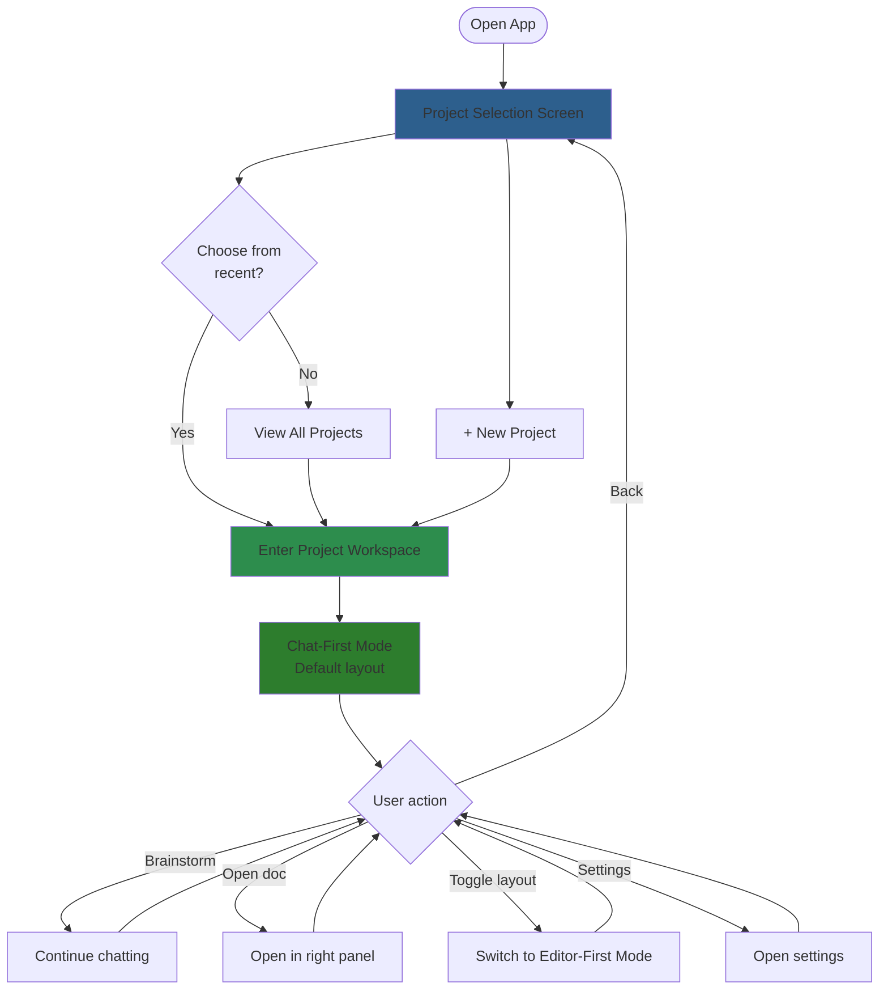
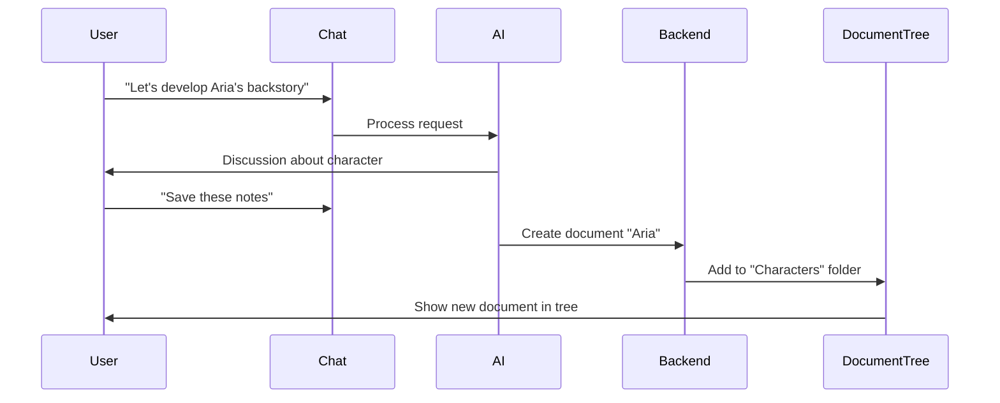

# MVP 1 UI Design (AI-Enabled)

## Purpose

This document defines the user interface and user experience for Meridian's **MVP 1** - the full AI-enabled brainstorming platform. Meridian is a **chat-first AI brainstorming platform** for creative writers, where conversations with AI are the primary workflow and documents are artifacts that emerge from those conversations.

**Note**: This builds on **MVP 0** (see `mvp-0-ui.md`), which implements the document management foundation without AI features. MVP 1 adds the chat interface, AI integration, and suggestion system.

**Key principle**: Writing a book requires extensive brainstorming and research. The UI prioritizes AI-assisted ideation over direct editing, though both are supported.

## Design Philosophy

1. **Chat is central** - Conversations are the main workspace, not the editor
2. **Documents are artifacts** - Created through brainstorming, edited when needed
3. **One project at a time** - Deep focus, not constant context switching
4. **Collapsible everything** - Maximize space for current task
5. **Markdown-first** - No file extensions, no technical jargon

## User Flow Overview



## Project Selection Screen

### Layout

**First-time / No recent projects**:
```
┌────────────────────────────────────────┐
│                                        │
│          [Meridian Logo]               │
│                                        │
│      Your Writing Projects             │
│                                        │
│  ┌──────────────────────────────────┐  │
│  │  📚 Fantasy Novel                │  │
│  │     Last edited 2 hours ago      │  │
│  │     15 documents                 │  │
│  └──────────────────────────────────┘  │
│                                        │
│  ┌──────────────────────────────────┐  │
│  │  + Create New Project            │  │
│  └──────────────────────────────────┘  │
│                                        │
└────────────────────────────────────────┘
```

**With recent projects**:
```
┌────────────────────────────────────────┐
│          [Meridian Logo]               │
│                                        │
│      Recent Projects                   │
│                                        │
│  ┌──────────────────────────────────┐  │
│  │  📚 Fantasy Novel                │  │
│  │     2 hours ago • 15 documents   │  │
│  └──────────────────────────────────┘  │
│                                        │
│  ┌──────────────────────────────────┐  │
│  │  📖 Sci-Fi Series                │  │
│  │     Yesterday • 43 documents     │  │
│  └──────────────────────────────────┘  │
│                                        │
│  ┌──────────────────────────────────┐  │
│  │  📝 Short Story Collection       │  │
│  │     Last week • 8 documents      │  │
│  └──────────────────────────────────┘  │
│                                        │
│      ─── All Projects ───              │
│                                        │
│  Fantasy Novel                         │
│  Sci-Fi Series                         │
│  Short Story Collection                │
│  Mystery Thriller (archived)           │
│                                        │
│  [+ New Project]                       │
│                                        │
└────────────────────────────────────────┘
```

### Behavior

- **Recent projects**: Shows 3-5 most recently accessed (click to enter)
- **All projects list**: Scrollable list below fold (no visual cards, just names)
- **New project**: Prominent button, creates project and enters workspace
- **No back button**: This is the home screen

### Data Requirements

```typescript
interface Project {
  id: string
  name: string
  lastEditedAt: Date
  documentCount: number
  archived: boolean
}
```

## Main Workspace Layout

### Default: Chat-First Mode

```
┌──────────┬─────────────────┬──────────────┐
│ 🏠       │                 │              │
│ Meridian │  Active Chat    │  [Collapsed] │
│          │  (MAIN FOCUS)   │              │
├──────────┼─────────────────┼──────────────┤
│          │                 │              │
│🔍 Search │ > Let's develop │              │
│          │   Aria's back-  │              │
│ • Story  │   story         │              │
│   Ideas  │                 │              │
│          │ < Great! What   │              │
│ • Charac-│   motivated her │              │
│   ters   │   to leave...   │              │
│          │                 │              │
│ • World  │ > She witnessed │              │
│   Buildi-│   something...  │              │
│   ng     │                 │              │
│          │                 │              │
│          │                 │              │
│          │                 │              │
│          │┌───────────────┐│              │
│          ││ Type message  ││              │
│──────────│└───────────────┘│              │
│ [⚙️] [👤]│                 │              │
└──────────┴─────────────────┴──────────────┘
    30%             50%             20%
```

### With Right Panel Expanded

```
┌──────────┬─────────────────┬──────────────┐
│ 🏠       │                 │ Documents    │
│ Meridian │  Active Chat    │              │
│  [→]     │                 │      [←]     │
├──────────┼─────────────────┼──────────────┤
│          │                 │              │
│🔍 Search │ > Let's develop │ 📁 Character │
│          │   Aria's back-  │   📄 Aria    │
│ • Story  │   story         │   📄 Marcus  │
│   Ideas  │                 │              │
│          │ < I've saved    │ 📁 Chapters  │
│ • Charac-│   notes to      │   📄 Ch 1    │
│   ters   │   "Aria"        │   📄 Ch 2    │
│          │                 │              │
│ • World  │ > Can you add   │ 📁 Outline   │
│   Buildi-│   more details  │   📄 Act 1   │
│   ng     │                 │              │
│          │                 │              │
│          │┌───────────────┐│              │
│          ││ Type message  ││ [+ New Doc]  │
│──────────│└───────────────┘│              │
│ [⚙️] [👤]│                 │              │
└──────────┴─────────────────┴──────────────┘
    25%             50%             25%
```

### Document Opened in Right Panel

```
┌──────────┬─────────────────┬──────────────┐
│ 🏠       │                 │← Aria    [←] │
│ Meridian │  Active Chat    │              │
│  [→]     │                 │──────────────│
├──────────┼─────────────────┤              │
│          │                 │ ┌──────────┐ │
│🔍 Search │ > Tell me more  │ │ [TipTap] │ │
│          │   about Aria    │ │          │ │
│ • Story  │                 │ │ Aria is  │ │
│   Ideas  │ < She's a...    │ │ a skilled│ │
│          │                 │ │ warrior  │ │
│ • Charac-│ > Save that to  │ │ who left │ │
│   ters   │   her doc       │ │ her home │ │
│          │                 │ │ after... │ │
│ • World  │ < Updated Aria  │ │          │ │
│   Buildi-│   document ✓    │ │          │ │
│   ng     │                 │ │          │ │
│          │                 │ └──────────┘ │
│          │┌───────────────┐│              │
│          ││ Type message  ││              │
│──────────│└───────────────┘│              │
│ [⚙️] [👤]│                 │              │
└──────────┴─────────────────┴──────────────┘
    25%             50%             25%
```

### Future: Editor-First Mode

**Not in prototype MVP** - documented for future reference.

```
┌──────────┬──────────────────┬─────────────┐
│ 🏠       │                  │ AI Chat     │
│ Meridian │  Editor          │ (collapsed) │
│  [→]     │  (MAIN FOCUS)    │             │
├──────────┼──────────────────┼─────────────┤
│          │  ← Chapter 1     │             │
│📁 Charac │                  │             │
│  📄 Aria │ ┌──────────────┐ │             │
│  📄 Marcu│ │  [TipTap]    │ │             │
│          │ │              │ │             │
│📁 Chapter│ │ Aria walked  │ │             │
│  📄 Ch 1 │ │ into the     │ │             │
│  📄 Ch 2 │ │ tavern...    │ │             │
│          │ │              │ │             │
│📁 Outline│ │              │ │             │
│  📄 Act 1│ │              │ │             │
│          │ │              │ │             │
│          │ └──────────────┘ │             │
│          │                  │             │
│ [+ New]  │  1,247 words     │             │
│──────────│                  │             │
│ [⚙️] [👤]│                  │             │
└──────────┴──────────────────┴─────────────┘
    20%             60%             20%

Toggle to chat mode anytime
```

## Panel Behaviors

### Left Panel: Chat List

**States**:
- **Expanded** (default on first load): 25-30% width
- **Collapsed**: Hidden, show/hide toggle button visible on center panel

**Contents** (top to bottom):
- **App logo/name** (top): "🏠 Meridian" - click to return to project selection
- **Collapse toggle** ([→]): Hides left panel
- **Search bar**: Filters chats by name/content
- **Chat list**: Scrollable list of chats for current project
- **Settings & user menu** (bottom): [⚙️] and [👤] icons

**Chat List Item**:
```
• Chat Name
  Last message preview...
  2 hours ago
```

**Interactions**:
- Click logo → returns to project selection screen
- Click [→] → collapses left panel
- Click chat → loads in center panel
- Click [⚙️] → opens settings modal/page
- Click [👤] → opens user menu (account, logout)
- New chat → "+" button at top of chat list or in header

### Center Panel: Active Chat

**Always visible** - This is the core workspace.

**Header**:
```
┌──────────────────────────────────────┐
│ [Chat Name]                    [⋮]   │
└──────────────────────────────────────┘
```

**Contents**:
- Chat messages (user and AI)
- Scrollable conversation history
- Input area at bottom

**Input Area**:
```
┌─────────────────────────────────────┐
│ Type a message...                   │
│                                  [↑]│
└─────────────────────────────────────┘
```

**Message Format**:
```
> User message
  Aligned right, distinct color

< AI response
  Aligned left, different color
  "I've created a document 'Aria Backstory'"
```

### Right Panel: Documents / Editor

**States**:
- **Collapsed** (default): Hidden, toggle button visible
- **Documents view**: Shows document tree (25% width)
- **Editor view**: Shows TipTap editor (25-30% width)

**Documents View**:
```
┌──────────────────────┐
│ Documents       [←]  │
├──────────────────────┤
│ 📁 Characters        │
│   📄 Aria            │
│   📄 Marcus          │
│                      │
│ 📁 Chapters          │
│   📄 Chapter 1       │
│   📄 Chapter 2       │
│                      │
│ 📁 Outline           │
│   📄 Act 1           │
│                      │
│ [+ New Document]     │
└──────────────────────┘
```

**Editor View**:
```
┌──────────────────────┐
│ ← Aria          [←]  │
├──────────────────────┤
│ ┌──────────────────┐ │
│ │  [TipTap Editor] │ │
│ │                  │ │
│ │  Document        │ │
│ │  content...      │ │
│ │                  │ │
│ │                  │ │
│ └──────────────────┘ │
│                      │
│ 512 words            │
└──────────────────────┘
```

**Transitions**:
- Click document in tree → switches to editor view
- Back button (←) in editor → returns to documents view
- Close button ([←]) → collapses entire right panel

## Navigation Patterns

### Primary Navigation (Left Panel)

All primary navigation lives in the left panel (no top bar):

**App Logo** (top of left panel):
- Click "🏠 Meridian" → returns to project selection screen
- Always visible when left panel is expanded
- When left panel is collapsed, show [←] expand button on center/right panel

**User Controls** (bottom of left panel):
- **[⚙️] Settings icon** → opens settings modal/page
- **[👤] User menu** → dropdown with:
  - Account settings
  - Preferences
  - Logout

**When left panel is collapsed**:
- Expand button ([←]) appears on center panel header
- Click to restore left panel
- Logo and user controls hidden until panel re-expanded

### Settings Access

**Two entry points** (both in left panel):

1. **Settings icon**: Bottom-left [⚙️] → opens settings modal/page
2. **User menu**: Bottom-left [👤] → dropdown → Settings

**Settings categories** (future):
- Account
- Editor preferences
- AI model settings
- Keyboard shortcuts
- Data & storage

### Keyboard Shortcuts (Future)

Not in prototype MVP, but planned:

- `Cmd/Ctrl + K`: Quick switcher (projects, documents, chats)
- `Cmd/Ctrl + N`: New chat
- `Cmd/Ctrl + B`: Toggle left panel
- `Cmd/Ctrl + \`: Toggle right panel
- `Cmd/Ctrl + E`: Focus editor (if document open)

## Layout Modes & User Preferences

### Chat-First Mode (Default)

**When to use**: Brainstorming, research, ideation phase

**Layout priorities**:
1. Chat is center and largest
2. Right panel collapsed by default
3. Expand right panel only when referencing/editing docs

**Default state on app load**:
```
Chat List (25%) | Active Chat (50%) | [Collapsed] (25%)
```

### Editor-First Mode (Future)

**When to use**: Deep writing sessions, editing existing content

**Layout priorities**:
1. Editor is center and largest
2. Chat collapsed by default (expand when need AI help)
3. Document tree on left for quick navigation

**Not implemented in prototype MVP.**

### User Preference Persistence

**LocalStorage saves**:
```typescript
interface LayoutPreferences {
  leftPanelCollapsed: boolean
  rightPanelCollapsed: boolean
  rightPanelState: 'documents' | 'editor' | null
  lastOpenDocumentId?: string
  layoutMode: 'chat-first' | 'editor-first'  // Future
}
```

**Behavior**:
- On app load: restore last session's panel states
- First-time user: use defaults (chat-first, right collapsed)
- Per-project preferences (future): remember different layouts per project

## Project & Chat Scoping

### Project Isolation

**One project at a time**:
- User works in one project workspace
- Switching projects requires returning to project selection screen
- No dropdown/quick switcher (prevents constant context switching)
- Encourages deep focus on current book/project

**Data scoping**:
- Chats belong to a project (filtered in backend)
- Documents belong to a project (existing folder structure)
- Settings are global (not per-project)

### Chat Lifecycle

**MVP (project-scoped chats)**:
```
Project
  ├─ Chat 1: "Story Ideas"
  ├─ Chat 2: "Character Development"
  ├─ Chat 3: "World Building"
  └─ Documents (folders + files)
```

**Future (global chats)**:
- Some chats can reference multiple projects
- "External" chat type for cross-project brainstorming
- Requires chat-to-project relationship tracking

### Document Creation Flows

**AI-driven (primary)**:


**User-driven (manual)**:
```
1. Click [+ New Document] in right panel
2. Modal opens:
   - Name: "Untitled"
   - Location: [Select folder ▾]
   - [Cancel] [Create]
3. Document created, opens in editor
```

**Organization**:
- Rename: Click document name, edit inline
- Move: Right-click → Move to... (folder picker)
- Delete: Right-click → Delete (with confirmation)

All operations sync immediately (0ms debounce per flows.md).

## Integration with Existing Architecture

### Relationship to flows.md

The UI implements the visual layer on top of the data flows:

**Session Bootstrap (Flow 2)**:
```
User opens app
  ↓
Project selection screen
  ↓
Click project → Bootstrap workspace
  ↓
Load chats + document tree from backend
  ↓
Render UI with data
```

**Auto-Save (Flow 1)**:
```
User edits document in right panel
  ↓
TipTap onChange → Debounce → IndexedDB
  ↓
Background sync to backend
  ↓
Update word count in document tree
```

**Document Open (Flow 6)**:
```
User clicks document in tree
  ↓
Check IndexedDB cache
  ↓
If stub: fetch from backend
  ↓
Load into TipTap editor
  ↓
Switch right panel to editor view
```

### Data Requirements

**New API endpoints needed**:

```
GET    /api/projects                  # Project selection screen
GET    /api/projects/:id              # Enter project workspace
POST   /api/projects                  # Create new project

GET    /api/projects/:id/chats        # Chat list for project
POST   /api/projects/:id/chats        # Create new chat
GET    /api/chats/:id                 # Load chat messages
POST   /api/chats/:id/messages        # Send message (MVP: no AI)

# Documents already implemented (from git status)
GET    /api/documents                 # Tree structure
POST   /api/documents                 # Create document
PATCH  /api/documents/:id             # Update/rename/move
DELETE /api/documents/:id             # Delete
```

**Zustand stores**:

```typescript
// UI state store (existing, extend)
interface UIStore {
  leftPanelCollapsed: boolean
  rightPanelCollapsed: boolean
  rightPanelState: 'documents' | 'editor' | null
  activeDocumentId: string | null
  activeChatId: string | null
  toggleLeftPanel: () => void
  toggleRightPanel: () => void
  // ... existing tree state
}

// Project store (new)
interface ProjectStore {
  currentProject: Project | null
  setCurrentProject: (project: Project) => void
  clearCurrentProject: () => void
}

// Chat store (new)
interface ChatStore {
  chats: Chat[]
  activeChat: Chat | null
  messages: Message[]
  loadChats: (projectId: string) => Promise<void>
  loadChat: (chatId: string) => Promise<void>
  sendMessage: (content: string) => Promise<void>
}
```

## Prototype MVP vs Full MVP

### Prototype Scope (Phase 0)

**Included**:
- ✅ Project selection screen
- ✅ Basic workspace layout (3 panels)
- ✅ Panel collapse/expand
- ✅ Document tree view
- ✅ Document editor (TipTap)
- ✅ Document CRUD operations
- ✅ Local-first data layer (from flows.md)

**Excluded** (placeholder/mock):
- ❌ Actual AI chat (center panel shows placeholder)
- ❌ Chat list (left panel shows static mockup)
- ❌ Chat backend integration
- ❌ AI suggestion system (documented in ai-suggestions.md)

**Prototype center panel**:
```
┌─────────────────────────────────┐
│                                 │
│      [Meridian Logo]            │
│                                 │
│   AI Chat Coming Soon           │
│                                 │
│   For now, use the document     │
│   editor to create and manage   │
│   your writing.                 │
│                                 │
│   → Open a document to start    │
│                                 │
└─────────────────────────────────┘
```

Or collapse center panel entirely and use editor-first mode for prototype.

### Full MVP Scope (Phase 1)

**Adds**:
- ✅ AI chat backend integration
- ✅ Chat CRUD (create, load, send messages)
- ✅ AI suggestion system (from ai-suggestions.md)
- ✅ Three-way merge conflict resolution
- ✅ Document creation via chat

**Still future**:
- ⏭️ Editor-first mode toggle
- ⏭️ Multi-device sync
- ⏭️ Real-time collaboration
- ⏭️ Global/cross-project chats

## Design Mockup Notes

**Colors** (dark mode compatible):
- Primary action: `#2d8d4d` (green)
- Background panels: `#1a1a1a` / `#2a2a2a`
- Text: `#e0e0e0`
- Borders: `#404040`
- AI messages: `#2d5f8d` (blue tint)
- User messages: `#2d7d2d` (green tint)

**Typography**:
- UI: System font stack (SF Pro, Segoe UI, Inter)
- Editor: Monospace option (optional) or serif for prose
- Code blocks in chat: Monospace

**Spacing**:
- Panel padding: 16-24px
- Message spacing: 12-16px
- Document tree indent: 20px per level

## References

- **MVP 0 UI (prototype)**: `_docs/technical/frontend/mvp-0-ui.md`
- **AI suggestion system**: `_docs/technical/ai-suggestions.md`
- **Local-first data flows**: `_docs/technical/frontend/flows.md`
- **Backend API contracts**: `_docs/technical/backend/api-contracts.md`
- **Product vision**: `_docs/high-level/1-overview.md`
