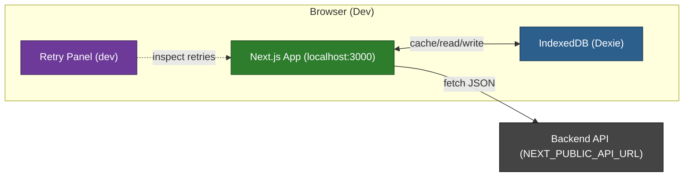

# Frontend Setup Quickstart

Purpose: provide only the initial environment setup and run commands. The UI is being overhauled separately and is intentionally omitted here.

## Prerequisites

- Node.js LTS and npm
- Backend API running locally or remote (see backend QUICKSTART)

## Environment

- Set `NEXT_PUBLIC_API_URL` to your backend (e.g., `http://localhost:8080`).
- Optional: `NEXT_PUBLIC_DEV_TOOLS=1` to enable the Retry panel.

## Commands

```bash
cd frontend
npm install
npm run dev          # http://localhost:3000
npm run test         # unit tests (Vitest)
```

These commands are intentionally generic to avoid coupling to specific layouts; use the project’s standard task runner targets (e.g., install, run, dev, test, seed) as provided.

## Notes

- The backend is the system of record; local browser storage is treated as a cache.
- See `_docs/technical/frontend/sync-system-minimal.md` for the current sync architecture.
- This quickstart will change only if setup changes; UI details live in the design/flows docs.

## High‑Level Dev Flow (Mermaid)


