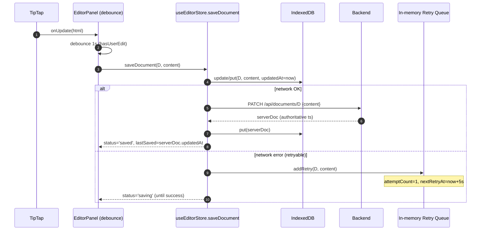
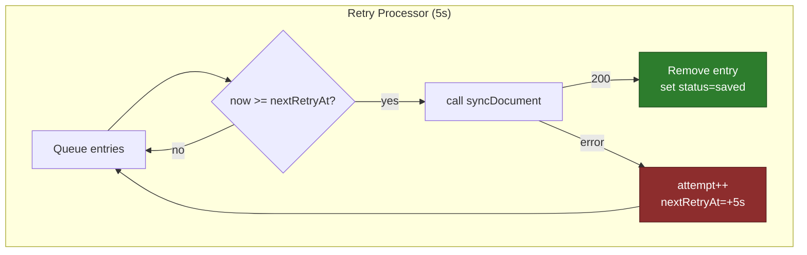
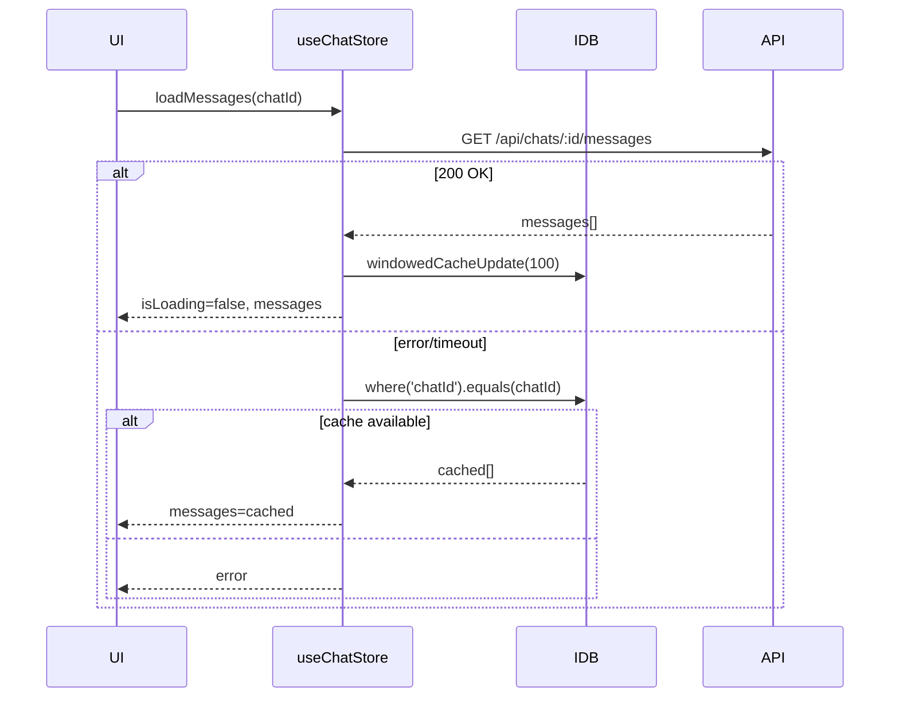

# Frontend Sync System — End‑to‑End Review

Scope: current Meridian frontend (Next.js + Zustand + Dexie + TipTap). Maps all sync paths, race guards, caches, and edge cases. References exact files/lines. Includes concrete invariants and a test matrix.

Primary files
- Documents
  - Store: `frontend/src/core/stores/useEditorStore.ts`
  - Editor cache: `frontend/src/core/hooks/useEditorCache.ts`
  - Sync core: `frontend/src/core/lib/sync.ts`
  - Cache helpers: `frontend/src/core/lib/cache.ts`
  - IndexedDB: `frontend/src/core/lib/db.ts`
- Chats/Messages
  - Store: `frontend/src/core/stores/useChatStore.ts`
  - Cache helpers: `frontend/src/core/lib/cache.ts`
- Orchestration
  - Retry lifecycle: `frontend/src/core/components/SyncProvider.tsx`

Status summary
- Documents: local‑first with server reconciliation by `updatedAt` on open; direct sync on save; in‑memory retries for network failures; editor instance LRU cache.
- Chats/Messages: network‑first with IndexedDB fallback; messages are windowed to last 100.

---

## 1) Document Open (Reconcile Newest)

Always attempt server; compare with cache by `updatedAt`; pick newest; fallback to cache on network error/abort. Editor remains read‑only until initialization completes.

```mermaid
sequenceDiagram
    autonumber
    participant UI as UI (openDocument)
    participant Store as useEditorStore.loadDocument
    participant IDB as IndexedDB (Dexie)
    participant API as Backend API
    participant EC as useEditorCache (TipTap LRU)

    UI->>Store: loadDocument(D)
    Store->>Store: set({_activeDocumentId:D,isLoading:true})
    par Editor instance
        UI->>EC: get editor for D
        alt cache hit
            EC-->>UI: editor(D), isFromCache=true
        else miss
            EC-->>UI: new editor(D), isFromCache=false
        end
    and Data
        Store->>IDB: get(D)
        alt cached with content
            IDB-->>Store: cachedDoc
            Store->>Store: set({activeDocument:cachedDoc})
        else no content
            Store-->>Store: note "no cache"
        end
        Store->>API: GET /api/documents/D (AbortController owned by store)
        alt 200 OK
            API-->>Store: serverDoc
            Store->>Store: pick newer by updatedAt (server wins on tie)
            alt server newer
                Store->>IDB: put(serverDoc)
                Store-->>UI: activeDocument=serverDoc
            else cache newer
                Store-->>UI: activeDocument=cachedDoc
            end
        else AbortError/Network
            alt cachedDoc exists
                Store-->>UI: keep cachedDoc; isLoading=false
            else
                Store-->>UI: set error → ErrorPanel
            end
        end
    end
```

Guards
- Intent flag `_activeDocumentId` checked after each await (store).
- Store‑owned `AbortController` cancels previous doc’s fetch without killing the current one (Strict Mode safe).
- Editor initialization waits for `activeDocument.id === documentId` and sets `isInitialized` before enabling edit/auto‑save.

Code refs
- Store open: `frontend/src/core/stores/useEditorStore.ts:35–120`
- Reconcile helper: `frontend/src/core/lib/cache.ts:120–201`
- Editor init gate: `frontend/src/features/documents/components/EditorPanel.tsx:84–121, 214`

Edge cases
- Strict Mode duplicate mounts → AbortError: handled by store controller; falls back to cache or surfaces error.
- Empty cached editor: if cached editor has `''`/`<p></p>` and server has content, we initialize from server content.

---

## 2) Document Save → Sync → Retry

On user edits (after init), debounce 1s, optimistic write to IndexedDB, direct sync to server. Network errors enqueue a transient retry. Server response always applied when received.



Retry processor (background every 5s)



Guards
- `cancelRetry(documentId)` on new save so older content can’t overwrite newer edits.
- Active‑doc check before applying retry success to the store; also content equality guard to avoid stomping newer local content.

Code refs
- Save/Sync: `frontend/src/core/stores/useEditorStore.ts:117–206`
- Retry core: `frontend/src/core/lib/sync.ts:56–118, 126–214, 232–271`
- Provider: `frontend/src/core/components/SyncProvider.tsx:12–24`

Open questions / improvements
- When cache wins at open (local newer than server), we currently do not auto‑push. Consider an optional background sync: if `cached.updatedAt > server.updatedAt` by a safe delta (e.g., >1s), enqueue a non‑blocking `syncDocument` to bring server up to date.

---

## 3) Chats and Messages (Network‑First + Windowing)

Chats/messages prefer fresh network data; on failure fall back to IndexedDB. Messages cache stores only the latest N (100) with `lastAccessedAt` for future eviction.



Code refs
- Chat store: `frontend/src/core/stores/useChatStore.ts:1–260`
- Cache helpers: `frontend/src/core/lib/cache.ts:146–201, 205–240`

---

## 4) Concurrency & Race Prevention

Patterns in use
- Intent flags: `_activeDocumentId` guards all awaits in `useEditorStore`.
- Store‑owned AbortControllers: cancel previous fetches reliably (Strict Mode safe) for editor, chats, messages.
- Editor gating: `isInitialized` + `editable` depends on `activeDocument.id === documentId` to prevent typing over stale content.
- In‑memory queues: retries keyed by `documentId`, deduped via `activeSyncs`.

Potential pitfalls and how they’re addressed
- Double fetch on dev (Strict Mode): store controller + abort handling fallback to cache.
- Empty first‑mount update from TipTap: onUpdate ignored pre‑init; autosave gated by `isInitialized`.
- Editor cache LRU vs active editor: LRU evicts least‑recent; current doc is always most recent after open.

---

## 5) Invariants (assertions we rely on)

- I1 Doc open: for `D`, either we render server or cache; no path leaves `isLoading=true` without `activeDocument` or `error`.
- I2 Editor init: editor becomes editable only after `activeDocument.id === documentId` and content is set.
- I3 Saving: last write wins per documentId, with cancelation of stale retries when new edits occur.
- I4 Caching: `""` (empty string) is valid content and must never be filtered by falsy checks.
- I5 Chats/messages: network‑first fallback must not block UI on abort; cache shown when available.

---

## 6) Observed Edge Cases & Outcomes

- Cold open without cache + AbortError: Store sets `error` → ErrorPanel, no infinite skeleton.
- Switch A→B→A rapidly: only latest `_activeDocumentId` applies; stale reads/writes log and return.
- Local newer than server at open: cache wins for display; consider optional auto‑push as follow‑up.

---

## 7) Test Matrix (manual checks)

- Open flows
  - No cache, server 200 → editor shows content, unlocks after init.
  - No cache, server abort → ErrorPanel rendered; retry works.
  - Cache exists, server 200 older → cache remains; no autosave; optional info log.
  - Cache exists newer than server → cache shown; (optional) auto‑push queued.
- Save flows
  - Online: debounce → IDB updated → server 200 → status saved; timestamps from server applied.
  - Offline: debounce → IDB updated → retry queued; status shows saving until success.
  - Keep typing during retry: retry canceled; only latest content retries.
- Editor cache
  - Open A, type; open B; open A → content, selection, history preserved.
  - LRU eviction at N+1 editors evicts least recently used, not the active one.
- Chats/messages
  - Server OK: messages render and cache windowed to 100.
  - Server fail: cached messages render; no spinner lock.

---

## 8) Recommendations (next hardening steps)

- Background reconcile push: when cache wins because it is newer than server, enqueue a low‑priority `syncDocument` (once per open) after init, gated by `!hasUserEdit`.
- Tiny telemetry logs: add `[Reconcile] winner=server|cache, deltaMs` to confirm decisions during dev; guard behind `NEXT_PUBLIC_DEBUG`.
- Editor instance tagging: set `editor.storage.__docId = documentId`; assert on cache hits and recreate on mismatch.
- Retry backoff: make delay configurable and jittered (±20%) to avoid thundering herd.

