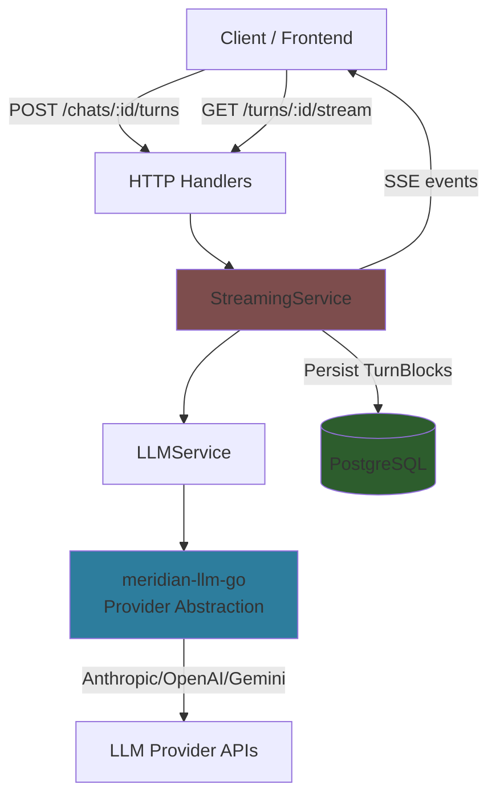

# Backend LLM Integration

**Purpose:** How Meridian backend integrates with the `meridian-llm-go` library for chat functionality.

---

## Overview

The Meridian backend uses the `meridian-llm-go` library to provide:

1. **Multi-provider chat** - Anthropic (current), OpenAI/Gemini (planned)
2. **Real-time streaming** - SSE with catchup for reconnections
3. **Tool execution** - Server-side web search, client-side bash/editor
4. **Turn persistence** - PostgreSQL storage with block accumulation
5. **Provider routing** - Model-based provider selection

**For library usage**, see: `../../meridian-llm-go/docs/`

---

## Documentation Index

### Library Documentation (meridian-llm-go)

For **standalone library usage**:

- **[Library README](../../meridian-llm-go/docs/README.md)** - Quick start, examples
- **[Blocks & Content Model](../../meridian-llm-go/docs/blocks.md)** - Message/Block structure
- **[Streaming](../../meridian-llm-go/docs/streaming.md)** - Real-time SSE streaming
- **[Tools](../../meridian-llm-go/docs/tools.md)** - Function calling
- **[Errors](../../meridian-llm-go/docs/errors.md)** - Error handling
- **[Capabilities](../../meridian-llm-go/docs/capabilities.md)** - Provider configs
- **[Providers](../../meridian-llm-go/docs/providers.md)** - Supported providers

### Backend Integration

For **Meridian backend implementation**:

- **[Architecture](./architecture.md)** - Backend service layer architecture
- **[LLM Integration](./llm-integration.md)** - How backend uses meridian-llm-go
- **[Provider Routing](./provider-routing.md)** - Model-based provider selection

### Backend Streaming

- **[Streaming Overview](./streaming/README.md)** - Backend streaming architecture
- **[Race Conditions](./streaming/race-conditions.md)** - Concurrency fixes
- **[API Endpoints](./streaming/api-endpoints.md)** - SSE endpoint details
- **[Tool Execution](./streaming/tool-execution.md)** - Tool execution flow
- **[Edge Cases](./streaming/edge-cases.md)** - Error handling

---

## Backend Architecture

The backend uses a 3-service architecture to integrate with `meridian-llm-go`:

**Key components:**

1. **LLMService** - Calls `meridian-llm-go` providers
2. **StreamingService** - Orchestrates streaming, persistence, SSE
3. **HTTP Handlers** - API endpoints for turns and streaming

See [architecture.md](./architecture.md) for details.

---

## Backend vs Library

| Concern | Library (meridian-llm-go) | Backend |
|---------|---------------------------|---------|
| **Provider abstraction** | ✅ Block-centric API | Uses library |
| **Streaming** | ✅ StreamEvent generation | SSE broadcast + catchup |
| **Tool execution** | ✅ Block representation | Tool execution loop |
| **Error handling** | ✅ LLMError normalization | Retry logic, user messages |
| **Blocks** | ✅ Core types (text, tool_use, etc.) | Extensions (reference, partial_reference) |
| **Persistence** | ❌ | ✅ PostgreSQL TurnBlocks |
| **Provider routing** | ❌ | ✅ Model-based selection |
| **Authentication** | ❌ | ✅ User sessions |

---

## Quick Links

**Implementation files:**
- Service: `backend/internal/service/llm/`
- Handlers: `backend/internal/handler/chat.go`, `backend/internal/handler/sse_handler.go`
- Models: `backend/internal/domain/models/llm/`
- Repository: `backend/internal/repository/postgres/llm/`

**Related docs:**
- Backend architecture: `../backend/architecture/`
- LLM integration: `./llm-integration.md`
- Streaming system: `./streaming/README.md`

---

**Questions?** See individual docs linked above.
