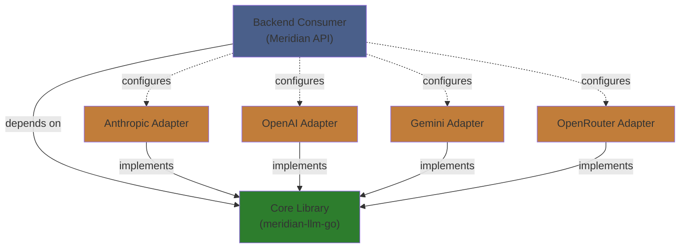
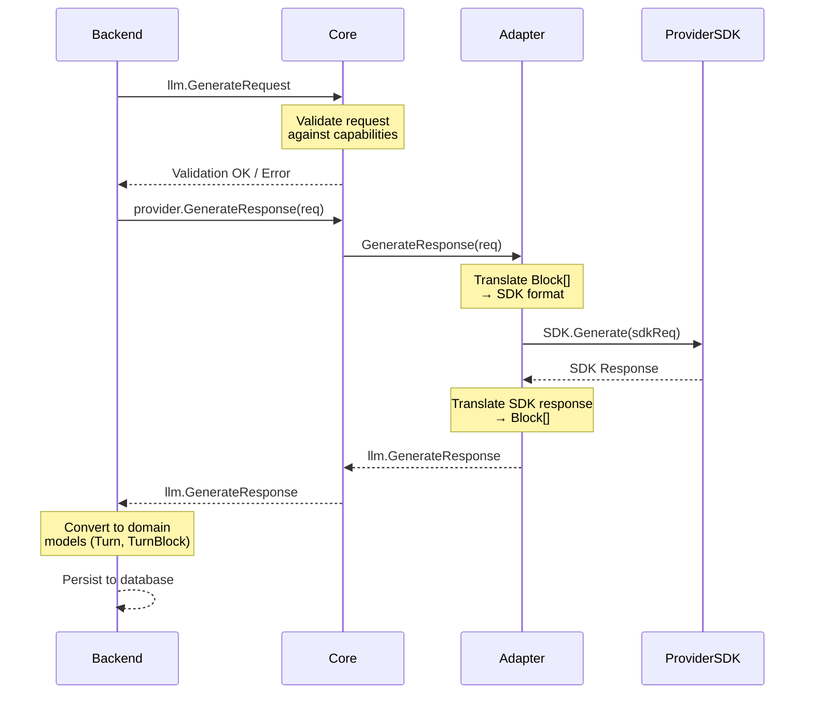

# LLM Library Architecture: Layered Boundaries

**Purpose:** Define clear architectural boundaries between core library, provider adapters, and backend consumer.

**Principles:** SOLID, dependency inversion, minimal coupling, maximal cohesion.

**Note:** This document describes the **meridian-llm-go library architecture**. For **backend integration architecture**, see:
- [Backend README](./README.md)
- [Backend Streaming Architecture](../backend/architecture/streaming-architecture.md)

For **library usage docs**, see: `../../meridian-llm-go/docs/`

---

## 1. Three-Layer Architecture



**Key Insight:** Dependencies point INWARD. Core knows nothing about adapters or consumers.

---

## 2. Layer Responsibilities

### 2.1 Core Library (`meridian-llm-go/`)

**Single Responsibility:** Define provider-agnostic abstractions for LLM interactions.

**What Lives Here:**
- ✅ Universal data structures (`Block`, `Message`, `StreamEvent`)
- ✅ Provider interface (`Provider`)
- ✅ Capability definitions (feature flags, constraints)
- ✅ Request/response types
- ✅ Error types (sentinel errors, typed errors)
- ✅ Validation logic (capability-based)
- ✅ Built-in tool catalog (registry, not implementations)

**What Does NOT Live Here:**
- ❌ Provider-specific logic (Anthropic message format, OpenAI reasoning JSON)
- ❌ SDK imports (no `anthropic.MessageParam` in core)
- ❌ HTTP clients (no `net/http` in core)
- ❌ Configuration management (no ENV var reading)
- ❌ Business logic (no "retry 3 times" policies)

**Design Constraints:**
- Must compile without any provider SDK dependencies
- All types must be JSON serializable (for REST API passthrough)
- No global state (everything via dependency injection)
- Immutable request/response objects (use pointers for optionality)

### 2.2 Provider Adapters (`meridian-llm-go/providers/*/`)

**Single Responsibility:** Translate between core abstractions and provider SDKs.

**What Lives Here:**
- ✅ Provider interface implementation
- ✅ SDK imports and initialization
- ✅ Translation logic (`Block[]` ↔ provider format)
- ✅ Streaming event conversion
- ✅ Provider-specific error handling
- ✅ SDK fallback to REST (when SDK lacks features)
- ✅ Built-in tool wiring (if provider supports)

**What Does NOT Live Here:**
- ❌ Core abstractions (no defining new `Block` types in adapters)
- ❌ Capability definitions (read from configs, don't hardcode)
- ❌ Cross-provider logic (no "if anthropic else openai")
- ❌ Business rules (no "max 3 retries" in adapter)

**Design Constraints:**
- Each adapter is independent (no shared code between adapters except core)
- Adapters should be pluggable (consumer can add custom adapters)
- Fail loudly (return errors, don't swallow them)
- No side effects (adapters don't log, emit metrics, or write files)

**Adapter Structure:**
```
providers/<provider>/
├── provider.go       # Implements core.Provider interface
├── adapter.go        # Translation: core ↔ SDK
├── streaming.go      # SSE/streaming handling
├── client.go         # SDK/HTTP client wrapper
├── errors.go         # Provider-specific error mapping
└── provider_test.go  # Integration tests
```

### 2.3 Backend Consumer (Meridian API)

**Single Responsibility:** Compose LLM capabilities into business features.

**What Lives Here:**
- ✅ Provider selection logic (route by model/feature/cost)
- ✅ Configuration loading (API keys, capability configs)
- ✅ Retry policies and error recovery
- ✅ Logging, metrics, tracing
- ✅ Rate limiting and quotas
- ✅ Request/response transformation (domain models ↔ library models)
- ✅ Custom tool implementations (if needed)
- ✅ Caching layer

**What Does NOT Live Here:**
- ❌ Provider translation logic (that's adapter's job)
- ❌ Core abstractions (use library as-is)
- ❌ SDK knowledge (consumer only knows core interfaces)

**Design Constraints:**
- Consumer depends ONLY on `meridian-llm-go` core package
- Provider adapters injected via dependency injection
- All provider-specific knowledge encapsulated in configs

---

## 3. Dependency Flow

### 3.1 Compile-Time Dependencies

```
backend/internal/service/llm/
    ↓ import
meridian-llm-go/              (core package)
    ↑ import (implements)
meridian-llm-go/providers/anthropic/
    ↓ import
github.com/anthropics/anthropic-sdk-go
```

**Key:** Backend never imports adapter packages directly. Adapters register themselves.

### 3.2 Runtime Dependencies (Initialization)

```go
// Backend initialization (backend/cmd/server/main.go)

// 1. Load capability configs
capabilityRegistry := llm.NewCapabilityRegistry()
capabilityRegistry.LoadEmbedded()  // Default configs
capabilityRegistry.LoadRemote(ctx) // Optional updates

// 2. Create provider registry
providerRegistry := llm.NewProviderRegistry(capabilityRegistry)

// 3. Register adapters (each adapter self-registers)
providerRegistry.Register("anthropic", anthropic.NewProvider(
    anthropic.WithAPIKey(cfg.AnthropicAPIKey),
))

providerRegistry.Register("openai", openai.NewProvider(
    openai.WithAPIKey(cfg.OpenAIAPIKey),
))

providerRegistry.Register("gemini", gemini.NewProvider(
    gemini.WithAPIKey(cfg.GeminiAPIKey),
    gemini.WithFallbackToREST(true), // Auto-fallback when SDK insufficient
))

// 4. Inject into service
llmService := service.NewLLMService(
    providerRegistry,
    service.WithRetryPolicy(retryPolicy),
    service.WithLogger(logger),
)
```

**Key:** Backend controls which adapters exist, but doesn't know their internals.

---

## 4. Feature Mapping: Which Layer Owns What?

### 4.1 Built-In Tools

**Core Library:**
```go
// Define UNIFIED tool abstraction
type BuiltInTool struct {
    UnifiedName string   // "search", "web_fetch", "code_exec", "apply_patch"
    Config      ToolConfig
}

type ToolConfig struct {
    // Universal parameters
    MaxResults   *int
    Timeout      *time.Duration

    // Capability-specific parameters
    Search      *SearchConfig
    WebFetch    *WebFetchConfig
    CodeExec    *CodeExecConfig
    ApplyPatch  *ApplyPatchConfig
}

type SearchConfig struct {
    AllowedDomains []string
    BlockedDomains []string
    MaxSearches    *int
}

type WebFetchConfig struct {
    URLs []string  // Max 20
    MaxSizePerURL int64
}

// Capability registry tracks which providers support which tools
type BuiltInToolSupport struct {
    UnifiedName     string
    ProviderMapping map[string]ProviderToolSpec // provider -> how they implement it
}

type ProviderToolSpec struct {
    NativeName    string      // Provider's actual tool name
    ExecutionSide ExecutionSide
    Parameters    interface{} // Provider-specific param schema
    Supported     bool
}
```

**Adapter Layer:**
```go
// Anthropic adapter
func (a *AnthropicAdapter) ConvertBuiltInTool(tool *BuiltInTool) (anthropic.Tool, error) {
    switch tool.UnifiedName {
    case "search":
        return anthropic.Tool{
            Type: anthropic.F("web_search_20250305"),
            Name: anthropic.F("web_search"),
            MaxUses: tool.Config.Search.MaxSearches,
            AllowedDomains: tool.Config.Search.AllowedDomains,
            BlockedDomains: tool.Config.Search.BlockedDomains,
        }, nil
    case "apply_patch":
        // Anthropic has text_editor, which is similar but not identical
        // Adapter translates apply_patch → text_editor semantics
        return anthropic.Tool{
            Type: anthropic.F("text_editor_20250728"),
            Name: anthropic.F("str_replace_based_edit_tool"),
        }, nil
    case "web_fetch":
        // Anthropic doesn't have native web_fetch
        // Return error with suggestion
        return nil, llm.ErrUnsupportedBuiltInTool{
            Tool:     "web_fetch",
            Provider: "anthropic",
            Suggestion: "Use custom tool implementation or switch to Gemini",
        }
    }
}

// Gemini adapter
func (g *GeminiAdapter) ConvertBuiltInTool(tool *BuiltInTool) (*genai.Tool, error) {
    switch tool.UnifiedName {
    case "search":
        return &genai.Tool{GoogleSearch: &genai.GoogleSearch{}}, nil
    case "web_fetch":
        if !g.sdkSupportsURLContext {
            // Fallback to REST API
            return g.fallbackToREST(tool)
        }
        return &genai.Tool{URLContext: &genai.URLContext{}}, nil
    case "code_exec":
        return &genai.Tool{CodeExecution: &genai.CodeExecution{}}, nil
    }
}
```

**Backend Consumer:**
```go
// Backend decides WHICH tools to enable per request
func (s *LLMService) GenerateTurn(ctx context.Context, req *TurnRequest) (*Turn, error) {
    // Business logic: enable search for certain conversation types
    tools := []llm.BuiltInTool{}

    if req.ConversationType == "research" {
        tools = append(tools, llm.BuiltInTool{
            UnifiedName: "search",
            Config: llm.ToolConfig{
                Search: &llm.SearchConfig{
                    MaxSearches: intPtr(5),
                    BlockedDomains: []string{"twitter.com"}, // Business rule
                },
            },
        })
    }

    if req.ConversationType == "coding" {
        tools = append(tools, llm.BuiltInTool{
            UnifiedName: "apply_patch",
        })
    }

    // Let library validate and route
    llmReq := &llm.GenerateRequest{
        Messages: s.convertToLLMMessages(req.Messages),
        Params: llm.RequestParams{
            BuiltInTools: tools,
        },
    }

    return s.provider.GenerateResponse(ctx, llmReq)
}
```

**Boundary Rules:**
- ✅ Core defines `BuiltInTool` abstraction with unified names
- ✅ Core capability registry tracks provider support (from config)
- ✅ Adapters translate unified tools → provider-specific format
- ✅ Adapters fail explicitly if tool unsupported
- ✅ Backend chooses which tools to enable (business logic)
- ❌ Core does NOT know provider names ("anthropic", "gemini")
- ❌ Adapters do NOT define new unified tool types
- ❌ Backend does NOT do provider-specific translation

### 4.2 Thinking/Reasoning

**Core Library:**
```go
type ThinkingConfig struct {
    Enabled         bool
    Effort          *string  // "minimal", "low", "medium", "high"
    ThinkingBudget  *int     // Explicit token budget
    IncludeThoughts bool     // Return thinking blocks in response
}

// Validation in core
func (v *RequestValidator) ValidateThinking(caps ProviderCapabilities, req *GenerateRequest) error {
    if req.Params.Thinking == nil || !req.Params.Thinking.Enabled {
        return nil
    }

    modelCaps := caps.GetModelCapabilities(req.Model)
    if !modelCaps.SupportsThinking {
        return ErrUnsupportedFeature{Feature: "thinking", Model: req.Model}
    }

    // Trust the provider to validate constraints
    // (e.g., Anthropic will error if thinking + forced tool choice is invalid)

    return nil
}
```

**Adapter Layer:**
```go
// Anthropic adapter
func (a *AnthropicAdapter) ConvertThinkingConfig(config *ThinkingConfig) *anthropic.MessageParam {
    if config == nil || !config.Enabled {
        return nil
    }

    // Anthropic uses token budgets
    budget := config.ThinkingBudget
    if budget == nil {
        // Convert effort to budget using configurable defaults
        budget = a.effortToBudget(config.Effort)
    }

    return &anthropic.Thinking{
        Type:         anthropic.F("enabled"),
        BudgetTokens: anthropic.F(*budget),
    }
}

// OpenAI adapter
func (o *OpenAIAdapter) ConvertThinkingConfig(config *ThinkingConfig) interface{} {
    if config == nil || !config.Enabled {
        return nil
    }

    // OpenAI uses effort levels (string)
    effort := config.Effort
    if effort == nil {
        // Convert budget to effort (reverse mapping)
        effort = o.budgetToEffort(config.ThinkingBudget)
    }

    // OpenAI Responses API expects JSON string for Reasoning parameter
    reasoningJSON := map[string]interface{}{
        "effort": *effort,
    }

    return reasoningJSON // Adapter marshals to string
}
```

**Backend Consumer:**
```go
// Backend sets thinking policy
func (s *LLMService) GenerateTurn(ctx context.Context, req *TurnRequest) (*Turn, error) {
    thinking := &llm.ThinkingConfig{
        Enabled: req.UserPreferences.EnableThinking,
        IncludeThoughts: true, // Always show reasoning
    }

    // Business logic: adjust effort based on conversation complexity
    if req.EstimatedComplexity > 0.7 {
        thinking.Effort = stringPtr("high")
    } else {
        thinking.Effort = stringPtr("medium")
    }

    llmReq := &llm.GenerateRequest{
        Params: llm.RequestParams{
            Thinking: thinking,
        },
    }

    return s.provider.GenerateResponse(ctx, llmReq)
}
```

**Boundary Rules:**
- ✅ Core defines `ThinkingConfig` with both effort and budget
- ✅ Core validates against capability constraints
- ✅ Adapters convert effort ↔ budget as needed
- ✅ Backend sets thinking policy (business logic)
- ❌ Core does NOT know conversion ratios (effort → budget)
- ❌ Adapters do NOT decide when to enable thinking
- ❌ Backend does NOT do provider-specific validation

### 4.3 Capability Configs

**Core Library:**
```go
type CapabilityRegistry struct {
    capabilities map[string]ProviderCapabilities
    configLoader ConfigLoader
}

type ConfigLoader interface {
    LoadEmbedded() (map[string]ProviderCapabilities, error)
    LoadRemote(ctx context.Context, url string) (map[string]ProviderCapabilities, error)
}

// Core reads configs, doesn't define them
func (cr *CapabilityRegistry) LoadEmbedded() error {
    // Use embed.FS to load from config/capabilities/*.yaml
    configs, err := cr.configLoader.LoadEmbedded()
    if err != nil {
        return err
    }

    for provider, caps := range configs {
        cr.capabilities[provider] = caps
    }

    return nil
}
```

**Config Files (Embedded in Library):**
```yaml
# config/capabilities/anthropic.yaml
provider: anthropic

models:
  claude-sonnet-4-5-20250929:
    context_window: 200000
    max_output_tokens: 64000
    input_price_per_mtok: 3.0
    output_price_per_mtok: 15.0
    features:
      vision: true
      tool_calling: true
      thinking: true
      streaming: true
    modalities: [text, image]
    status: current

  claude-3-5-haiku-20241022:
    context_window: 200000
    max_output_tokens: 8000
    input_price_per_mtok: 0.8
    output_price_per_mtok: 4.0
    features:
      vision: true
      tool_calling: true
      thinking: false  # Key difference
      streaming: true
    modalities: [text, image]
    status: legacy

thinking:
  type: token_budget
  min_budget: 1024
  max_budget: 200000
  supports_effort: false
  supports_budget: true
  constraints:
    - type: tool_choice
      incompatible_with: [required, specific]
      reason: "Extended thinking only works with tool_choice 'auto' or 'none'"

built_in_tools:
  search:
    native_name: web_search_20250305
    native_support: true
    execution_side: server
    requires_version: true
    per_request_cost: 0.01  # $10 per 1K searches
    parameters:
      max_uses: {type: int, optional: true}
      allowed_domains: {type: array, optional: true}
      blocked_domains: {type: array, optional: true}

  web_fetch:
    native_support: false  # Anthropic doesn't have this

  apply_patch:
    native_name: text_editor_20250728
    native_support: true
    execution_side: client
    requires_version: true
    token_cost: 700  # Additional input tokens
    semantic_match: approximate  # Similar to apply_patch, not identical
```

**Backend Consumer:**
```go
// Backend can override with remote configs
func (s *Server) Initialize(ctx context.Context) error {
    capRegistry := llm.NewCapabilityRegistry()

    // Load embedded defaults
    if err := capRegistry.LoadEmbedded(); err != nil {
        return err
    }

    // Optionally fetch latest from CDN
    if s.config.UseRemoteCapabilities {
        remoteURL := "https://cdn.meridian.app/llm-capabilities/latest.json"
        if err := capRegistry.LoadRemote(ctx, remoteURL); err != nil {
            s.logger.Warn("Failed to load remote capabilities, using embedded",
                "error", err)
        }
    }

    s.capabilityRegistry = capRegistry
    return nil
}
```

**Boundary Rules:**
- ✅ Core defines capability schema (Go structs)
- ✅ Capability configs embedded in library (YAML/JSON)
- ✅ Core loads and parses configs
- ✅ Backend can override with remote configs
- ✅ Adapters read capabilities at runtime (no hardcoded checks)
- ❌ Adapters do NOT define capabilities (read-only)
- ❌ Backend does NOT define capability schema
- ❌ Configs do NOT contain business logic (just facts)

### 4.4 Error Handling

**Core Library:**
```go
// Define error types
type UnsupportedFeatureError struct {
    Feature    string
    Provider   string
    Model      string
    Reason     string
    Suggestion string
}

// Deprecated in V5: provider APIs enforce constraints; keep for legacy context only.
type ConstraintViolationError struct {
    Constraint string
    Reason     string
    Mitigation []string
}

// Core validation returns typed errors
func (v *RequestValidator) Validate(provider string, req *GenerateRequest) error {
    // Returns core error types
    return &UnsupportedFeatureError{...}
}
```

**Adapter Layer:**
```go
// Adapter wraps SDK errors
func (a *AnthropicAdapter) GenerateResponse(ctx context.Context, req *llm.GenerateRequest) (*llm.GenerateResponse, error) {
    resp, err := a.client.Messages.New(ctx, params)
    if err != nil {
        // Translate SDK error → core error
        return nil, a.mapError(err)
    }
    return resp, nil
}

func (a *AnthropicAdapter) mapError(err error) error {
    var apiErr *anthropic.APIError
    if errors.As(err, &apiErr) {
        switch apiErr.StatusCode {
        case 400:
            return llm.ErrInvalidRequest{Reason: apiErr.Message}
        case 429:
            return llm.ErrRateLimited{RetryAfter: apiErr.RetryAfter}
        case 500:
            return llm.ErrProviderError{Provider: "anthropic", Message: apiErr.Message}
        }
    }
    return llm.ErrUnknown{Underlying: err}
}
```

**Backend Consumer:**
```go
// Backend handles errors with retries, logging, metrics
func (s *LLMService) GenerateTurn(ctx context.Context, req *TurnRequest) (*Turn, error) {
    resp, err := s.provider.GenerateResponse(ctx, llmReq)
    if err != nil {
        // Check typed errors
        var rateLimitErr llm.ErrRateLimited
        if errors.As(err, &rateLimitErr) {
            // Business logic: retry with backoff
            return s.retryWithBackoff(ctx, llmReq, rateLimitErr.RetryAfter)
        }

        var unsupportedErr llm.UnsupportedFeatureError
        if errors.As(err, &unsupportedErr) {
            // Business logic: log and suggest alternative
            s.logger.Error("Feature not supported",
                "feature", unsupportedErr.Feature,
                "model", unsupportedErr.Model,
                "suggestion", unsupportedErr.Suggestion)
            return nil, fmt.Errorf("cannot complete request: %w", err)
        }

        return nil, err
    }

    return resp, nil
}
```

**Boundary Rules:**
- ✅ Core defines error types
- ✅ Core validation returns typed errors
- ✅ Adapters map SDK errors → core errors
- ✅ Backend handles errors (retry, log, metrics)
- ❌ Core does NOT log or emit metrics
- ❌ Adapters do NOT retry (stateless)
- ❌ Backend does NOT know SDK error types

---

## 5. Data Flow: Request Lifecycle



**Key Points:**
1. Backend works with domain models (`Turn`, `TurnBlock`)
2. Core works with library models (`GenerateRequest`, `Block`)
3. Adapter works with SDK models (`anthropic.MessageParam`)
4. No layer skips another (no Backend → Adapter directly)

---

## 6. Extension Points

### 6.1 Adding a New Provider

**Steps:**
1. Create `meridian-llm-go/providers/<provider>/`
2. Implement `core.Provider` interface
3. Add capability config: `config/capabilities/<provider>.yaml`
4. Write adapter translation logic
5. Add integration tests
6. Backend registers provider at initialization

**What Changes:**
- ✅ New adapter package (additive)
- ✅ New capability config (additive)
- ✅ Backend initialization (adds registration)
- ❌ Core interfaces (unchanged)
- ❌ Other adapters (unchanged)

### 6.2 Adding a New Built-In Tool

**Steps:**
1. Add unified tool name to `BuiltInTool` constants
2. Add tool config struct to `ToolConfig`
3. Update capability configs for each provider
4. Implement translation in each adapter
5. Add validation logic in core

**What Changes:**
- ✅ Core tool abstractions (extends enum)
- ✅ Capability configs (adds tool support)
- ✅ Each adapter (adds translation case)
- ❌ Provider interface (unchanged)
- ❌ Backend (no changes needed unless using new tool)

### 6.3 Adding a New Block Type

**Steps:**
1. Add block type constant in core
2. Document block content schema
3. Update adapters to handle new type (or return unsupported)
4. Backend may use new block type in responses

**What Changes:**
- ✅ Core `Block` constants (extends enum)
- ✅ Adapters (may need translation logic)
- ✅ Backend (if consuming new block type)
- ❌ `Block` struct itself (flexible `Content` field handles it)

---

## 7. SOLID Principles Applied

### Single Responsibility Principle

| Layer | Responsibility | NOT Responsible For |
|-------|---------------|---------------------|
| Core | Define abstractions | Provider-specific logic |
| Adapter | Translate formats | Business rules, validation |
| Backend | Business logic | Format translation, SDK errors |

### Open/Closed Principle

- Core is **open for extension** (new providers, tools, block types)
- Core is **closed for modification** (adding providers doesn't change core)

### Liskov Substitution Principle

- Any `Provider` implementation is **interchangeable**
- Backend can swap providers without code changes

### Interface Segregation Principle

- `Provider` interface is **minimal** (4 methods)
- Adapters don't implement unused methods
- Capability queries separated from generation

### Dependency Inversion Principle

- Backend depends on `Provider` **abstraction** (not concrete adapters)
- Adapters depend on `Provider` **interface** (not internal core details)
- High-level modules don't depend on low-level modules

---

## 8. Anti-Patterns to Avoid

### ❌ Leaky Abstraction
```go
// BAD: Core knows about Anthropic
type Block struct {
    AnthropicSignature *string // Provider-specific field
}

// GOOD: Core uses flexible Content
type Block struct {
    Content map[string]interface{} // Can hold "signature" for any provider
}
```

### ❌ Adapter Reaching Into Core
```go
// BAD: Adapter modifies core validation
func (a *Adapter) Validate(req *Request) error {
    // Adapter shouldn't do core's job
}

// GOOD: Adapter returns error, core validates
func (a *Adapter) ConvertRequest(req *Request) (interface{}, error) {
    if unsupported {
        return nil, core.ErrUnsupportedFeature{...}
    }
}
```

### ❌ Backend Knowing Provider Details
```go
// BAD: Backend does provider-specific logic
if provider == "anthropic" {
    req.ThinkingBudget = 6000
} else if provider == "openai" {
    req.ReasoningEffort = "medium"
}

// GOOD: Backend uses unified abstraction
req.Thinking = &ThinkingConfig{
    Effort: stringPtr("medium"), // Core/adapter handles conversion
}
```

### ❌ Global State
```go
// BAD: Global registry
var GlobalProviderRegistry = &ProviderRegistry{}

// GOOD: Dependency injection
func NewLLMService(registry *ProviderRegistry) *LLMService {
    return &LLMService{registry: registry}
}
```

---

## 9. Testing Strategy by Layer

### Core Tests
- Unit tests for validation logic
- Capability loading tests
- Error type tests
- No provider SDK dependencies

### Adapter Tests
- Unit tests for translation logic (mock SDK responses)
- Integration tests for real provider APIs (requires keys)
- Error mapping tests

### Backend Tests
- Unit tests with mocked `Provider` interface
- Integration tests with real adapters
- End-to-end tests with database

---

## 10. Summary: Boundary Checklist

Before adding a feature, ask:

**Does this belong in Core?**
- [ ] Is it provider-agnostic?
- [ ] Does every provider need it?
- [ ] Can it be expressed abstractly?

**Does this belong in Adapter?**
- [ ] Is it provider-specific translation?
- [ ] Does it require SDK knowledge?
- [ ] Is it stateless transformation?

**Does this belong in Backend?**
- [ ] Is it business logic?
- [ ] Does it involve multiple systems (DB, cache, etc.)?
- [ ] Is it about request orchestration?

**If unsure:** Start in Core with minimal abstraction. Move to adapter when provider differences emerge. Move to backend when business rules emerge.

---

**End of Architecture Document**
