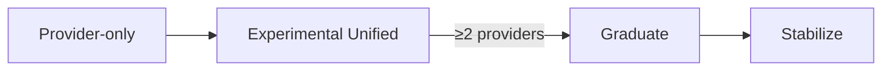

# Extensibility & Lifecycle (Future Updates)

Purpose: how to adopt new provider features with minimal churn.

## Config‑Only Upgrades
- New/updated models: add to capability YAML (IDs, limits, pricing, features), reload.
- Thinking ranges/defaults: adjust `min_budget`/`max_budget`/`default_budget` and effort map.
- Provider gains a unified tool: set `built_in_tools.<name>.native_support: true`, update routing.
- Prefer CustomTools for app‑specific features (no adapter changes).

## Provider‑Only Feature Lifecycle
- Explore: prototype as CustomTool or keep provider‑specific in your app.
- Experimental unified: reserve a unified tool/block name; adapters map native→native, others→function schema or client polyfill.
- Graduate: when ≥2 providers converge, promote common params to typed fields; keep edge cases in `ToolConfig.Extras`.
- Stabilize: document v1; maintain polyfill; deprecate temporary knobs later.

## Escape Hatches (Keep Minimal)
- `ToolConfig.Extras map[string]any`: temporary per‑tool params. Adapters may read known keys; others ignore.
- Avoid global hint bags until needed; promote to typed fields only after convergence.

## When Library Changes Are Required
- New provider‑native tool format not yet mapped → add small adapter case + capability YAML.
- New block/stream event type → adapter decode + (optional) new `BlockType` docs.

## Tests (Future Features)
- Contract tests per adapter (mapping, error normalization, execution side).
- Cross‑provider: assert invariants (ordering, tool loop semantics), not text equality.

