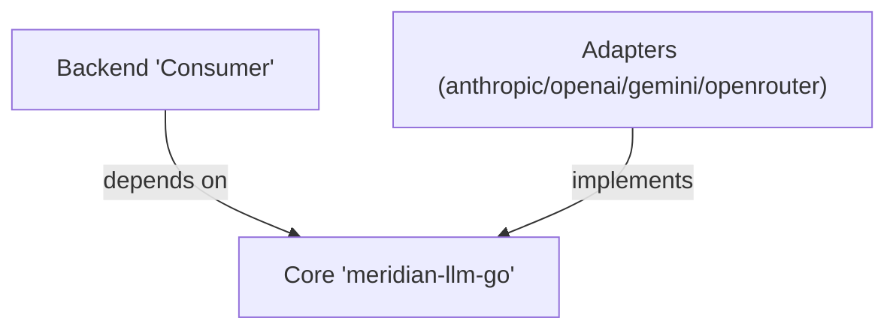
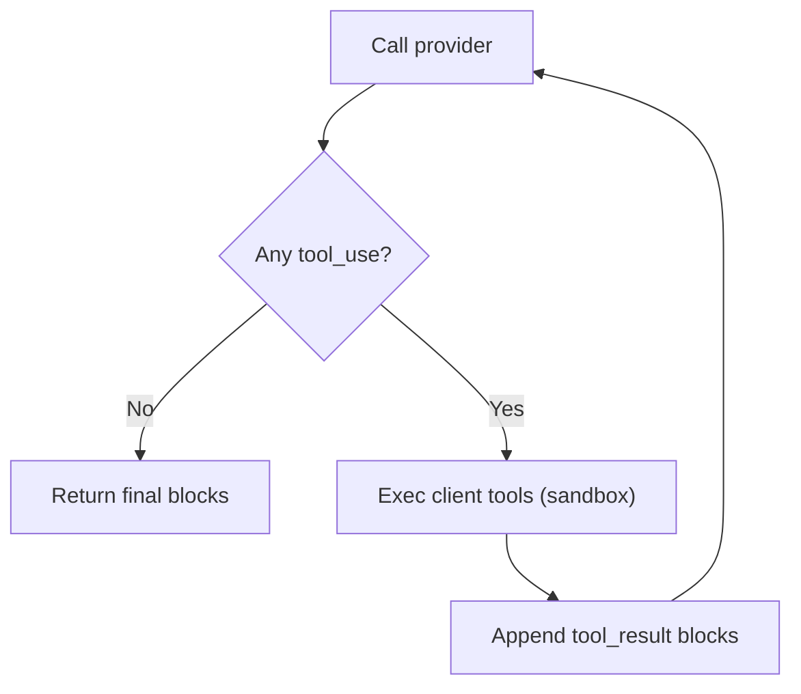

# LLM Provider Unification — Implementation Gotchas

Keep this short, practical, and enforced in code review.

## Core Principles
- SOLID always; one responsibility per package/file.
- Structure is the product: the 3-layer boundary is sacred.
- DRY across layers: configs via YAML anchors; constants in one place; helpers have one canonical name.
- Trust providers: don’t re-implement their validation; let errors flow and normalize them.
- Minimal capability configs: user-facing facts only; no adapter internals.

## Layering Rules (Do/Don’t)
- Do: keep dependencies pointing inward (Backend → Core; Adapters → Core).
- Don’t: import provider SDKs in Core, or Core types in Adapters beyond defined interfaces.
- Do: ensure Core compiles without any provider SDKs.
- Don’t: put provider translation or business logic in Core.
- Do: keep request/response structs immutable; use typed option fields.

## Tools & Execution Side
- Adapters must tag blocks with `ExecutionSide` when decoding.
- Fallback order to detect side: Block tag → streaming event → capability default.
- Server-executed tools: don’t execute locally; results arrive in response blocks.
- Client-executed tools: sandbox strictly; never shell out unsafely; enforce timeouts.
- Limit tool loop iterations (e.g., 10) and surface an explicit error on cap.
- Decode tool inputs into typed structs; avoid unsafe type assertions that can panic.

## Capability Configs
- Use `native_support`, `execution_side`, pricing; nothing else.
- Keep naming consistent across all docs and code.
- Manual reload only (SIGHUP/deploy); no TTL unless explicitly required.
- Use YAML anchors for shared model features/pricing.
- Don’t include adapter internals (native names, versions, sdk flags) in capability files.

## Thinking/Reasoning
- `ThinkingConfig`: support both effort and explicit budget; adapters convert.
- Validate budgets against provider ranges only; let providers reject incompatible combos.
- `IncludeThoughts`: document provider behavior; don’t promise raw chain-of-thought if provider doesn’t return it.
- Sentinel handling (e.g., `-1` for dynamic budgets) must be adapter-specific and documented.

## Error Handling
- Normalize to typed categories; always include provider code, HTTP status, request ID when available.
- Don’t swallow provider messages—surface them with our category.
- Streaming: handle mid-stream failures distinctly from pre-token HTTP errors.
- Retry only on retryable categories; backoff policies live in Backend.

## Streaming
- Accumulate deltas deterministically; preserve block ordering.
- Treat stream interruptions as first-class errors; clean up goroutines.
- Timeouts: distinguish idle stream timeout vs overall request timeout.

## Testing & Conformance
- Test invariants (tool loop semantics, error categories, ordering), not exact text parity across providers.
- Contract tests for adapters: request translation, error normalization, execution-side tagging.
- Integration tests should allow provider flakiness; avoid brittle goldens.

## Security
- Code execution tools must be sandboxed/disabled by default in prod.
- Apply-patch: enforce relative paths; block path traversal; size limits.
- Web fetch/custom fetch: block internal IPs; validate schemes; enforce size/time limits.
- Redact secrets in logs; never echo provider keys or user data.

## Naming & Constants
- Use adapter constants for provider tool versions; don’t scatter magic strings.
- One canonical helper name: `FindProvidersWithTool(toolName string) []string`.
- Use typed string constants for error categories and block types.

<!-- Future-facing upgrade guidance moved to Extensibility & Lifecycle doc -->

## Common Footguns
- Using `supported` instead of `native_support` in capability YAML.
- Assuming streaming is required to infer execution side (set the block tag instead).
- Unsafe `.(type)` assertions on tool inputs.
- Executing server-side tools locally (duplicate work and inconsistent state).
- Over-validating requests and drifting from provider behavior.

## Pre‑PR Checklist
- Boundaries: Core has zero provider SDK imports; Adapters have zero business logic.
- Configs: only minimal fields; naming consistent; YAML anchors used.
- Tools: block tagging implemented; loop has max iterations; client tools sandboxed.
- Errors: normalized categories present; provider details preserved.
- Tests: adapter contract tests added; invariants over text equality.
- Docs: references instead of duplication; diagrams explain the flow.
