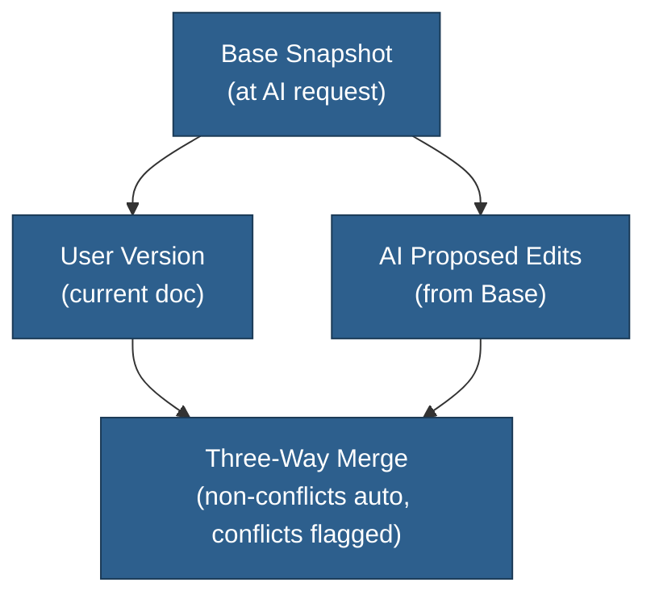

detail: minimal
audience: architect
status: backlog
implementation: post-mvp
---
 
# AI Suggestions (Three-Way Merge) — Backlog

This is an outline for a future feature. Do not implement until prioritized.

## Idea
Let AI propose edits while users continue typing, then reconcile via three‑way merge (Base, User, AI). User edits always win; non‑conflicting AI edits apply cleanly; conflicts surface for review.

## High‑Level



## Notes
- Snapshot Base at AI request time; compute diffs against Base.
- Persist sessions separately from documents; expire safely.
- Start with character‑level diff; upgrade only if needed.

## When We Build It
- Define minimal DTOs and endpoints.
- Store sessions in DB; add small Dexie cache only if necessary.
- Keep UI passive until we have confident merge quality.

  type: 'insert' | 'delete' | 'replace'
  start: number
  end: number
  text: string
}

function diffToRanges(
  baseText: string,
  newText: string
): ChangeRange[] {
  const diff = diffChars(baseText, newText)
  const ranges: ChangeRange[] = []
  let position = 0

  diff.forEach(part => {
    if (part.added) {
      ranges.push({
        type: 'insert',
        start: position,
        end: position,
        text: part.value
      })
    } else if (part.removed) {
      ranges.push({
        type: 'delete',
        start: position,
        end: position + part.value.length,
        text: ''
      })
      position += part.value.length
    } else {
      position += part.value.length
    }
  })

  return ranges
}
```

**Step 3: Detect Conflicts**

```typescript
function rangesOverlap(a: ChangeRange, b: ChangeRange): boolean {
  return !(a.end <= b.start || b.end <= a.start)
}

function detectConflicts(
  userChanges: ChangeRange[],
  aiChanges: ChangeRange[]
): Array<{ userChange: ChangeRange, aiChange: ChangeRange }> {
  const conflicts = []

  for (const aiChange of aiChanges) {
    for (const userChange of userChanges) {
      if (rangesOverlap(aiChange, userChange)) {
        conflicts.push({ userChange, aiChange })
      }
    }
  }

  return conflicts
}
```

**Step 4: Map Positions**

```typescript
function mapPositionThroughChanges(
  position: number,
  changes: ChangeRange[]
): number {
  let mapped = position

  for (const change of changes) {
    if (change.start <= position) {
      if (change.type === 'insert') {
        mapped += change.text.length
      } else if (change.type === 'delete') {
        if (change.end <= position) {
          mapped -= (change.end - change.start)
        } else {
          // Position was inside deleted range - invalid
          return -1
        }
      } else if (change.type === 'replace') {
        const deletedLength = change.end - change.start
        const insertedLength = change.text.length
        mapped += (insertedLength - deletedLength)
      }
    }
  }

  return mapped
}
```

**Step 5: Apply Three-Way Merge**

```typescript
interface Suggestion {
  type: 'clean' | 'conflict'
  start: number
  end: number
  text: string
  description: string
  userVersion?: string  // For conflicts
}

async function applyThreeWayMerge(
  sessionId: string
): Promise<Suggestion[]> {
  const session = await db.aiSessions.get(sessionId)
  const document = await db.documents.get(session.documentId)

  const baseText = session.baseSnapshot
  const userText = document.content
  const aiText = applyEditsToText(baseText, session.aiEdits)

  // Calculate diffs
  const userChanges = diffToRanges(baseText, userText)
  const aiChanges = session.aiEdits

  // Detect conflicts
  const conflicts = detectConflicts(userChanges, aiChanges)
  const conflictedAIEdits = new Set(
    conflicts.map(c => c.aiChange)
  )

  // Categorize AI edits
  const suggestions: Suggestion[] = aiChanges.map(aiEdit => {
    const isConflict = conflictedAIEdits.has(aiEdit)

    if (isConflict) {
      // User already edited this area
      return {
        type: 'conflict',
        start: aiEdit.start,
        end: aiEdit.end,
        text: aiEdit.text || '',
        description: aiEdit.description,
        userVersion: userText.substring(aiEdit.start, aiEdit.end)
      }
    } else {
      // Clean edit - map to current position
      const mappedStart = mapPositionThroughChanges(
        aiEdit.start,
        userChanges
      )
      const mappedEnd = mapPositionThroughChanges(
        aiEdit.end,
        userChanges
      )

      if (mappedStart === -1 || mappedEnd === -1) {
        // Position deleted by user - treat as conflict
        return {
          type: 'conflict',
          start: aiEdit.start,
          end: aiEdit.end,
          text: aiEdit.text || '',
          description: `${aiEdit.description} (area was deleted)`,
          userVersion: '[deleted]'
        }
      }

      return {
        type: 'clean',
        start: mappedStart,
        end: mappedEnd,
        text: aiEdit.text || '',
        description: aiEdit.description
      }
    }
  })

  return suggestions
}
```

### UI Implementation

#### Inline Suggestion Rendering (TipTap)

**Custom TipTap Mark for Suggestions**:

```typescript
import { Mark } from '@tiptap/core'

export const AISuggestion = Mark.create({
  name: 'aiSuggestion',

  addAttributes() {
    return {
      suggestionId: { default: null },
      type: { default: 'clean' },
      originalText: { default: '' },
      suggestedText: { default: '' },
      description: { default: '' }
    }
  },

  parseHTML() {
    return [{ tag: 'span[data-ai-suggestion]' }]
  },

  renderHTML({ HTMLAttributes }) {
    const { type } = HTMLAttributes

    return [
      'span',
      {
        'data-ai-suggestion': true,
        'data-type': type,
        class: type === 'conflict'
          ? 'ai-suggestion-conflict'
          : 'ai-suggestion-clean',
        style: type === 'conflict'
          ? 'background: #9d4d7d30; border-bottom: 2px solid #9d4d7d'
          : 'background: #2d7d2d30; border-bottom: 2px solid #2d7d2d'
      },
      0
    ]
  }
})
```

**Render Suggestions in Editor**:

```typescript
function renderSuggestionsInEditor(
  editor: Editor,
  suggestions: Suggestion[]
) {
  suggestions.forEach((suggestion, index) => {
    const { type, start, end, text, description, userVersion } = suggestion

    if (type === 'clean') {
      // Show as inline suggestion (like Google Docs)
      editor.chain()
        .setTextSelection({ from: start, to: end })
        .setMark('aiSuggestion', {
          suggestionId: index,
          type: 'clean',
          originalText: editor.state.doc.textBetween(start, end),
          suggestedText: text,
          description
        })
        .run()
    } else {
      // Show as conflict marker
      editor.chain()
        .setTextSelection({ from: start, to: end })
        .setMark('aiSuggestion', {
          suggestionId: index,
          type: 'conflict',
          originalText: userVersion,
          suggestedText: text,
          description
        })
        .run()
    }
  })
}
```

**Accept/Reject UI**:

```tsx
function SuggestionTooltip({ suggestion, position }) {
  const handleAccept = () => {
    editor.chain()
      .setTextSelection({ from: position.start, to: position.end })
      .insertContent(suggestion.suggestedText)
      .unsetMark('aiSuggestion')
      .run()

    markSuggestionApplied(suggestion.id)
  }

  const handleReject = () => {
    editor.chain()
      .setTextSelection({ from: position.start, to: position.end })
      .unsetMark('aiSuggestion')
      .run()

    markSuggestionRejected(suggestion.id)
  }

  return (
    <div className="suggestion-tooltip">
      <div className="suggestion-header">
        {suggestion.type === 'conflict' ? (
          <>
            <AlertIcon />
            <span>You and AI both edited this</span>
          </>
        ) : (
          <>
            <SparklesIcon />
            <span>AI suggestion</span>
          </>
        )}
      </div>

      <div className="suggestion-body">
        <p>{suggestion.description}</p>

        {suggestion.type === 'conflict' && (
          <div className="conflict-comparison">
            <div>
              <strong>Your version:</strong>
              <code>{suggestion.userVersion}</code>
            </div>
            <div>
              <strong>AI suggested:</strong>
              <code>{suggestion.suggestedText}</code>
            </div>
          </div>
        )}
      </div>

      <div className="suggestion-actions">
        <button onClick={handleAccept}>Accept</button>
        <button onClick={handleReject}>Reject</button>
        <button onClick={handleEdit}>Edit Manually</button>
      </div>
    </div>
  )
}
```

## UX Flow

### Happy Path (No Conflicts)

```mermaid
sequenceDiagram
    participant User
    participant Chat
    participant Editor
    participant AI
    participant DB as IndexedDB

    User->>Chat: "Make the tavern scene more vivid"
    Chat->>DB: Save base snapshot
    Chat->>AI: Request edits with base version

    Note over AI: AI generates 3 edits:<br/>Lines that user didn't touch

    AI-->>DB: Store edits in session
    AI-->>Chat: "I've suggested some changes"

    User->>Editor: Opens document
    Editor->>DB: Load document + AI session
    Editor->>Editor: Calculate diffs (no conflicts!)
    Editor->>User: Show 3 inline suggestions ✨

    User->>Editor: Click "Accept" on suggestion 1
    Editor->>DB: Apply edit, update session
    Editor->>User: Suggestion applied ✓

    User->>Editor: Click "Accept All"
    Editor->>DB: Apply remaining edits
    Editor->>DB: Delete session (all applied)
    Editor->>User: All suggestions applied ✓

    style AI fill:#2d7d2d
    style Editor fill:#2d5f8d
```

### Conflict Path

```mermaid
sequenceDiagram
    participant User
    participant Chat
    participant Editor
    participant AI
    participant DB as IndexedDB

    User->>Chat: "Make the tavern scene more vivid"
    Chat->>DB: Save base snapshot
    Chat->>AI: Request edits with base version

    Note over User,Editor: User continues editing while AI works

    User->>Editor: Edits line 5: "tavern" → "tavern, sword at side"
    Editor->>DB: Auto-save user's edit

    AI-->>DB: Store edits (includes edit to line 5)
    AI-->>Chat: "I've suggested some changes"

    User->>Editor: Opens document
    Editor->>DB: Load document + AI session
    Editor->>Editor: Calculate diffs:<br/>- 2 clean suggestions<br/>- 1 conflict (line 5)

    Editor->>User: Show suggestions:<br/>✨ 2 clean (green)<br/>⚠️ 1 conflict (yellow)

    User->>Editor: Click conflict marker
    Editor->>User: Show comparison:<br/>Your: "tavern, sword at side"<br/>AI: "dimly lit tavern"

    User->>Editor: Choose "Edit Manually"
    User->>Editor: Types: "dimly lit tavern, sword at side"
    Editor->>DB: Save merged version
    Editor->>DB: Mark suggestion as applied

    User->>Editor: Click "Accept All" (remaining clean)
    Editor->>DB: Apply clean suggestions
    Editor->>DB: Delete session
    Editor->>User: All resolved ✓

    style AI fill:#2d7d2d
    style Editor fill:#b8860b
```

## Implementation Libraries

### Recommended

**Diff Algorithm**: `fast-myers-diff`
```bash
npm install fast-myers-diff
```

Why:
- 6-50x faster than alternatives
- 4KB minified
- TypeScript support
- Battle-tested (used in VS Code, Git)

**Alternative**: `diff` (jsdiff)
```bash
npm install diff
```

Why:
- More features (word diff, line diff, JSON diff)
- Larger bundle (12KB)
- More familiar API

### TipTap Extensions

```bash
npm install @tiptap/core @tiptap/pm @tiptap/react
```

Custom marks and decorations for inline suggestions.

## Storage & Performance

### Storage Estimates

**Per AI Session**:
- Base snapshot: ~10-50KB (markdown document)
- AI edits array: ~1-5KB (metadata + diffs)
- Total: ~15-55KB per session

**Typical Usage**:
- 5-10 active sessions: 75-550KB
- 50 sessions (heavy user): 750KB - 2.75MB
- Well within IndexedDB quota (50MB-10GB)

### Cleanup Strategy

```typescript
// Run on app startup and every hour
async function cleanupExpiredSessions() {
  const now = Date.now()

  // Delete expired sessions
  await db.aiSessions
    .where('expiresAt')
    .below(now)
    .delete()

  // Also delete in backend
  await fetch('/api/ai-sessions/cleanup', { method: 'POST' })
}

// Exponential cleanup if storage pressure
async function emergencyCleanup() {
  // Delete rejected sessions older than 1 hour
  await db.aiSessions
    .where('status').equals('rejected')
    .and(s => s.createdAt < Date.now() - 3600000)
    .delete()

  // If still tight, delete all rejected
  const estimate = await navigator.storage.estimate()
  if (estimate.usage / estimate.quota > 0.9) {
    await db.aiSessions
      .where('status').equals('rejected')
      .delete()
  }
}
```

## Trade-offs

### Advantages

✅ **Precise conflict detection** - Character-level accuracy
✅ **User work never lost** - User edits always preserved
✅ **Handles complex edits** - Insertions, deletions, moves
✅ **Industry-proven** - Same approach as git/GitHub
✅ **Clean UX** - Clear visual distinction between clean/conflict suggestions
✅ **Local-first compatible** - Works offline, syncs later

### Disadvantages

⚠️ **Storage overhead** - Must store base snapshot (10-50KB per session)
⚠️ **Diff calculation cost** - O(n*m) for Myers algorithm (~1ms for <100KB docs)
⚠️ **Complexity** - More moving parts than naive approaches
⚠️ **UI complexity** - Inline suggestions require custom TipTap marks

### Mitigations

- Automatic cleanup keeps storage usage low
- Diff calculation is fast enough for <100KB documents (typical chapter)
- Complexity is abstracted behind clear API
- TipTap marks provide smooth UX

## Integration with Existing Architecture

### Relationship to flows.md

This system extends **Flow 1: Auto-Save Flow** with AI suggestions:

```
User edits → Debounce → IndexedDB → Sync Queue → Backend
                ↓
         (Meanwhile)
                ↓
AI suggests → Store session → Show in editor → User accepts
                                     ↓
                              Apply to IndexedDB → Sync Queue
```

**Key difference**: AI suggestions go through review UI before hitting IndexedDB/sync queue.

### Sync Queue Interaction

AI suggestions are **not queued for sync** until accepted:

```typescript
async function acceptSuggestion(suggestionId: string) {
  const suggestion = await db.aiSessions.get(suggestionId)
  const document = await db.documents.get(suggestion.documentId)

  // Apply to document
  document.content = applySuggestion(document.content, suggestion)
  await db.documents.put(document)

  // NOW queue for sync (just like manual edit)
  await db.syncQueue.add({
    operation: 'update',
    documentId: document.id,
    data: { content: document.content }
  })

  // Delete session
  await db.aiSessions.delete(suggestionId)
}
```

This ensures only accepted changes sync to backend.

## Future Considerations

### Phase 1: MVP (Single-Device)

✅ Implement as documented above
✅ IndexedDB storage only
✅ Manual conflict resolution
✅ Basic inline suggestion UI

### Phase 2: Multi-Device

Challenges:
- AI sessions need to sync across devices
- What if user accepts on device A, rejects on device B?

Solution:
- Store AI sessions in backend
- Sync session state (applied/rejected) via sync queue
- Last-write-wins for session state (like document edits)

### Phase 3: Real-Time Collaboration

Challenges:
- Multiple users, multiple AI suggestions
- Operational Transform / CRDT needed

Solution:
- Use Y.js for document state
- AI edits become Y.js operations
- Automatic merge via CRDT

## References

- **Local-first flows**: `_docs/technical/frontend/flows.md`
- **Backend API contracts**: `_docs/technical/backend/api-contracts.md`
- **High-level product vision**: `_docs/high-level/1-overview.md`
- **Myers diff algorithm**: [Original paper](http://www.xmailserver.org/diff2.pdf)
- **TipTap docs**: [tiptap.dev](https://tiptap.dev)
- **Dexie.js docs**: [dexie.org](https://dexie.org)
