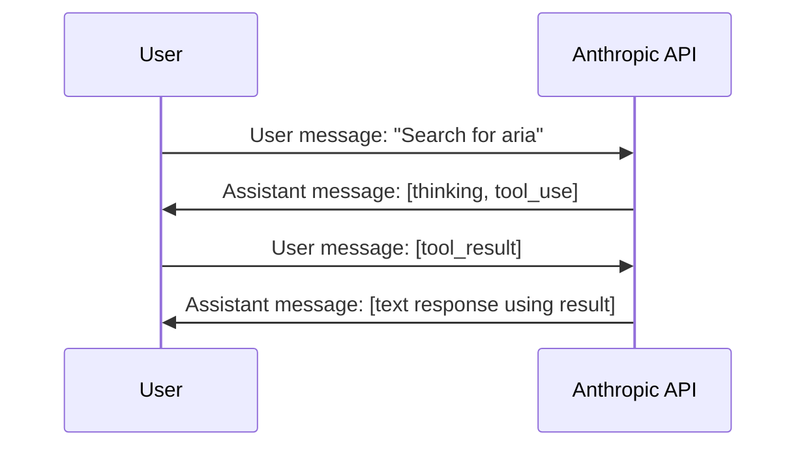

# Tool Use Message Structure

## Critical Requirement

**tool_result blocks MUST appear in USER messages, not assistant messages.**

This is an Anthropic API requirement. Violating it causes API errors.

## Correct Message Flow



## Message Structure

### ✅ Correct

```json
[
  {
    "role": "user",
    "content": [{"type": "text", "text": "Search for aria"}]
  },
  {
    "role": "assistant",
    "content": [
      {"type": "thinking", "thinking": "..."},
      {"type": "tool_use", "id": "toolu_01...", "name": "doc_search", "input": {...}}
    ]
  },
  {
    "role": "user",
    "content": [
      {"type": "tool_result", "tool_use_id": "toolu_01...", "content": [...]}
    ]
  }
]
```

### ❌ Incorrect

```json
[
  {
    "role": "user",
    "content": [{"type": "text", "text": "Search for aria"}]
  },
  {
    "role": "assistant",
    "content": [
      {"type": "thinking", "thinking": "..."},
      {"type": "tool_use", "id": "toolu_01...", "name": "doc_search", "input": {...}},
      {"type": "tool_result", "tool_use_id": "toolu_01...", "content": [...}}
    ]
  }
]
```

**Problem**: tool_result in assistant message violates API spec.

## Our Implementation

### Storage (Database)

For simplicity, tool_result blocks are stored in the **assistant turn** in our database:

```
Turn (role: assistant)
├─ Block: thinking
├─ Block: tool_use
└─ Block: tool_result  ← Stored here for convenience
```

**Rationale**: Tool results logically belong to the assistant's response. Storing them together keeps related data co-located.

### API Conversion (Message Building)

When converting turns to API messages, we **split** tool_result blocks into a separate user message:

**See**: `backend/internal/service/llm/streaming/service.go:407-436` (buildMessagesFromPath)

```go
// For assistant turns, partition blocks
assistantBlocks := []  // thinking, tool_use, text
toolResultBlocks := [] // tool_result

// Create assistant message (if has content)
if len(assistantBlocks) > 0 {
    messages = append(messages, Message{Role: "assistant", Content: assistantBlocks})
}

// Create synthetic user message for tool_result blocks
if len(toolResultBlocks) > 0 {
    messages = append(messages, Message{Role: "user", Content: toolResultBlocks})
}
```

**Result**: Database simplicity + API compliance.

## Why This Matters

- **API errors**: Sending tool_result in assistant message causes request failure
- **Streaming**: Tool results must be in the correct message for continuation
- **Multi-turn**: Conversation history must maintain proper role alternation

## Other Providers

This requirement is **Anthropic-specific**. Other LLM providers may have different rules for tool result placement.
