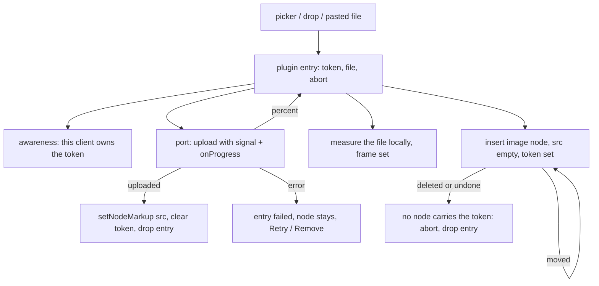

# core/editor/images — contracts

## The lifecycle



Each step's rule:

- **The entry opens first, then the slot.** `insertImageFile` mints the token and
  writes the entry, which is what publishes the awareness field, and only then
  inserts the node carrying that token. The order is the invariant: the owner
  signal is on the wire before the document update a peer would otherwise read as
  an abandoned slot. If the insert refuses, the entry is dropped again and the
  field released.
- **Where the node may go.** `image` is an inline atom (§5.6), so it goes inline
  where the position can hold one and in a paragraph of its own after the block
  where it cannot. A position that can take neither is the one refusal.
- **Replace claims an existing slot.** `openImageReplacePicker` writes the token
  onto the node the writer is pointing at (`addToHistory: false`, because it is
  bookkeeping) and runs the ordinary lifecycle. It works on `figure` for the same
  reason it works on `image`: both carry the attribute.
- **The frame.** `measure-image.ts` decodes the local file for its intrinsic
  size. The node view puts that size on the wrapper and REMEMBERS it, because
  the picture's own bytes arrive after its `src` does and a frame that collapsed
  in that gap would reflow twice. An unmeasurable file (an SVG with no intrinsic
  size) falls back to the default frame, which is the one case where completion
  can still move a line.
- **Landing.** One transaction: `setNodeMarkup` on the same node writing `src`,
  `alt`, and `uploadToken: null`, plus the meta that drops the entry,
  `addToHistory: false`. Clearing the token is what stops every peer being told
  the slot is still in flight. Undo therefore removes the picture the writer
  inserted rather than stepping back through the arrival of its bytes and leaving
  an empty frame. The fence is re-read here because an upload outlives the
  connection that started it; a fenced document turns the entry to `failed` with
  Retry instead of writing.
- **Settling.** The extension's orphan sweep and paste-import start run in a microtask
  after the view updates, never inside `update` itself: a plugin must not
  dispatch from its own update, and identity can only be read once the Yjs
  binding has finished describing the new document (`../../anchors.ts`).

## Ports

```ts
type ImageUploadPort = (input: {
  file: File;
  alt: string;
  signal: AbortSignal;
  onProgress: (percent: number | null) => void;
}) => Promise<UploadedImage>;

type ImageBytesPort = (input: {
  url: string;
  filename: string;
  signal: AbortSignal;
}) => Promise<File | null>;
```

`UploadedImage.src` is always `asset:<documentId>`. `ImageBytesPort` returning
null is the ordinary answer, not an error: most of the web serves images without
the CORS headers a fetch needs.

Registration is runtime, not construction (`registerImageIngressHost`), the same
shape as the link lane's resolver port: the editor mounts before the project
query settles, and a picker with no host refuses out loud rather than opening
onto nothing.

## The paste-import seam

A pasted `` never becomes a document `src`. The transform
lands a link to the address (`image-workflow.ts`) and the import replaces that
link with the picture once the bytes belong to the project. The link is both the
in-flight placeholder (decorated, so the manuscript shows the import is running)
and the honest end state when the site refuses — nothing has to be undone.

Finding the link again is a three-step handoff, because a transform runs before
its transaction exists:

1. `transformPasted` records the imports it created links for.
2. `appendTransaction` reads `pastedContentRange` off the paste itself — the only
   thing that knows where its own content went — and stores it as plain numbers
   in plugin state, carried through later mappings.
3. The microtask settle pins those numbers as an anchor and starts one import per
   address. Each import owns its own entry, so a refusal cannot report for an
   import that is still working.

## Identity

An upload IS its token. `nextIngressId` mints one per arrival with a per-tab
random origin, because the string reaches the shared document and two clients
must never claim each other's slots. `slotForUploadToken` reads it back with one
`descendants` pass, so a move, a peer's whole-document rebuild, and an undo all
answer correctly with no state to carry.

Deliberately NOT a `NodeHold`. That contract ends a held identity at a Yjs move
(`../../anchors.ts`), which is right for a gesture aimed at a node and wrong for
a slot §5.6 promises the writer may drag mid-upload. An import is the exception:
its placeholder is text, text has no attribute to carry, so it keeps an
`EditorAnchor` plus `pastedImageLinkRange`.

## Ownership across clients

| Question | Answered by |
|---|---|
| Is this slot in flight? | the node's `uploadToken` |
| Is it mine? | this editor's plugin `pending` map, keyed by that token |
| Is somebody else's, and what shape? | plugin `elsewhere`, projected from awareness by `image-upload-presence.ts` |
| Nobody's? | a token with no entry and no owner — the abandoned slot, the one that offers Remove |

The awareness field is `imageUploads`: `{ token, frame }` per in-flight slot. The
frame is there for the same reason the placeholder exists at all — a peer holding
an unshaped box would take the reflow the owner was spared. It is published from
the presence plugin's `view.update`, which runs inside the dispatch that opened
the entry, and cleared on the plugin's `destroy`. Nothing else goes on that
channel: a percent there would be a percent on the wire.

## Invariants worth a test

- The document contains a pending node while the upload is held open.
- A landing changes only `src`, `alt`, and the token. Any other document
  difference means completion is moving the manuscript.
- Deleting the node aborts the request and writes nothing afterwards; MOVING it in
  one delete-plus-insert transaction does not, and the bytes land where it moved.
- A peer sees an active upload as in flight, never as abandoned, in a slot already
  the picture's shape; an ownerless empty-src slot stays recoverable.
- `editor.destroy()` aborts every upload and import and releases the owner field.
- Two uploads and two imports hold independent state.
- An empty-src image round-trips through `@meridian/markup`, and a token'd one
  serializes identically with no token on the wire (its codec test).
