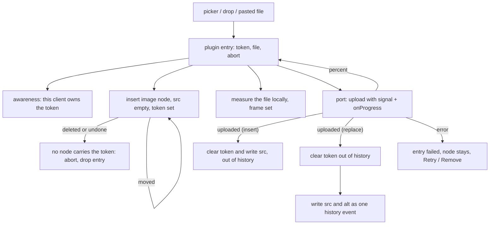

# core/editor/images — contracts

## The lifecycle



Each step's rule:

- **The entry opens first, then the slot.** `insertImageFile` mints the token and
  writes the entry, which is what publishes the awareness field, and only then
  inserts the node carrying that token. The order is the invariant: the owner
  signal is on the wire before the document update a peer would otherwise read as
  an abandoned slot. If the insert refuses, the entry is dropped again and the
  field released.
- **Where the node may go.** `image` is an inline atom (§5.6), so it goes inline
  where the position can hold one and in a paragraph of its own after the block
  where it cannot. A position that can take neither is the one refusal. A drop
  goes exactly where the dropcursor showed: between two words it lands in that
  sentence, at a block seam it becomes a paragraph of its own. Where it lands
  changes nothing about how big it is drawn — a picture is one object at one
  size, bounded by the prose column, sitting on the text baseline either way.
  Insert and drop are deliberately not unified — the caret is the insert's
  answer, the dropcursor is the drop's.
- **Replace claims an existing slot, and takes hold of it first.**
  `openImageReplacePicker` accepts a `NodeHold` — the identity the object surface
  already carries — never a position: the operating system's chooser stays open
  across peer writes and AI writes, and a raw number means something else by the
  time a file comes back. After the file arrives the hold is resolved, the node is
  read back through `objectSurfaceKind(node) === "image"`, and a picture that went
  away refuses out loud rather than opening an entry or an upload. Then the token
  goes on (`addToHistory: false`, because it is bookkeeping) and the ordinary
  lifecycle runs. It works on `figure` for the same reason it works on `image`:
  both carry the attribute, and both are registered image surfaces.
- **The frame.** `measure-image.ts` decodes the local file for its intrinsic
  size, and that size is what the slot reserves wherever it stands. The node
  view puts it on the wrapper and REMEMBERS it, because
  the picture's own bytes arrive after its `src` does and a frame that collapsed
  in that gap would reflow twice. A measured frame is that size EXACTLY, down to
  a 32px icon: the placeholder's readable minimums (8rem by 4.5rem, and 8rem by
  6rem for the loading placeholder) belong to a slot with no measured frame, and
  under one they would reserve a box the picture cannot fill. Below the size a
  placeholder can speak in, its name drops out — a container query on the frame,
  which asks the RENDERED box, because a picture wider than the prose column has
  already been narrowed by `max-width`. An unmeasurable file (an SVG with no
  intrinsic size) falls back to the default frame, which is the one case where
  completion can still move a line.
- **What lets the frame go.** A slot that is asking something rather than
  waiting — an upload that failed, one nobody can finish, a picture whose address
  would not resolve — drops the measured frame and takes the fallback box. Its
  message and its verbs do not fit inside a 32px square, nothing is going to land
  there to move the line back, and law 5 wants the refusal read and pressed.
- **Landing, and what the writer undoes.** The entry carries `landing`, which is
  how the slot was opened, because that decides the history:
  - `insert` — one transaction: `setNodeMarkup` on the same node writing `src`,
    `alt`, and `uploadToken: null`, plus the meta that drops the entry,
    `addToHistory: false`. The insert was the history event, so undo removes the
    picture rather than stepping back through the arrival of its bytes and leaving
    an empty frame.
  - `replace` — two, in this order: the token cleared outside history (an undo
    that brought it back would hand the writer a slot whose upload is over), then
    `src`/`alt` in an ordinary historical transaction. That is the whole of the
    writer's edit — this picture became that picture — and one undo takes it back.
    The non-historical write first is also what stops the replacement merging into
    the previous stack item: y-tiptap calls `stopCapturing()` for a transaction
    marked `addToHistory: false`.

  Clearing the token, either way, is what stops every peer being told the slot is
  still in flight. The fence is re-read here because an upload outlives the
  connection that started it; a fenced document turns the entry to `failed` with
  Retry instead of writing.
- **Settling.** The extension's orphan sweep and paste-import start run in a microtask
  after the view updates, never inside `update` itself: a plugin must not
  dispatch from its own update, and identity can only be read once the Yjs
  binding has finished describing the new document (`../../anchors.ts`).

## Ports

```ts
type ImageUploadPort = (input: {
  file: File;
  alt: string;
  signal: AbortSignal;
  onProgress: (percent: number | null) => void;
}) => Promise<UploadedImage>;

type ImageBytesPort = (input: {
  url: string;
  filename: string;
  signal: AbortSignal;
}) => Promise<File | null>;
```

`UploadedImage.src` is always `asset:<documentId>`. `ImageBytesPort` returning
null is the ordinary answer, not an error: most of the web serves images without
the CORS headers a fetch needs.

Registration is runtime, not construction (`registerImageIngressHost`), the same
shape as the link lane's resolver port: the editor mounts before the project
query settles, and a picker with no host refuses out loud rather than opening
onto nothing.

## The paste-import seam

A pasted `` never becomes a document `src`. The transform
lands a link to the address (`image-workflow.ts`) and the import replaces that
link with the picture once the bytes belong to the project. The link is both the
in-flight placeholder (decorated, so the manuscript shows the import is running)
and the honest end state when the site refuses — nothing has to be undone.

Finding the link again is a three-step handoff, because a transform runs before
its transaction exists:

1. `transformPasted` records the imports it created links for.
2. `appendTransaction` reads `pastedContentRange` off the paste itself — the only
   thing that knows where its own content went — and stores it as plain numbers
   in plugin state, carried through later mappings.
3. The microtask settle pins those numbers as an anchor and starts one import per
   address. Each import owns its own entry, so a refusal cannot report for an
   import that is still working.

## Identity

An upload IS its token. `nextIngressId` mints one per arrival with a per-tab
random origin, because the string reaches the shared document and two clients
must never claim each other's slots. `slotForUploadToken` reads it back with one
`descendants` pass, so a move, a peer's whole-document rebuild, and an undo all
answer correctly with no state to carry.

Two nodes can briefly carry one token: an in-editor copy-drag duplicates the
slice attributes. Only the first receives the bytes, and the other ends as the
ordinary recoverable empty-src slot once the entry is dropped — the honest
reading of "you duplicated a picture that had not arrived". The clipboard cannot
produce this at all, because the token is not in any HTML the editor writes.

Deliberately NOT a `NodeHold`. That contract ends a held identity at a Yjs move
(`../../anchors.ts`), which is right for a gesture aimed at a node and wrong for
a slot §5.6 promises the writer may drag mid-upload. An import is the exception:
its placeholder is text, text has no attribute to carry, so it keeps an
`EditorAnchor` plus `pastedImageLinkRange`.

## Ownership across clients

| Question | Answered by |
|---|---|
| Is this slot in flight? | the node's `uploadToken` |
| Is it mine? | this editor's plugin `pending` map, keyed by that token |
| Is somebody else's, and what shape? | plugin `elsewhere`, projected from awareness by `image-upload-presence.ts` |
| Nobody's? | a token with no entry and no owner — the abandoned slot, the one that offers Remove |

The awareness field is `imageUploads`: `{ token, frame }` per in-flight slot. The
frame is there for the same reason the placeholder exists at all — a peer holding
an unshaped box would take the reflow the owner was spared. It is published from
the presence plugin's `view.update`, which runs inside the dispatch that opened
the entry, and cleared on the plugin's `destroy`. Nothing else goes on that
channel: a percent there would be a percent on the wire.

The write goes through the session's presence port
(`../../local-presence.ts`), never `Awareness.setLocalStateField`. A raw field
write is a silent no-op while local state is null, which is exactly how a
suspended presence looks (inline review, a schema fence), so an announcement made
or released behind a review would be recorded here and never sent — and the
publisher's own equality cache would then refuse to say it again. The port takes
the write either way and publishes the current field map when presence resumes.

## Invariants worth a test

- The document contains a pending node while the upload is held open.
- A landing changes only `src`, `alt`, and the token. Any other document
  difference means completion is moving the manuscript.
- One undo after a Replace restores the previous picture and reaches no further
  back; one undo after an insert removes the picture. Both belong in a real
  two-editor suite: the collaborative UndoManager is the only history there is.
- A Replace whose picture a peer replaced, moved past, or deleted while the
  chooser was open lands on the ORIGINAL picture, or on nothing at all.
- A field written while presence is suspended is on the wire after resume, and a
  released token does not come back as an owner.
- Deleting the node aborts the request and writes nothing afterwards; MOVING it in
  one delete-plus-insert transaction does not, and the bytes land where it moved.
- A peer sees an active upload as in flight, never as abandoned, in a slot already
  the picture's shape; an ownerless empty-src slot stays recoverable.
- `editor.destroy()` aborts every upload and import and releases the owner field.
- Two uploads and two imports hold independent state.
- An empty-src image round-trips through `@meridian/markup`, and a token'd one
  serializes identically with no token on the wire (its codec test).
