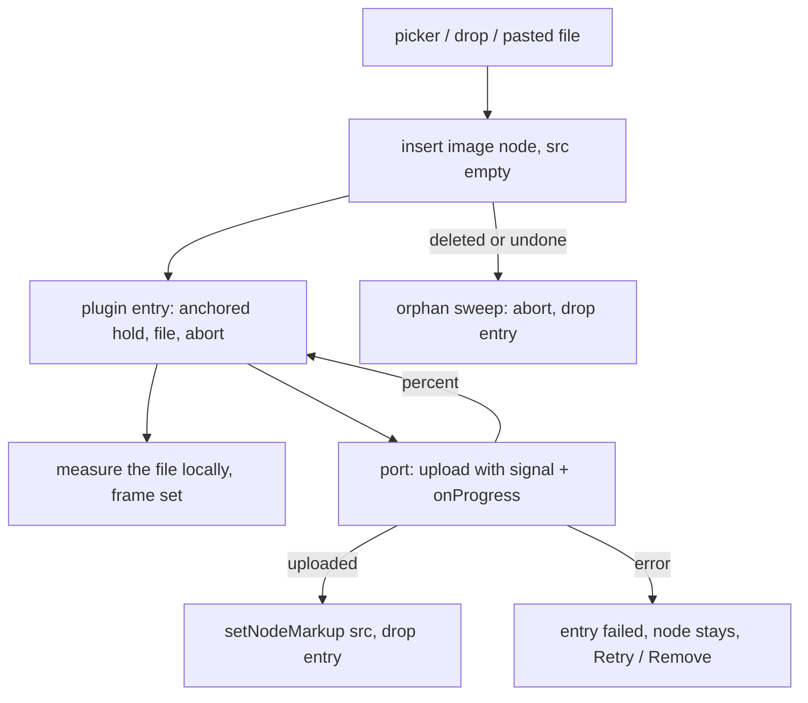

# core/editor/images — contracts

## The lifecycle



Each step's rule:

- **Insert first.** `insertImageFile` opens the slot and only then calls the
  port. `image` is an inline atom (§5.6), so it goes inline where the position
  can hold one and in a paragraph of its own after the block where it cannot.
  A position that can take neither is the one refusal.
- **The frame.** `measure-image.ts` decodes the local file for its intrinsic
  size. The node view puts that size on the wrapper and REMEMBERS it, because
  the picture's own bytes arrive after its `src` does and a frame that collapsed
  in that gap would reflow twice. An unmeasurable file (an SVG with no intrinsic
  size) falls back to the default frame, which is the one case where completion
  can still move a line.
- **Landing.** One transaction: `setNodeMarkup` on the same node plus the meta
  that drops the entry, `addToHistory: false`. Undo therefore removes the
  picture the writer inserted rather than stepping back through the arrival of
  its bytes and leaving an empty frame. The fence is re-read here because an
  upload outlives the connection that started it; a fenced document turns the
  entry to `failed` with Retry instead of writing.
- **Settling.** The orphan sweep and the paste-import start run in a microtask
  after the view updates, never inside `update` itself: a plugin must not
  dispatch from its own update, and identity can only be read once the Yjs
  binding has finished describing the new document (`../../anchors.ts`).

## Ports

```ts
type ImageUploadPort = (input: {
  file: File;
  alt: string;
  signal: AbortSignal;
  onProgress: (percent: number | null) => void;
}) => Promise<UploadedImage>;

type ImageBytesPort = (input: {
  url: string;
  filename: string;
  signal: AbortSignal;
}) => Promise<File | null>;
```

`UploadedImage.src` is always `asset:<documentId>`. `ImageBytesPort` returning
null is the ordinary answer, not an error: most of the web serves images without
the CORS headers a fetch needs.

Registration is runtime, not construction (`registerImageIngressHost`), the same
shape as the link lane's resolver port: the editor mounts before the project
query settles, and a picker with no host refuses out loud rather than opening
onto nothing.

## The paste-import seam

A pasted `` never becomes a document `src`. The transform
lands a link to the address (`image-workflow.ts`) and the import replaces that
link with the picture once the bytes belong to the project. The link is both the
in-flight placeholder (decorated, so the manuscript shows the import is running)
and the honest end state when the site refuses — nothing has to be undone.

Finding the link again is a three-step handoff, because a transform runs before
its transaction exists:

1. `transformPasted` records the imports it created links for.
2. `appendTransaction` reads `pastedContentRange` off the paste itself — the only
   thing that knows where its own content went — and stores it as plain numbers
   in plugin state, carried through later mappings.
3. The microtask settle pins those numbers as an anchor and starts one import per
   address. Each import owns its own entry, so a refusal cannot report for an
   import that is still working.

## Invariants worth a test

- The document contains a pending node while the upload is held open.
- A landing changes only `src` (and `alt` to the upload's answer). Any other
  document difference means completion is moving the manuscript.
- Deleting the node aborts the request and writes nothing afterwards.
- Two uploads and two imports hold independent state.
- An empty-src image round-trips through `@meridian/markup` (its codec test).
