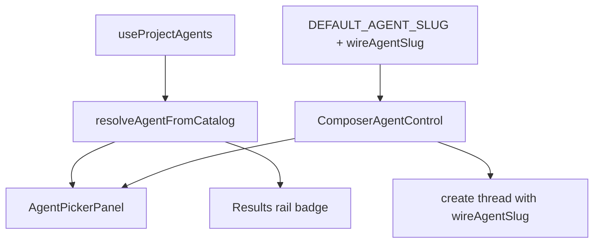

# features/agents — Agent identity, selection, and binding UI

This module owns focused agent identity and selection surfaces used by chat
and project provenance. It keeps the capability-freeze rule out of
individual call sites: a picker is a control only when the next send can change
which agent handles that send.

## Contracts

### Synthetic default agent

`DEFAULT_AGENT_SLUG = "general"` is a client-side label for the platform-default
experience. It is not a server row and must not cross the wire.

- UI label: **General**.
- Server representation: no current-agent binding on the thread/create request.
- Choke point: `wireAgentSlug(slug)` returns `undefined` for `general`, `null`,
  and `undefined`; every thread-create write site must use it.
- Upgrade path: if builtin agents are seeded as real package-domain definitions,
  `general` becomes a real catalog row and this filter is removed.

Sending `general` to the server attempts to bind an agent definition that does
not exist. That is a bug in the caller, not a valid fallback.

### Capability-freeze UI rule

Thread capabilities are frozen at the first turn attempt by the runtime's
composed prompt bake. The frontend mirrors that constraint in where it renders
controls:

| Surface | Behavior |
|---|---|
| New/Home composer or deferred project new-chat | Interactive picker; selection changes the agent bound on first send. |
| Existing server-backed thread, zero turns | Interactive picker; rebinding is allowed until first send. |
| Existing server-backed thread after first send | Read-only selector state; selection would not change the frozen prompt, so it is not a control. |
| Results provenance | Inert badge inside the producing-thread navigation control. |

Do not render a picker just because an agent label appears. A control must change the
next send, or it teaches the user that capability controls are unreliable.

### Identity vocabulary

Agents carry **no avatar mark** — identity is the name (plus an optional
source badge), styled through the shared `Badge`/`Button` primitives. Human
account imagery stays human-only; do not reintroduce initials circles or
jade-gradient discs for agents.

There is no shared `AgentChip` abstraction. Keep the surfaces honest and local:

| Surface | Shell | Use |
|---|---|---|
| `ComposerAgentControl` | toolbar-owned current-value trigger or readonly status | Composer agent selection before prompt freeze and truthful frozen-thread identity afterward. |
| `AgentPickerPanel` row | row-owned button with name + optional source `Badge` | Catalog choice inside the toolbar-owned popover. |
| Results rail provenance | truncated `Badge neutral` inside the producing-thread button | Compact attribution, not a standalone control. |

## Architecture

Key files:

| File | Role |
|---|---|
| `constants.ts` | Synthetic General/default-agent wire filter. |
| `AgentPicker.tsx` | Defines `AgentPickerPanel`, the live toolbar-owned catalog body grouped into installed/user and builtin sources. There is no standalone picker wrapper. |
| `ComposerAgentControl.tsx` | Applies capability freeze, adapting Agent identity to an interactive panel or readonly status through the toolbar-owned current-value family. |

## Patterns

- Keep Agent catalog loading, grouping, and retry presentation in
  `AgentPickerPanel`; the toolbar adapter supplies focus destinations and close
  behavior.
- Use `resolveAgentFromCatalog` anywhere a stored slug becomes writer-facing
  identity so fallback names and source metadata stay consistent.
