# Agent experience design target

This folder is the visual and behavioral acceptance target for Meridian Flow's agent implementation. It deliberately contains no product implementation. The implementation may choose different component boundaries, but it should preserve the hierarchy, states, copy truth, and responsive behavior shown here and in [the agent experience](agent-ux-spec.md).

## The target in one sentence

A writer chooses a collaborator for a new chat, sees the abilities and limits that apply now, lets it work without approving native manuscript edits, supervises only exceptional root or helper needs, and receives a report whose first proof is what changed and how to undo it.

## Design set

1. [Agent system design](agent-system-design.md) defines the vocabulary, boundaries, authority model, and target architecture.
2. [Agent system data model](agent-system-data-model.md) defines Mars exchange objects and Flow persistence/domain records.
3. [Agent system implementation plan](agent-system-implementation-plan.md) defines the cross-repository delivery order and gates.
4. [Agent experience](agent-ux-spec.md) defines writer-facing behavior, information hierarchy, responsive rules, and visual patterns.

## Required journey

1. **Choose:** purpose-first discovery distinguishes ready, available-with-limits, blocked, and incompatible definitions.
2. **Bind:** Agent and Work are explicit and fixed when a new chat begins.
3. **Run:** one readable activity frontier supports cancel, backgrounding, reconnect, and bounded helper supervision.
4. **Report:** the result leads; changed documents and undo are immediately visible; mechanics are secondary.
5. **Trust and author:** install/update shows material policy and source changes; custom agents use structured authoring and Mars YAML for exchange.

## Visual evidence

The screenshots in this folder are rendered at 1440 × 1000 for desktop and 390 × 844 for mobile. They extend Flow's current warm paper transcript, compact activity disclosure, and edit receipt patterns. They are not intended as pixel-perfect production code; they are the interaction and hierarchy target.

| Surface | Desktop | Narrow |
|---|---|---|
| Choose | [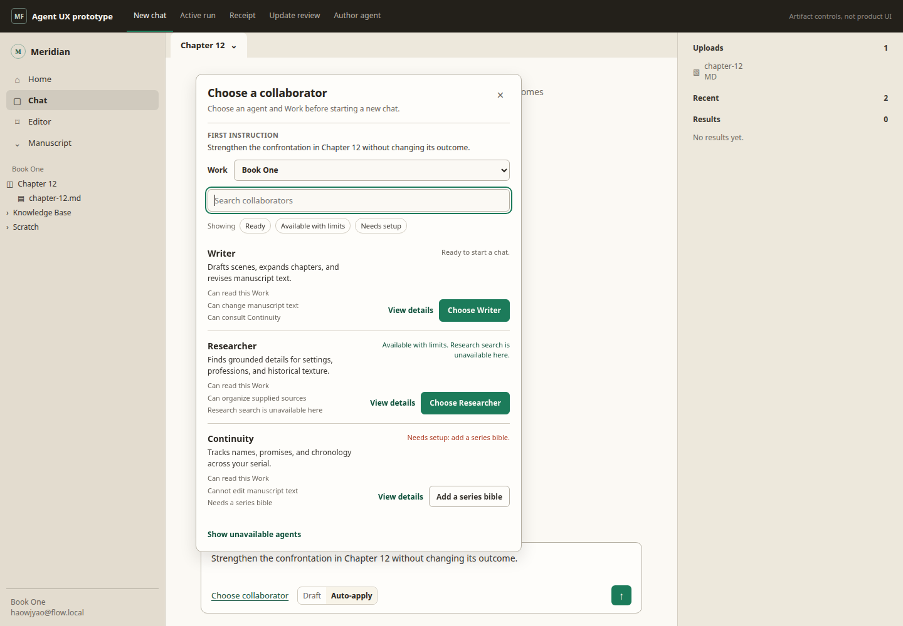](screenshots/picker-1440x1000.png) | [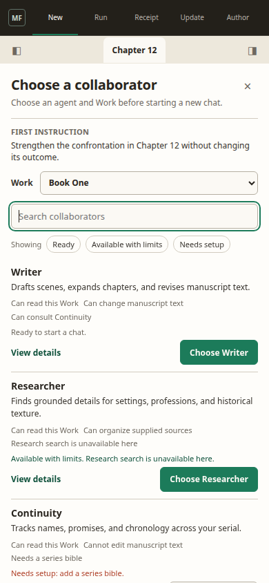](screenshots/picker-390x844.png) |
| Show unavailable | [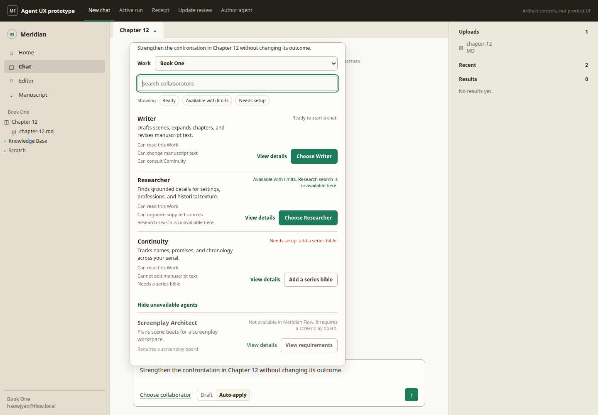](screenshots/picker-unavailable-1440x1000.png) | [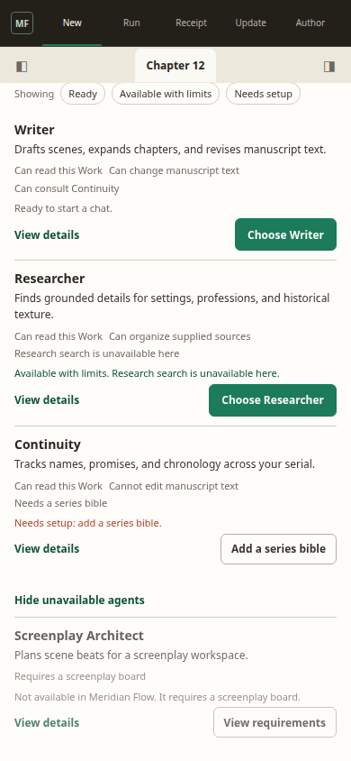](screenshots/picker-unavailable-390x844.png) |
| Bind | [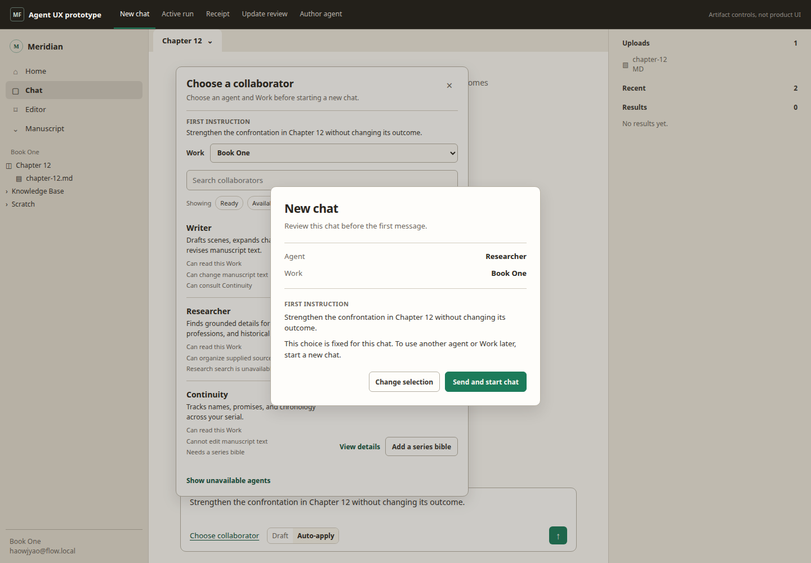](screenshots/binding-review-1440x1000.png) | [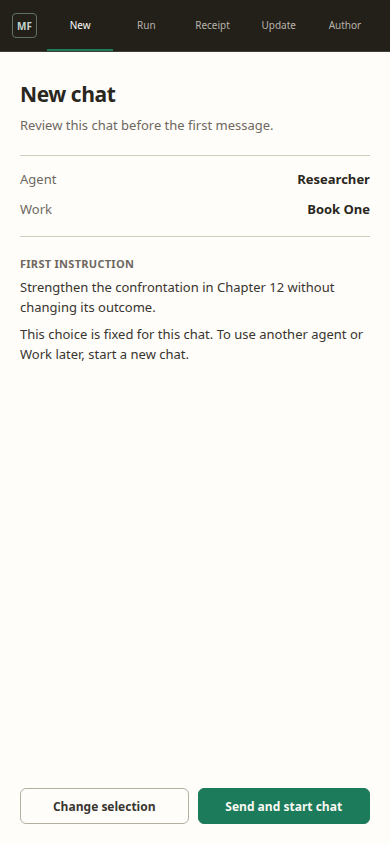](screenshots/binding-review-390x844.png) |
| Run | [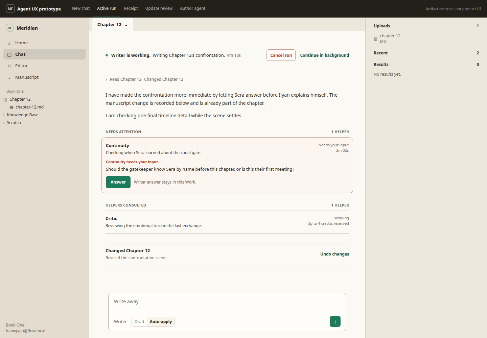](screenshots/run-1440x1000.png) | [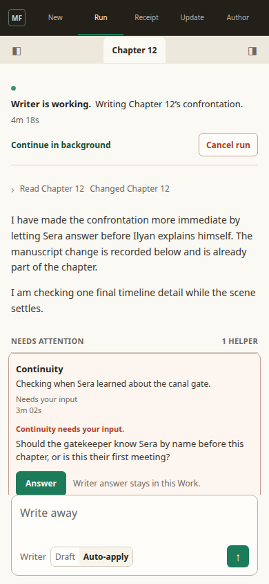](screenshots/run-390x844.png) |
| Report | [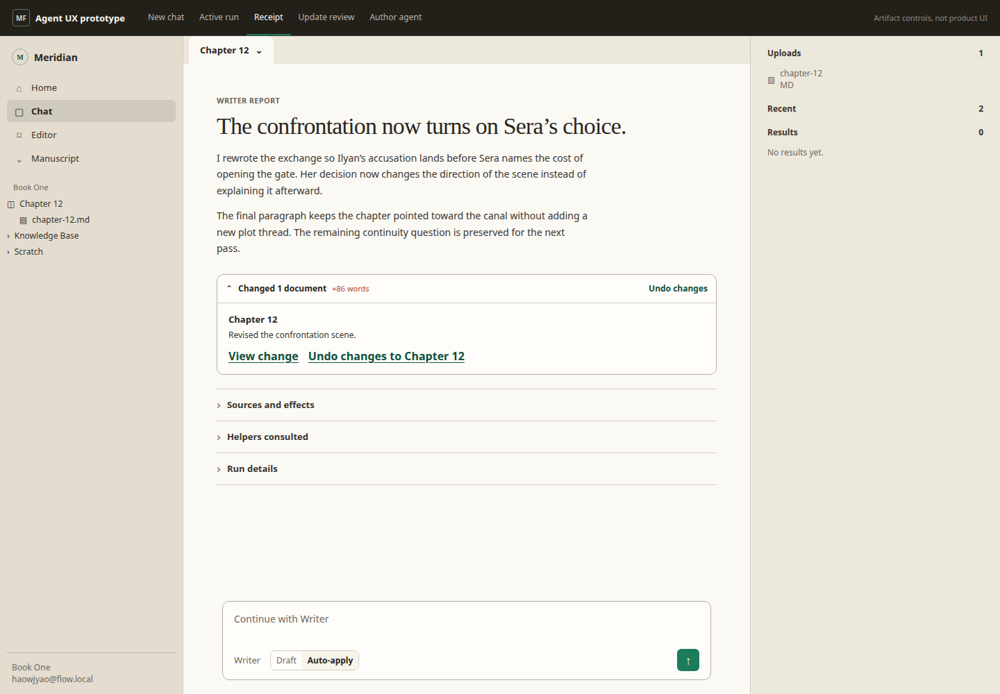](screenshots/receipt-1440x1000.png) | [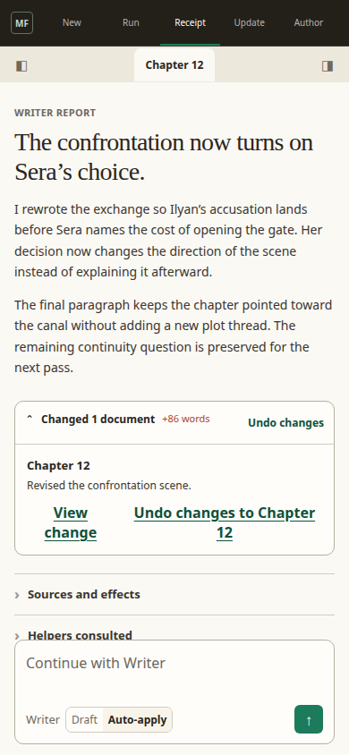](screenshots/receipt-390x844.png) |
| Update | [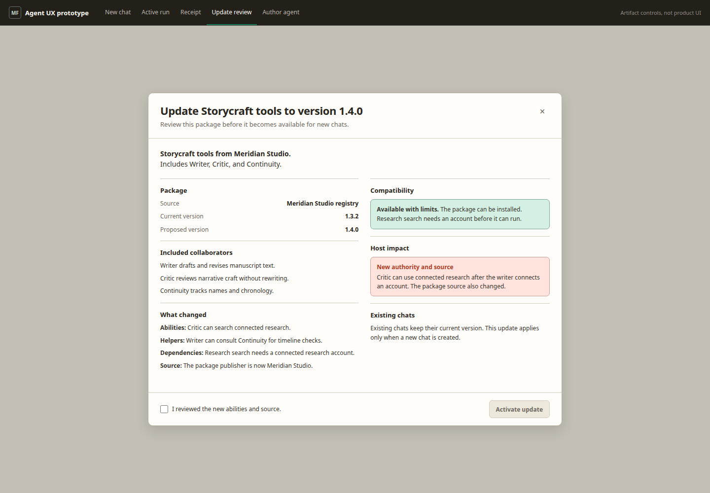](screenshots/update-1440x1000.png) | [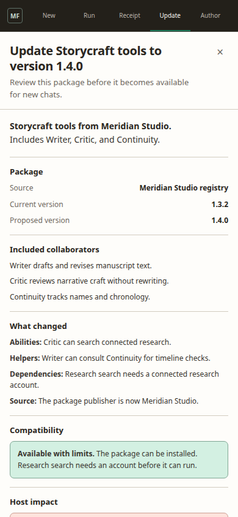](screenshots/update-390x844.png) |
| Update decision | See the complete update review above. | [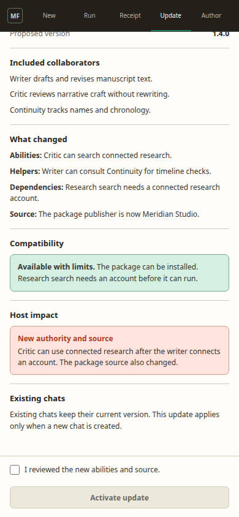](screenshots/update-decision-390x844.png) |
| Author | [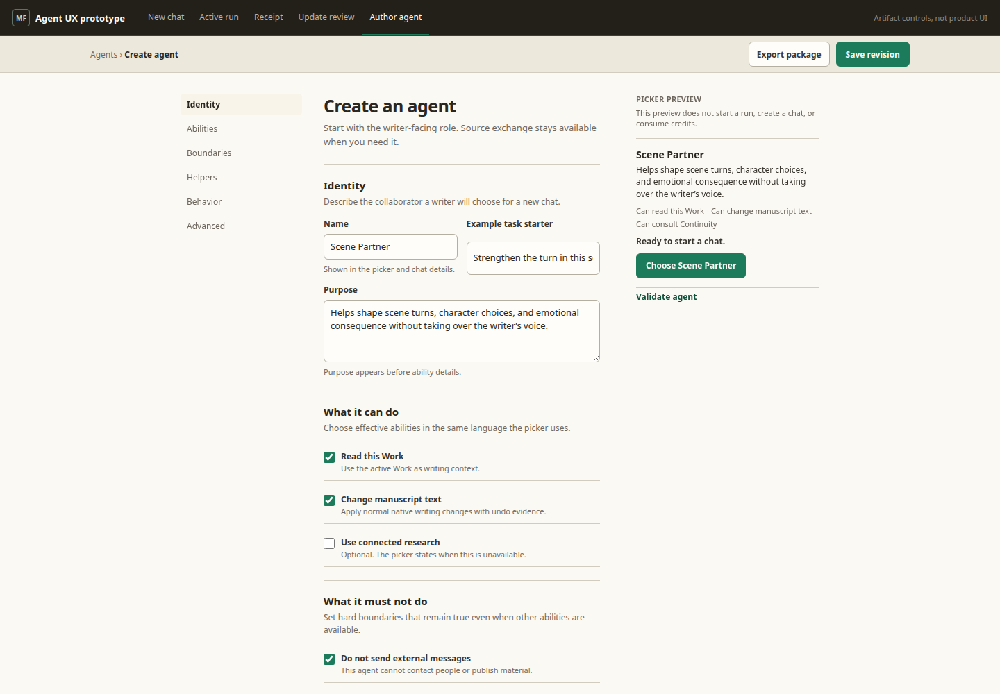](screenshots/author-1440x1000.png) | [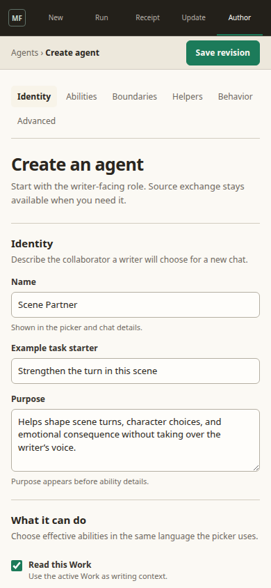](screenshots/author-390x844.png) |

## Non-negotiable behavior

- Existing chats do not switch Agent or Work. A different collaborator starts a new chat.
- Draft Agent, Work, and first-instruction selections create no empty thread. **Send and start chat** persists the message and immutable binding together.
- Availability language reflects the effective capabilities for this host and writer, not a raw tool manifest.
- Native Yjs document writes do not ask for approval. Receipts and precise undo preserve writer control.
- Writer questions, scoped external confirmations, budget increases, and outcome checks are durable action requests that survive backgrounding and reconnect.
- External confirmation applies to one literal proposed action, target, account, scope, and expiry.
- Child helpers remain collapsed unless they fail or need attention.
- Reports lead with the answer and changes. Sources, effects, helpers, models, credits, duration, revision, and provenance remain inspectable behind disclosures.
- Custom agents are ordinary Mars package profiles, not a Flow-only definition type. YAML is the exchange format, not the default editor.
- Mobile recomposes into viewport-bound sheets and full-width routes. It must not preserve clipped desktop dialogs or hover-only meaning.

## Implementation boundary

The target names product/domain responsibilities, not React files. Keep the agent catalog, immutable thread binding, run lifecycle, action-request records, receipt projection, package install/update, and structured authoring as separate ownership boundaries. UI state derives from durable domain state rather than optimistic stream messages.
