# Quiet agent management and New Chat selection

This folder is the visual and behavioral acceptance target for Meridian Flow's agent implementation. It contains design evidence, not product implementation.

## The target

**New Chat is the only place a writer chooses an Agent and Work. Agents is where definitions and packages are understood and maintained. Existing chats show their immutable identity as a quiet fact.**

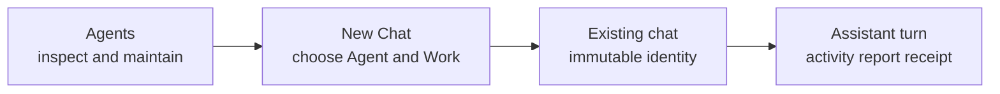

The implementation may choose different component boundaries, but it must preserve this ownership, information hierarchy, copy truth, and responsive behavior.

## Surface ownership

| Surface | Owns | Does not own |
|---|---|---|
| **New Chat** | compact draft Agent and Work controls, first instruction, atomic first send | package management, definition editing, launch gallery, separate start-agent ceremony |
| **Agents** | inventory, detail, readiness, edit, duplicate, export, revisions, defaults, package install and update | starting chats, starting runs, live runs, helpers, queues, receipts |
| **Existing chat** | visible immutable Agent and Work identity, ordinary conversation | selectors, switch controls, package settings |
| **Assistant turn** | current activity, exceptional attention, report, changes, evidence, undo | global task-center or management-page run UI |

The Home package cards that currently create package-shaped projects or chats are not part of the target. Package discovery and maintenance belongs in Agents.

## Design set

1. [Agent system design](agent-system-design.md) defines vocabulary, boundaries, authority, and target architecture.
2. [Agent system data model](agent-system-data-model.md) defines Mars exchange objects and Flow persistence/domain records.
3. [Agent system implementation plan](agent-system-implementation-plan.md) defines cross-repository delivery order, gates, and replacement inventory.
4. [Agent experience](agent-ux-spec.md) defines surface ownership, writer-facing behavior, responsive rules, and visual patterns.

## Visual evidence

Every state is rendered without prototype navigation at 1440 × 1000 and 390 × 844. The target extends Flow's current warm writing desk, pinned composer, compact popover, settings list/detail, assistant prose, activity disclosure, and edit receipt patterns.

### New Chat stays writing-first

The blank transcript and ordinary composer remain primary. Agent and Work are small draft controls; the ordinary Send action creates the first message and immutable binding together.

| Desktop | Narrow |
|---|---|
| [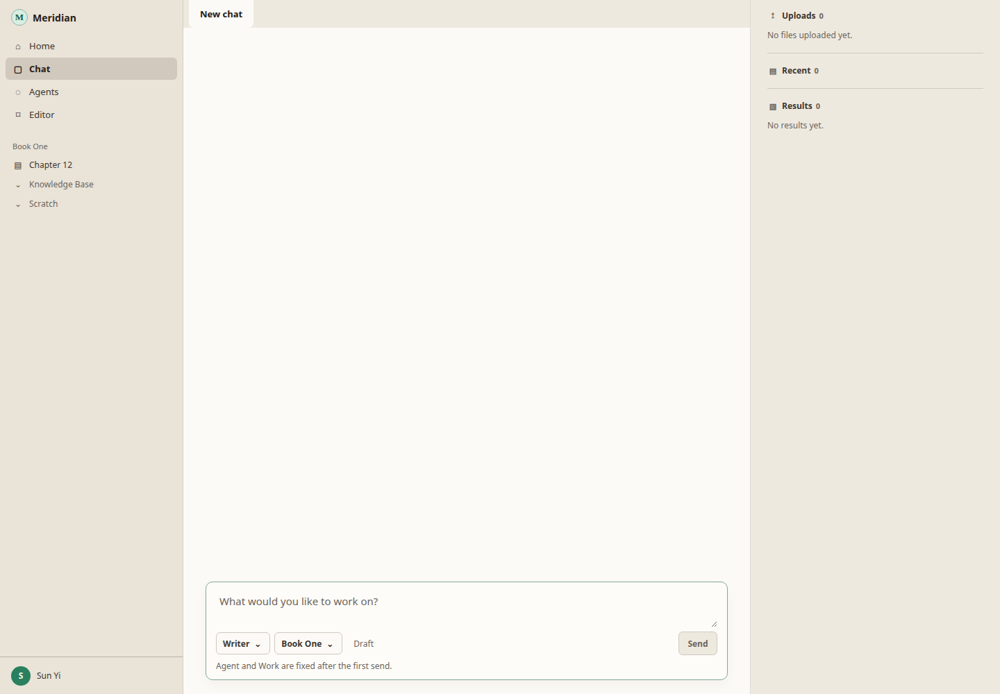](screenshots/new-chat-1440x1000.png) | [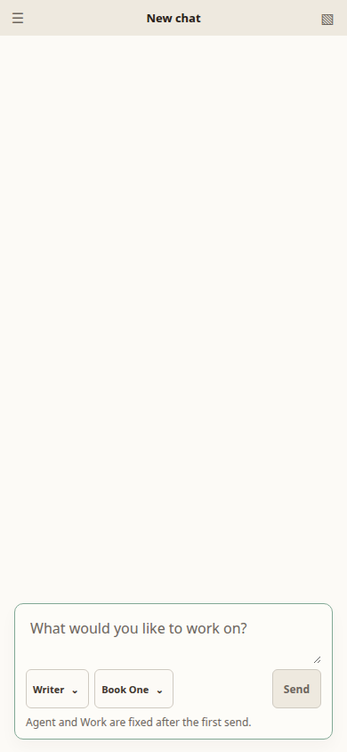](screenshots/new-chat-390x844.png) |

### Agent choice stays compact

The picker answers only who the collaborator is, what it is for, and whether it is currently available. Deeper understanding and maintenance routes to Agents.

| Desktop | Narrow |
|---|---|
| [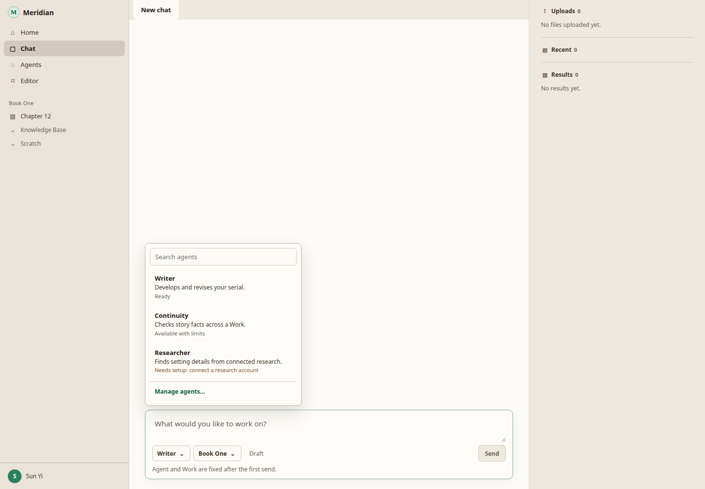](screenshots/new-chat-picker-1440x1000.png) | [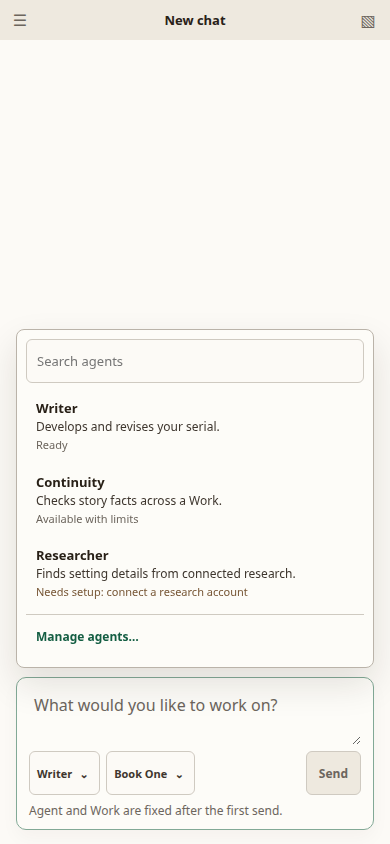](screenshots/new-chat-picker-390x844.png) |

### Agents is a management workspace

Definitions are primary because they are what writers select. Package ownership and updates remain visible without turning the area into a store or launcher. There is no Start, Run, or Test action.

| Desktop | Narrow |
|---|---|
| [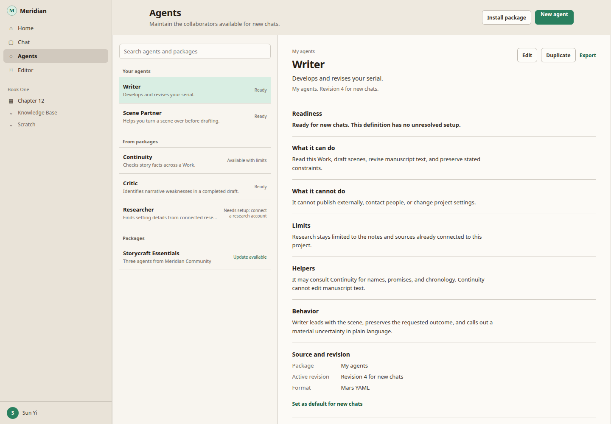](screenshots/agents-1440x1000.png) | [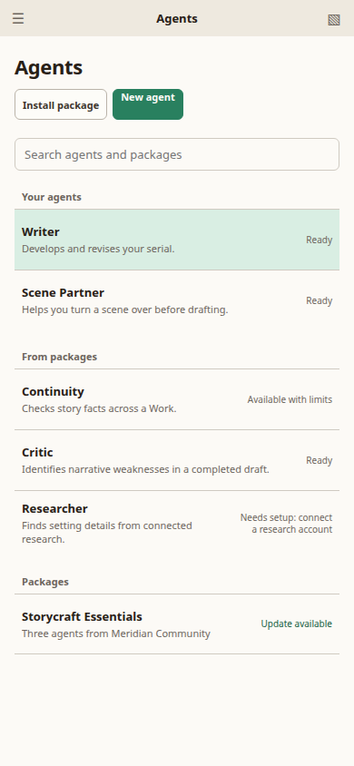](screenshots/agents-390x844.png) |

### Editing is structured; Mars remains portable

The default editor is organized around identity, abilities, boundaries, helpers, and behavior. Saving creates an immutable revision. Mars YAML remains the exchange and distribution format rather than the default authoring interface.

| Desktop | Narrow |
|---|---|
|  | [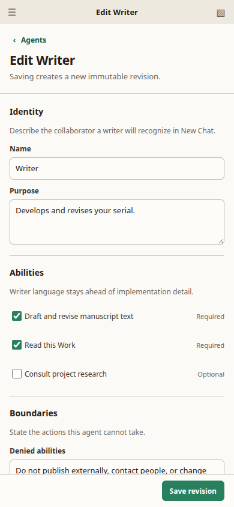](screenshots/agent-editor-390x844.png) |

### Package changes affect future chats

Install and update review lives inside Agents. It explains material abilities, helpers, source, compatibility, and host impact, including the fixed promise that existing chats keep their current version.

| Desktop | Narrow |
|---|---|
| [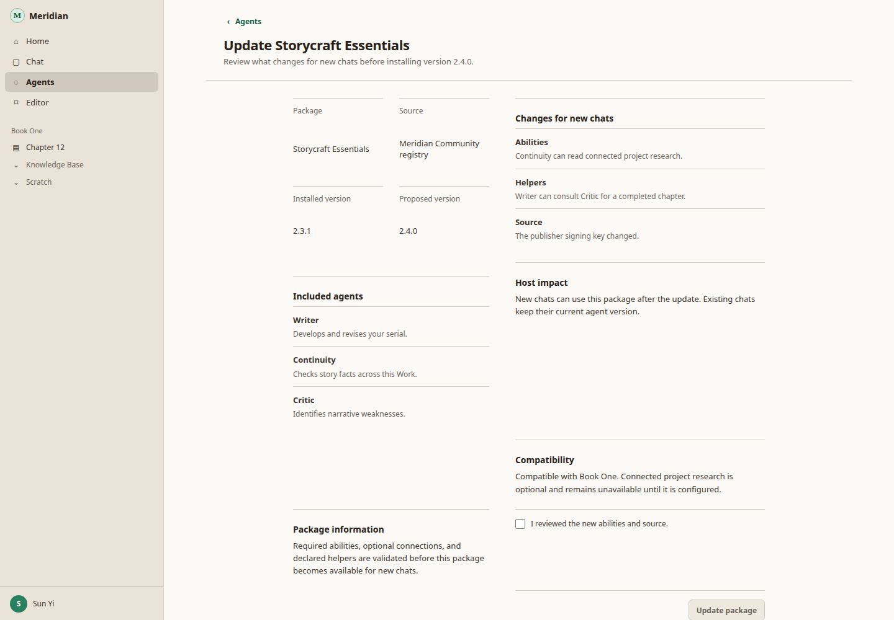](screenshots/package-update-1440x1000.png) | [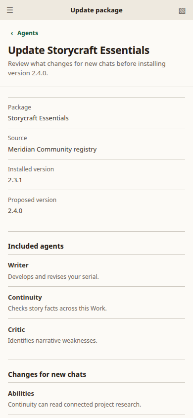](screenshots/package-update-390x844.png) |

### Existing chats remain quiet

The bound identity is inert text rather than disabled selector chrome. Activity and helpers remain compact inside the originating assistant turn. The unboxed report leads and the current edit receipt keeps changed documents and Undo immediately discoverable.

| Desktop | Narrow |
|---|---|
| [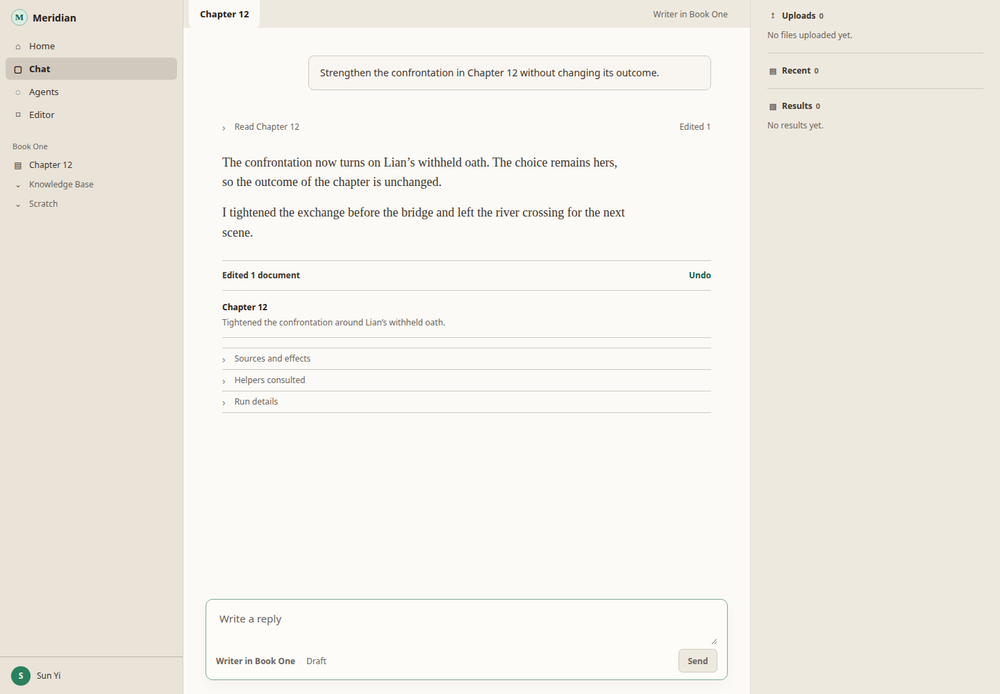](screenshots/existing-chat-1440x1000.png) | [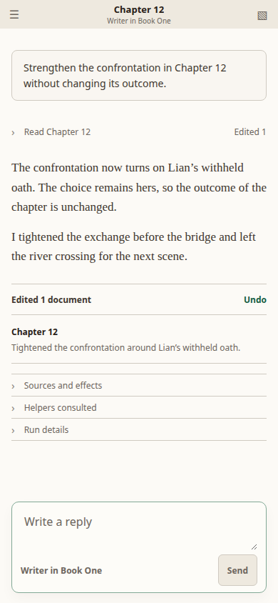](screenshots/existing-chat-390x844.png) |

## Non-negotiable behavior

- New Chat is the only Agent and Work choice boundary. Draft selection creates no empty thread.
- The normal first Send atomically persists the writer message, thread, Work relation, and exact Agent definition binding.
- Existing chats never switch Agent or Work.
- Agents supports understanding and maintenance but contains no chat or run launch action.
- Availability language reflects effective capabilities for this host and writer, not a raw tool manifest.
- Native Yjs manuscript writes happen without approval and remain recoverable through receipts and precise undo.
- Writer questions, scoped external confirmations, budget increases, and outcome checks use durable action requests that survive backgrounding and reconnect.
- Reports lead with the result and changes. Sources, effects, helpers, model, credits, duration, revision, and provenance remain behind progressive disclosures.
- Custom agents are ordinary Mars package profiles, not a Flow-only definition type.
- Mobile uses viewport-bounded pickers and routed management views without horizontal clipping or hover-only meaning.

## Implementation boundary

Keep catalog/install state, immutable thread binding, run lifecycle, durable action requests, receipt projection, package install/update, and structured authoring as separate ownership boundaries. UI state derives from durable domain state rather than optimistic stream messages.

Current Flow source is evidence for reusable visual patterns and explicit deletions, not a compatibility target. No Agents destination currently ships; implementing this design creates it as a management surface rather than preserving the incomplete Home package-launch behavior.
