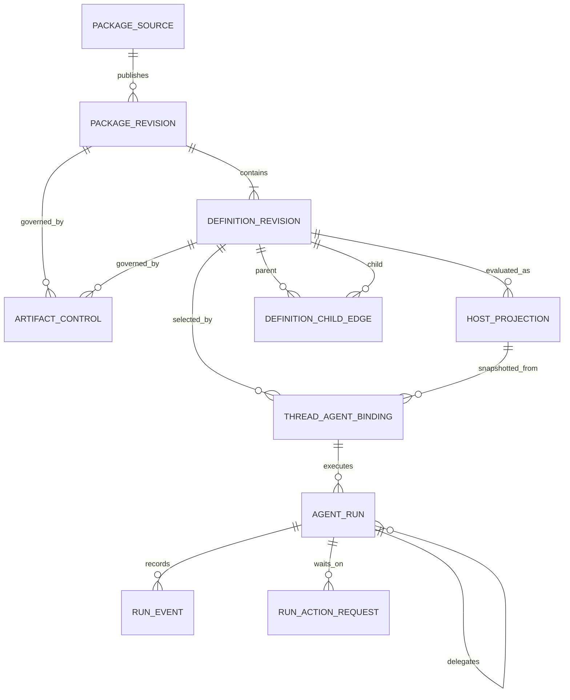

# Meridian Agent System Data Model

**Status:** proposed target structures
**Related:** [system design](agent-system-design.md), [implementation plan](agent-system-implementation-plan.md)

## Data-model decision

Keep four kinds of state separate:

1. **Editable source** is a Mars package authored outside Flow or in a writer-owned package workspace.
2. **Immutable definition state** is the exact normalized package/profile revision Flow installed.
3. **Immutable binding state** is the exact definition and launch bundle a thread selected.
4. **Run evidence** records what authority was effective and what happened.

Do not build one mutable `agent` row that mixes profile instructions, installation state, thread choice, live permissions, and execution status.



## Mars exchange structures

These are versioned contract shapes, not Flow database tables. The TypeScript is readable design notation; Mars must publish a complete language-neutral JSON Schema or equivalent IDL, canonical serialization/digest rules, generated bindings where useful, and the shared fixture corpus before producer or host persistence work begins. Any type merely named below is part of that required contract work, not permission for each repository to invent its own shape.

### `NormalizedPackageCatalog`

```ts
type NormalizedPackageCatalog = {
  contractVersion: string;
  requiredFeatures: string[];
  package: PackageRevision;
  agents: NormalizedAgentDefinition[];
  skills: NormalizedSkillDefinition[];
  provenance: ProvenanceMap;
  warnings: ContractDiagnostic[];
};

type PackageRevision = {
  name: PackageName;
  version: string;
  digest: string;
  lockDigest: string;
  source: PackageSourceProvenance;
};
```

Exchange identity uses distinct value objects:

```ts
type PackageName = string;
type AgentLogicalId = {
  packageName: PackageName;
  slug: string;
};
type AgentRevisionId = {
  packageRevisionDigest: string;
  definitionDigest: string;
  slug: string;
};
```

Authored child references use logical IDs plus dependency constraints. Normalized edges and executable bindings use revision IDs only.

Hosted ingestion uses a Mars-owned fetch plan rather than a second host resolver:

```ts
type DependencyFetchPlan = {
  contractVersion: string;
  root: PackageRevisionReference;
  lockDigest: string;
  dependencies: PackageRevisionReference[];
  planDigest: string;
};
```

Mars emits this from bounded offline inspection of the fetched root manifest/complete lock. The host fetches only the exact immutable coordinates through its source-origin policy, then Mars validates and compiles the complete closure offline.

The catalog is deterministic for the same source and dependency lock. It contains every static semantic a host needs; a host never reparses YAML to recover missing behavior.

### `NormalizedAgentDefinition`

```ts
type NormalizedAgentDefinition = {
  logicalId: AgentLogicalId;
  revisionId: AgentRevisionId;
  display: {
    name: string;
    description: string;
  };
  instructions: string;
  invocation: {
    user: boolean;
    model: boolean;
  };
  route: ModelRoutePolicy;
  capabilityPolicy: CapabilityPolicy;
  skills: ResolvedSkillReference[];
  children: ResolvedChildReference[];
  executionHints: ExecutionHints;
  provenance: ProvenanceMap;
};
```

### `CapabilityPolicy`

```ts
type CapabilityPolicy =
  | { disposition: "inherit"; denied: CapabilityConstraint[] }
  | {
      disposition: "explicit";
      required: CapabilityRequirement[];
      optional: CapabilityRequirement[];
      denied: CapabilityConstraint[];
    };

type CapabilityRequirement = {
  id: CapabilityId;
  contractVersion: string;
  scope?: CapabilityScopeExpression;
};

type CapabilityConstraint = CapabilityRequirement;
```

`inherit` is an explicit host-relative declaration, not the accidental result of a parser losing field presence. Published portable profiles use `explicit` and supply all three arrays. Their ceiling is `(required ∪ optional) − denied`; `denied` wins. Empty `required` and `optional` arrays mean no model-callable capabilities. Mars canonicalizes constraints and rejects any cross-disposition overlap using each capability contract's canonical `overlap` relation, including partial intersections where neither scope subsumes the other.

Portable authoring uses a new `capabilities` field. Existing Mars `tools`/`disallowed-tools` remain concrete target tool policy and require author-reviewed conversion or an explicitly nonportable target override; Mars must not silently reinterpret them. Hosts consume only the normalized capability form for portable authority.

Every capability contract versions its operation/argument schema and typed scope grammar. That contract defines canonical serialization, equality, overlap, subsumption, and intersection so Rust, TypeScript, and harness projectors cannot invent different narrowing behavior.

### `HostRuntimeDescriptor`

```ts
type HostRuntimeDescriptor = {
  host: "meridian-cli" | "meridian-flow" | string;
  target: "direct" | string;
  descriptorVersion: string;
  bundleVersions: string[];
  features: string[];
  models: ModelCapability[];
  capabilities: HostCapability[];
  scopeGrammarVersions: string[];
};
```

This describes executable host mechanisms. It never contains writer prompts, story content, account tokens, credentials, or live resource grants.

### `ContractCompatibility`

```ts
type ContractCompatibility = {
  status: "supported" | "degraded" | "incompatible";
  boundCapabilities: CapabilityRequirement[];
  missingRequired: CapabilityIssue[];
  unavailableOptional: CapabilityIssue[];
  inapplicableHints: CapabilityIssue[];
  warnings: ContractDiagnostic[];
};
```

Contract compatibility answers whether a host shape can faithfully bind static intent. It does not authorize a particular writer, Project, Work, document, or external account.

Flow separately produces live `BindingReadiness`:

```ts
type BindingReadiness = {
  launchability: "ready" | "blocked";
  effectiveCapabilities: CapabilityRequirement[];
  blockingReasons: ReadinessDiagnostic[];
  unavailableOptional: ReadinessDiagnostic[];
  evaluatedAt: string;
};
```

This is recomputed, not cached under the host descriptor digest. Missing live setup/grants for a required capability adds a blocking reason. Missing live setup/grants for an optional capability narrows `effectiveCapabilities`, adds `unavailableOptional`, and remains launchable when no other blocker exists. Multiple reasons coexist; no status-precedence rule discards evidence.

### `DefinitionPolicyDiff` and `ActivationImpact`

```ts
type DefinitionPolicyDiff = {
  contractVersion: string;
  from: PackageRevision;
  to: PackageRevision;
  capabilities: CapabilityPolicyChange[];
  delegation: DelegationGraphChange[];
  execution: ExecutionRequirementChange[];
  content: InstructionOrSkillChange[];
  dependencies: DependencyChange[];
  provenance: ProvenanceChange[];
};

type ActivationImpact = {
  definitionDiffDigest: string;
  authorityDirection: "reducing" | "unchanged" | "expanding" | "mixed";
  contentChanged: boolean;
  trustChanged: boolean;
  hostRiskChanges: HostRiskChange[];
  acknowledgementRequired: boolean;
};
```

Mars owns static normalized comparison. Flow owns the host/product impact and acknowledgement rule. Neither structure claims to be live run authority.

### `DirectLaunchBundle`

```ts
type DirectLaunchBundle = {
  contract: {
    bundleVersion: string;
    producerVersion: string;
    requiredFeatures: string[];
    canonicalizationVersion: string;
    bundleDigest: string;
  };
  packageClosure: {
    root: PackageRevision;
    dependencies: PackageRevisionReference[];
    resources: ResolvedResourceReference[];
  };
  definition: {
    revisionId: AgentRevisionId;
    display: { name: string; description: string };
    instructions: string;
  };
  target: {
    kind: "direct";
    descriptorDigest: string;
  };
  execution: {
    route: ResolvedModelRoute;
    capabilityPolicy: CapabilityPolicy;
    skills: ResolvedSkillContent[];
    delegation: ResolvedChildReference[];
    promptSurface: StaticPromptSurface;
    policy: ExecutionPolicy;
  };
  dynamicSlots: DynamicSlotDeclaration[];
  compatibility: ContractCompatibility;
  provenance: ProvenanceMap;
  diagnostics: ContractDiagnostic[];
};
```

The bundle is static and stores each resolved semantic once. `target.descriptorDigest` is the sole host-descriptor digest; `compatibility` is implicitly evaluated against that target. `contract.bundleDigest` is calculated over canonical bundle bytes with `bundleDigest` omitted. Flow fills only a fixed contract-owned enum of declared dynamic slots after thread binding and host authorization; packages cannot invent placement for confidential content. Mars publishes the complete language-neutral schema, diagnostic severity/path rules, canonical serialization/digest rules, and fixtures before a host persists this structure.

## Flow persistent records

Names below are conceptual. The implementation lead may align exact table names with the database package, but should preserve ownership and immutability.

### `agent_package_sources`

Editable or trackable package origin.

| Field group | Meaning |
|---|---|
| identity | source ID and provenance class: first-party, imported, personal, registry |
| ownership | account/project owner when the source is private |
| origin | repository/registry/local/private-workspace locator; no credential secret |
| authoring state | mutable source pointer or draft only for personal packages |

This record does not execute. External packages may not need mutable source storage; they still have a source/provenance record.

### `agent_package_revisions`

Immutable installed Mars package artifact.

| Field group | Meaning |
|---|---|
| coordinate | package name, SemVer, source revision, content digest |
| contract | contract version, required features, normalized catalog artifact |
| provenance | publisher/source/license/repository/lock evidence |
| lifecycle | installed time, supersedes revision, install diagnostics |

An update inserts a new revision. It never rewrites the artifact used by an existing thread.

### `agent_definition_revisions`

Immutable installed projection of one normalized profile.

| Field group | Meaning |
|---|---|
| identity | revision ID, package revision ID, qualified coordinate, definition digest |
| query projection | display name/description and invocation axes |
| artifact | normalized definition and/or direct bundle inputs |
| provenance | field/source evidence needed for inspection |

This table is derived from the Mars package revision. It is not an editable authoring format.

### `agent_definition_child_edges`

Resolved exact delegation graph.

| Field | Meaning |
|---|---|
| parent definition revision | exact caller revision |
| child definition revision | exact callee revision |
| source coordinate | authored qualified reference |

There is no slug-only runtime lookup and no global child inventory fallback. Host-specific availability belongs to `agent_host_projections`, not this definition edge.

### `agent_package_activations`

Mutable pointer selecting the package revision offered for future bindings in a source/owner scope.

| Field group | Meaning |
|---|---|
| scope | package source plus global/account/project owner scope |
| active revision | exact installed package revision |
| impact | Flow-derived `ActivationImpact` from the Mars `DefinitionPolicyDiff` |
| acknowledgement | actor/policy, acknowledged digest, and timestamp when expansion/provenance change requires it |

Candidate install, validation, projection, acknowledgement, and pointer switch form the update protocol. The pointer changes atomically only after all prerequisites succeed. Existing thread bindings are unaffected.

### `agent_artifact_controls`

Mutable host governance kept separate from immutable definition content.

| Field group | Meaning |
|---|---|
| target | tagged union: exact package revision or exact agent revision |
| scope | account/project/global catalog scope as the product requires |
| state | enabled, disabled, revoked, or emergency-stop |
| generation | monotonic generation plus effective timestamp |
| evidence | actor/policy, reason, timestamp, and replacement recommendation |

The evaluator reads package and definition targets atomically. Disabling affects discovery and new bindings. Ordinary revocation blocks root/child reservations at or after its generation while preserving historical bundle/receipt identity; dispatch from an earlier reservation ignores it. Emergency stop blocks new dispatch in active runs and requests cancellation. Controls are deny-first: emergency-stop/revoked win over disabled/enabled at every scope; narrower scopes may add restrictions but cannot override broader revocation. Neither state rewrites an artifact.

### `agent_host_projections`

Derived compatibility evaluation for a definition against a host descriptor.

| Field group | Meaning |
|---|---|
| key | definition revision plus host-descriptor digest |
| status | supported, degraded, incompatible |
| capability projection | statically bound capabilities and eligible child edges |
| diagnostics | structured incompatibility/lossiness evidence |
| writer projection | versioned static capability facts used with live readiness to create catalog copy |

A host upgrade creates/reuses a projection for a new descriptor digest. It does not mutate the definition. A thread snapshots the projection it bound against. Writer connections, resource grants, credits, and readiness never live here.

### `thread_agent_bindings`

Exact static execution contract fixed to a thread.

| Field group | Meaning |
|---|---|
| identity | thread ID, definition revision ID, host-projection ID |
| bundle | direct launch-bundle snapshot, version, and digest |
| context reference | thread's already-fixed Work relationship |
| lifecycle | created time |

The binding, initial writer message, and `thread_works` relationship are created immutably in the same thread-creation transaction. A mutable pre-send Agent/Work chooser and instruction are draft/client state, not an empty thread. Work remains owned by `works` + `thread_works`; this table references that context but does not grant it.

### `agent_runs`

One root or child execution.

| Field group | Meaning |
|---|---|
| lineage | run ID, thread binding, parent/root run IDs, invocation kind |
| task | bounded task/description and input receipt reference |
| lifecycle | state revision, queued/preparing/running/cancelling/finalizing/terminal state, cancellation request, attempt/lease, timestamps |
| effective truth | authority envelope, budget reservation, resolved provider/model route, warnings |
| outcome | report reference, error classification, usage/cost totals |
| delivery | separate pending/delivered/failed parent-report delivery projection for child runs |

Do not persist credential secrets. An authority snapshot may record connection/grant identifiers and effective scopes, while adapters resolve secrets at dispatch time.

### `agent_run_tree_budgets`

Root-owned atomic budget ledger plus child reservations.

| Field group | Meaning |
|---|---|
| ceiling | child count, concurrency, depth, credits/tokens, and time limits |
| accounted | committed actual usage plus outstanding reservations |
| reservation | child run ID, estimated amount, state, expiry/reconciliation evidence |

Child budget and durable run reservation occur in one transaction. Finalization reconciles actual usage and releases unused capacity. This ledger, not a stale run-context snapshot, arbitrates concurrent siblings.

### `agent_approval_grants`

Single-use external-effect confirmation.

| Field group | Meaning |
|---|---|
| binding | run, capability operation, canonical arguments/resource hash |
| account | connection/account grant reference and scope |
| policy | approval policy version, expiry, single-use nonce |
| lifecycle | proposed, granted, consumed, expired, rejected; consumed records unique effect-attempt ID |

Any argument, resource, account, or scope change produces a different hash and requires a new grant. Every external consequential effect has a stable `effectId` before authorization. One transaction/CAS claims that effect from authorized to dispatching, creates the unique effect attempt/idempotency key, and appends `dispatching` before the adapter call. The writer-confirmed branch also changes the exact unexpired grant from granted to consumed; the policy-authorized branch records its policy decision and consumes no grant. A unique constraint on `effectId` prevents a second claim in either branch. A claimed non-idempotent attempt without definitive result becomes `unknown`; it never makes a grant/effect reusable. Native Yjs writes never create one.

### `agent_run_events`

Append-only lifecycle and effect evidence, ordered by run-local sequence.

Event families include:

- lifecycle transitions
- model route/fallback
- capability/tool request, dispatch, denial, result, and effect
- external consequential effect transitions: proposed, typed authorization decision, dispatching, confirmed, failed, unknown; include approval/policy and idempotency evidence
- native document changes and undo/navigation references
- child reservation, start, report, cancellation, and failure
- usage/cost increments
- warnings and reconciliation facts
- final report or no-report reason

Events are evidence. Current run status and receipts are projections and must never claim a fact contradicted by the journal.

### `agent_run_action_requests`

Durable requests for an exceptional writer decision while a root or child run remains nonterminal.

| Field group | Meaning |
|---|---|
| identity | request ID, root/run/optional child run IDs, journal sequence |
| request | writer input, scoped external confirmation, budget increase, or outcome check; literal question or proposed effect |
| exact external proposal | proposed `effectId`, capability operation, canonical argument/resource hash, target, connection/account reference, scope, policy version, and expiry; absent for non-effect requests |
| continuation | suspended continuation/checkpoint reference, wake condition, whether this run blocks, and whether a required child blocks its parent |
| lifecycle | pending, answered, declined, expired, or resolved; timestamps and state revision |
| response | writer actor, structured response or decision, resulting wake evidence, and proposal-specific grant moved to `granted`; later consumption belongs only to the effect dispatch claim |

An action request is the durable source of truth for the derived `needs-input` presentation state; `needs-input` is not an `agent_runs` lifecycle value. It is never reconstructed from transient model prose or a streaming UI message. Native manuscript edits do not create confirmation requests. An external-effect confirmation authorizes only the immutable proposal recorded on the request. Answering compare-and-sets the exact request and creates, or moves, the joined proposal-specific grant to `granted`. The resumed executor consumes that still-live grant only inside the later effect `authorized → dispatching` claim transaction. Any argument, resource, target, account, scope, policy-version, or expiry change closes the old request and creates a new proposal/request. A budget increase records the exact increment and new ceiling.

A blocking request releases its attempt lease only after the continuation checkpoint and request are durable. Reconciliation cannot claim that continuation until an answered, declined, or expired request transition appends its wake event. Cancellation may close pending requests without an answer; terminal finalization closes all that remain. Answer, decline, expiry, cancellation, and terminal finalization compare-and-set the request and run revisions so one outcome wins. Multiple requests remain independent: presentation shows `needs-input` when any blocking request is pending, and a continuation wakes only when all requests it requires resolve. A parent waits only when a required child's request says it blocks the parent; unrelated work may continue. Reconnect and background clients rebuild outstanding attention from these records plus the journal.

### `agent_run_receipts`

Optional materialized projection for efficient UI access.

| Field group | Meaning |
|---|---|
| primary result | report or structured no-report reason |
| effects | changed documents, undo/navigation, sources, external operations |
| delegation | child summaries and report links |
| execution | exact definition, effective model/actions, duration, usage/cost, warnings |

The receipt is rebuildable from immutable binding data plus run events. It is not a second event truth.

## In-memory domain structures

### `ToolOperationBinding`

```ts
type ToolOperationBinding = {
  capability: CapabilityRequirement;
  toolName: string;
  modelContract: ModelCallableToolContract | ModelCallableOperationFragment;
  resolveCall: (args: unknown) => CanonicalCapabilityCall;
  authorize: ResourceScopeResolver;
  execute: CapabilityHandler;
  riskClass: "native-write" | "read" | "external-consequential" | "external-other";
  writerCopy: CapabilityCopy;
  receipt: ReceiptFormatter;
};
```

The registry maps one capability to one or more operation bindings. It owns model advertisement, canonical call resolution, dispatch, writer-facing facts, action classification, and receipt formatting. This prevents five drifting maps of the same action contract and supports compound model tools without granting every operation they contain.

### `DelegableAuthorityEnvelope`

```ts
type DelegableAuthorityEnvelope = {
  grants: Array<{
    capability: CapabilityRequirement;
    maximumScope: ResolvedResourceScope;
    connectionGrant?: ConnectionGrantReference;
    mayDelegate: boolean;
    maximumChildScope?: ResolvedResourceScope;
  }>;
  delegation: {
    rosterEdgeIds: string[];
    maximumDepth: number;
  };
  budgetLedger: RunTreeBudgetLedgerReference;
  deniedReasons: AuthorityDiagnostic[];
};

type ConnectionGrantReference = {
  id: string;
  connectionId: string;
  accountId: string;
  capabilities: CapabilityRequirement[];
  maximumScope: ResolvedResourceScope;
  revocationGeneration: number;
  delegation: "none" | "same-account-narrower-scope";
};
```

The envelope records the decision, not credential material. A child begins from the parent envelope and may only narrow it; it does not query the writer's broader grants or select a different account. Dispatch revalidates the same grant references and their revocation generations before resolving adapter-owned secrets.

### `AgentRunContext`

```ts
type AgentRunContext = {
  binding: ImmutableThreadAgentBinding;
  task: RunTask;
  work: FixedWorkContext;
  conversation: BoundedConversationContext;
  storyContext: ResolvedStoryContext;
  authority: DelegableAuthorityEnvelope;
  tools: ModelCallableToolContract[];
  route: ResolvedModelRoute;
  lineage: RunLineage;
  warnings: RunWarning[];
};
```

This value is complete before model execution. Root routes, child coordination, tool dispatch, and provider adapters consume it; none reconstruct it.

## Data invariants

1. A package revision, definition revision, thread binding, or terminal run event is never mutated into a different semantic revision.
2. Qualified coordinate plus revision/digest, never display name or bare slug, selects executable identity.
3. A thread has one agent binding and one Work from creation for its entire lifetime.
4. Existing bindings do not change when packages, host descriptors, catalog activation, or defaults change. Ordinary revocation blocks later reservations, not dispatch in an earlier reserved run; emergency stop is the separate active-run control. Neither substitutes content.
5. Every child run has one parent and one root; each capability, resource scope, connection grant, and further-delegation right is no broader than its parent's envelope.
6. The tool set advertised to the model implements exactly the effective capability set the dispatcher recognizes for that run. Resource checks may narrow a specific call further.
7. A definition, host projection, or run never stores credential secrets.
8. Current status and receipts are derived from ordered durable evidence.
9. Native Yjs writes are effects with evidence and undo, not approval requests.
10. A personal custom agent becomes executable only by producing a valid immutable Mars package/definition revision through the same install path as imported agents.
11. Concurrent children consume one atomic root-run-tree budget ledger; a snapshot is never sufficient authorization to reserve work.
12. External consequential dispatch requires an exact, live, single-use approval grant when host policy says so; native Yjs writes cannot enter that protocol.

## Patterns embodied by the data model

| Pattern | Structural consequence |
|---|---|
| **Revisioned source, derived install** | Editable package source and immutable installed revision are different records. |
| **Event journal + projections** | Run events are evidence; status and receipts are query views. |
| **Snapshot at the stability boundary** | Thread binding freezes the static launch contract; run snapshots effective authority. |
| **Semantic IR** | Mars normalized structures carry intent across languages and hosts. |
| **Attenuated authority** | Parent-effective authority is an input to every child resolution. |
| **One registry per capability** | Advertisement, dispatch, capability copy, risk, and receipt stay aligned. |
| **Atomic reservation ledger** | Child identity and estimated shared budget commit in one transaction. |
| **Exact approval grant** | One canonical external call/account/scope consumes one confirmation. |
| **No parallel truth** | Relational query projections are derived from immutable Mars artifacts and checked by digest. |
