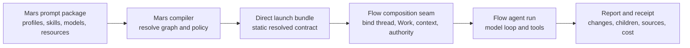
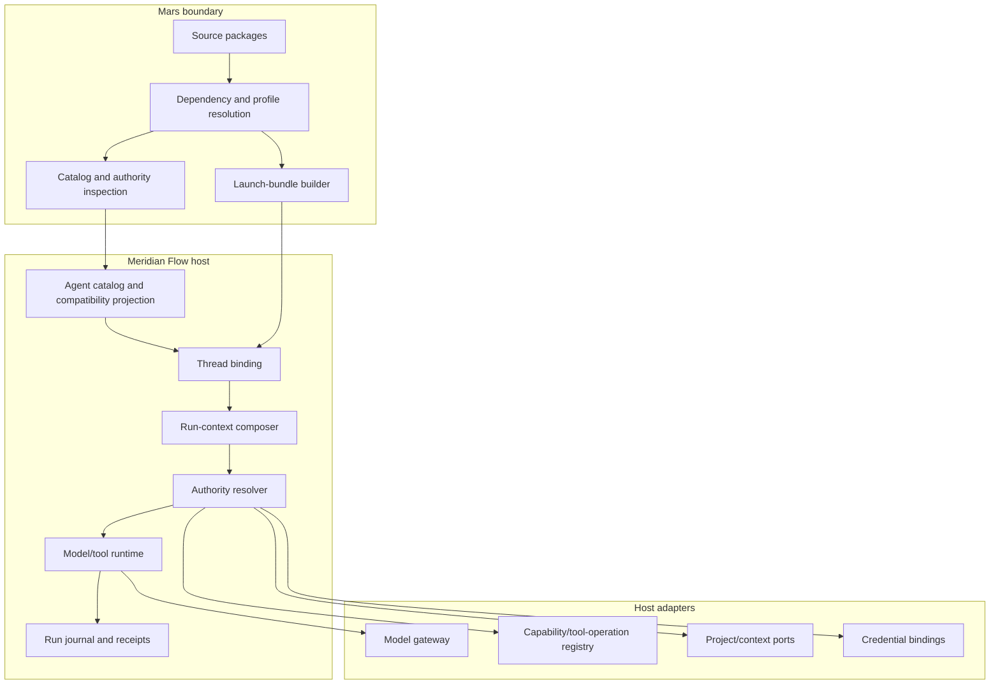
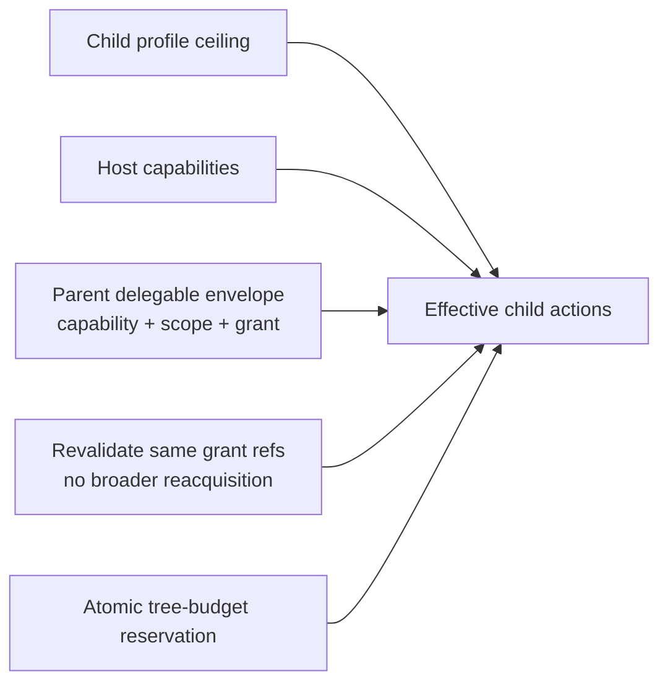
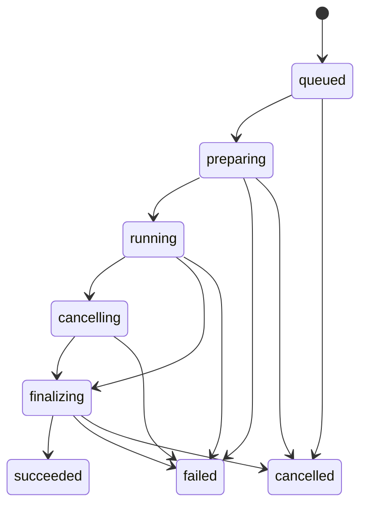

# Meridian Agent System Design

**Status:** proposed target architecture
**Scope:** shared Mars agent semantics, Meridian Flow host behavior, distribution, primary agents, delegated child runs, tools and authority, writer communication
**North star:** the ideal Meridian CLI architecture, adapted as a first-class direct host for fiction writing

**Companion artifacts:** [data structures](agent-system-data-model.md), [implementation plan](agent-system-implementation-plan.md)

## Decision summary

Meridian will have **one agent system with multiple hosts**. Mars packages are the authoring and distribution unit. Mars resolves the static agent contract into a versioned launch bundle. Meridian Flow binds that bundle to a fixed chat/Work context and executes it through its model-and-tool runtime. It does not invent a Flow-specific agent dialect or independently reinterpret Mars policy.



The system separates three truths:

1. **Definition truth:** what the package author configured and the maximum actions the profile requests.
2. **Binding truth:** which immutable definition revision and static launch contract a chat uses.
3. **Run truth:** what model, actions, resources, credentials, limits, and child lineage were effective for one execution.

## Reader model

A writer encounters an agent as a purposeful collaborator with understandable abilities. An implementation lead encounters it as a declarative profile compiled into an immutable host binding. The model encounters only the tools, skills, context, and delegation roster that survive host resolution.

```text
Writer: “Critic reviews but cannot rewrite my manuscript.”
Profile: purpose + instructions + tool ceiling + invocation + child roster
Binding: exact profile/package revision + direct launch bundle
Run: fixed Work context + effective tools + model + limits + receipt
```

## What an agent profile implements

**An agent is a versioned, purpose-led execution profile that a host binds to a model, context, tools, authority, and lifecycle for a run.** The profile makes behavior and maximum requested capabilities portable; the host makes them real and accountable.

An agent profile implements portable **purpose and policy**, not a runtime, credential set, or workflow. These are its complete feature axes:

| Feature | Declared by the profile | Resolved by Mars | Supplied/enforced by the host |
|---|---|---|---|
| Identity and purpose | stable slug, display name, description | qualified package coordinate and digest | catalog visibility and localized writer copy |
| Behavior | Markdown instructions and output contract | composed static prompt surface | task, chat, Work, and story context injection |
| Model preference | model/route policy and effort | canonical route, fallback, provenance | provider execution and actual usage |
| Skills | skill references | exact skill content, variants, provenance | progressive disclosure/loading mechanism |
| Actions | versioned constraints in the authored `capabilities` section | normalized ceiling and compatibility requirements | concrete model tools, resource authorization, credentials, dispatch |
| Human invocation | `user-invocable` | normalized eligibility intent | writer/account/project eligibility and every direct API |
| Model invocation | `model-invocable` | normalized eligibility intent | parent roster, authority, budget, and lifecycle checks |
| Delegation | exact `subagents` roster | qualified locked child edges and helper inventory | foreground/background child runs and reports |
| Execution hints | approval/sandbox/timeout/compaction preferences | normalized hint plus lossiness diagnostics | host policy; hints never grant authority |

Run lifecycle, Project/Work access, connected accounts, spend, approvals for external effects, receipts, and undo are host services around an agent profile. They are not portable powers the profile can grant itself.

## Canonical vocabulary

| Term | Definition |
|---|---|
| **Prompt package** | Versioned Mars source artifact containing agent profiles, skills, resource documents, model aliases, and dependencies. The unit of distribution. |
| **Agent profile** | Portable, versioned behavioral identity: metadata and policy in YAML frontmatter, instructions and output contract in Markdown body. |
| **Agent definition revision** | Flow's immutable installed projection of one resolved Mars profile revision. Derived data, never a second authoring format. |
| **Thread binding** | The exact agent-definition revision and launch-bundle snapshot fixed to a chat at creation. |
| **Agent run** | One execution of a bound agent in response to a task/turn. Owns effective authority, lifecycle, usage, and receipt. |
| **Primary run** | A run started directly by a writer in its chat. “Primary” describes invocation lineage, not a profile species. |
| **Child run** | A run delegated by another run. It uses a separate child thread and returns a report. “Child” is a relationship between runs. |
| **Skill** | Reusable doctrine or methodology composed into an agent without creating a separate model/context boundary. |
| **Capability** | Stable product-level action contract such as `document.read` or `document.edit`. A profile may require, optionally use, or deny it. |
| **Tool** | Concrete model-callable host interface implementing one or more capabilities. A tool is not a permission or credential. |
| **Capability policy** | Profile-declared maximum action surface: required, optional, and denied capabilities. It is not resource authorization. |
| **Host capability** | A semantic capability or execution feature the current host can faithfully bind. |
| **Resource authorization** | Concrete Project/account/resource access the host grants to a run. Definitions cannot grant it. |
| **Approval policy** | Host decision about which authorized consequential actions pause. Ordinary native Yjs writes never pause. |
| **Launch bundle** | Versioned, static Mars-to-host execution contract: resolved profile, model policy, skills, capability policy/binding requirements, prompt surface, delegation inventory, provenance, warnings, and empty dynamic-content slots. |
| **Run receipt** | Durable account of the resolved definition, effective model/actions, effects, child lineage, usage, warnings, and outcome. |

## Architecture boundaries



### Mars owns

- package/source resolution, SemVer, lock provenance, and distribution metadata
- agent and skill parsing/validation
- model aliases, policies, fallback, and direct-target routing
- semantic capability-policy normalization
- invocation axes and resolved delegation inventory
- static prompt surface and skill composition
- launch-bundle versioning, provenance, compatibility diagnostics, and lossiness warnings
- package/catalog inspection and static definition-policy diffs

### Meridian Flow owns

- Project ownership and the chat's fixed Work context
- writer-facing catalog projection and capability copy
- immutable thread binding and replay
- confidential task, chat history, story context, and dynamic prompt injection
- concrete tool implementations and operation-level dispatch
- resource/account authorization and credential binding
- host action classification and approval
- run and child lifecycle, budgets, event delivery, reports, receipts, and undo links

### The model gateway owns

- provider-specific request/stream translation
- provider/model execution and usage facts
- no product policy, agent parsing, or resource authorization

### Package ingestion is a supply-chain boundary

Network-capable fetch and compilation are separate, while Mars remains the only dependency resolver. Hosted install requires a complete lock graph:

1. The host fetches the root through a strict source-origin policy into a bounded immutable candidate tree.
2. Mars performs bounded offline inspection of the root manifest/lock and emits an exact `DependencyFetchPlan`; it makes every SemVer/lock decision.
3. The host fetches only those immutable coordinates/digests through the same policy.
4. Mars validates the supplied closure against the plan and compiles it offline/read-only.

Hosted Flow permits only configured registry and HTTPS Git origins, validates redirects and DNS/IP destinations on every hop, blocks loopback/link-local/private/control-plane targets by outbound policy, and accepts opaque host credential references rather than secrets embedded in URLs/packages. Server `file:`/local sources are unavailable; a trusted local CLI host may explicitly support them. Unlocked authoring resolves and writes a lock only in a trusted authoring environment before hosted installation.

Compilation runs no hooks, MCP servers, harnesses, package code, or network access and cannot escape the candidate root through paths, archives, or symlinks.

Mars and the host bound total bytes, file count/size, YAML aliases/nesting/scalars, dependency depth/count, CPU, memory, and time. Cycles, digest mismatch, path escape, executable hooks, and unsupported resources reject the entire candidate atomically. Flow persists nothing until the complete locked graph, normalized catalog, and direct artifacts validate.

## Portable Mars profile

A published profile is explicit enough to behave predictably across hosts:

```yaml
---
name: Critic
description: Reviews narrative craft without rewriting the manuscript.
model: moderate
effort: medium
user-invocable: true
model-invocable: true
skills: [fiction-critique]
subagents: []
capabilities:
  required:
    - id: context.read
      contractVersion: 1
    - id: document.read
      contractVersion: 1
      scope: { uri-schemes: [project, scratch] }
  optional: []
  denied:
    - id: document.edit
      contractVersion: 1
approval: default
---

You are Critic...
```

### Identity

- Canonical logical identity is `<package-name>/agents/<profile-slug>`.
- The filename stem is the stable slug.
- `name` is display copy and may differ from the slug.
- `PackageRevision` adds package version, content digest, and lock digest. `AgentRevisionId` adds the definition digest and slug. Flow assigns an internal immutable row ID but never treats it as the exchange identity.
- Cross-package skills and child references resolve through Mars and lock to package coordinates/digests.

### Capability policy

`required ∪ optional` is the complete profile ceiling. Missing `required` capability makes a host incompatible. Missing `optional` capability makes it degraded. `denied` is a hard denial and wins over every other source.

```text
definition action ceiling
  = (required ∪ optional) − denied

host-compatible actions
  = definition ceiling ∩ host semantic capabilities

launchable
  = every required action has a faithful host binding
```

For published packages, all three capability arrays, both invocation axes, and the child roster are explicit. In v1, any scope overlap across required, optional, and denied disposition sets is invalid; Mars does not perform policy subtraction. Local ad-hoc profiles may explicitly inherit host defaults, but Mars labels them host-relative rather than portable.

The authored `capabilities` section contains versioned capability constraints, not harness function spellings. Current Mars `tools` remains concrete harness tool policy and may appear only in a target-specific override; it is not silently reinterpreted. Existing profiles require author-reviewed conversion. Mars core IDs remain portable; package/host namespaces cover actions with no universal equivalent.

Each capability contract owns its argument shape and scope grammar, including canonical equality, overlap, subsumption, and intersection. A host maps one capability to one or more `ToolOperationBinding`s. Each binding converts a concrete tool call and canonical arguments into a capability operation plus resource scope before authorization. A compound tool exposes only allowed operations in its schema where possible and always rejects disallowed operations before its handler.

### Invocation

The axes are independent:

| Field | Meaning |
|---|---|
| `user-invocable` | Human-facing hosts may bind the profile directly. |
| `model-invocable` | Another agent may discover and delegate to the profile. |
| `mode` | Legacy harness/presentation hint only. It is not part of portable eligibility and Flow ignores it for that purpose. |

A profile may be human-only, model-only, both, or neither. Every direct launch API, not merely the visible picker, enforces the same eligibility rule.

### Delegation

`subagents` is the exact definition-level delegation roster. It is both the capability declaration and the source for the model-facing helper inventory.

- omitted or empty means leaf agent
- no separate positive `spawn` boolean exists
- each reference must resolve during package installation
- only `model-invocable` children are eligible
- the host may remove unavailable/incompatible children but never add undeclared ones
- a roster can contain a profile that is also user-invocable

Mars renders a **roster-scoped** inventory and spawn contract for every profile with eligible children. Nested delegation uses the same rule and remains bounded by host depth/budget limits.

### Skills

Skills remain progressive-disclosure instruction modules. Mars resolves required skill content, variants, and model/user invocability. A missing declared skill is a package/definition error, not a silent host fallback. Flow consumes the resolved skill surface from the bundle rather than rebuilding Mars resolution.

Shared capability policy belongs to the agent profile in v1. A skill never grants, requires, or dynamically changes run authority. Existing Mars skill `allowed-tools` remains a concrete harness-target restriction; a Flow direct target accepts only skills without that field until a future version defines a portable, precomputed narrowing contract. Restrictive skill policy is never silently ignored.

### Execution requirements and hints

Execution requirements and advisory hints are distinct in the normalized contract. A `requiredFeature` or minimum isolation class must be satisfied or the target is incompatible. Effort, timeout, compaction, and approval posture may be hints where declared as such; the bundle records whether each was applied or inapplicable. A package can request stricter containment/confirmation but can never weaken host policy, self-approve, grant authority, or require approval for native Flow manuscript edits. Unknown restrictive requirements fail closed; unknown advisory presentation metadata may be preserved without affecting execution.

## Direct launch bundle

Meridian Flow is a generic, transport-neutral `direct` Mars target, not a Flow-specific profile dialect. `Direct` means the bundle is consumed by a host-owned model/tool loop; Mars may be reached through a library, WASM module, or contained JSON process. Before bundle construction Flow supplies a host descriptor containing supported models, semantic capabilities, execution features, and contract versions—never user credentials or content.

```text
HostRuntimeDescriptor
├── target: direct
├── supported bundle/profile versions
├── available model routes
├── semantic capability bindings and supported scope grammar
├── delegation/background capability
├── approval/receipt feature support
└── host stability/version metadata
```

Mars returns a versioned bundle containing:

```text
LaunchBundle
├── resolved agent identity and body
├── routing: model token, canonical route, provider/harness evidence
├── execution policy: effort, approval preference, timeout/compaction hints
├── capability policy: required, optional, denied, structured external refs
├── skills: loaded/available content and metadata
├── delegation: qualified eligible children + inventory prompt
├── prompt surface: static system content + dynamic scaffold slots
├── provenance: source of every resolved field
├── compatibility: supported/degraded/incompatible reasons
└── warnings and lossiness
```

Mars never receives the writer's prompt, chat history, manuscript text, credentials, or live limits.

### Compatibility and readiness are different facts

Mars produces **contract compatibility** from only the definition and host descriptor:

- `supported`: every required mechanism binds faithfully
- `degraded`: required mechanisms bind, but optional mechanisms are absent
- `incompatible`: a required mechanism, restriction, scope grammar, or contract feature cannot bind

Flow separately computes **binding readiness** for the authenticated writer, Project, fixed Work, current grants, connections, credits, and controls. It records `launchability: ready | blocked`, all blocking reasons, unavailable optional capabilities, and the effective capability set. A missing required grant blocks; a missing optional grant narrows while remaining launchable absent another blocker. It is recomputed at catalog display, thread creation, run preparation, and dispatch where live grant revocation matters.

Static compatibility never contains `needs-setup`. Writer-facing capability copy combines compatibility and readiness without storing writer/account facts in a Mars artifact or host-descriptor projection.

## Flow composition seam

One deep module constructs an immutable `AgentRunContext`. All root turns and child runs use it; route handlers, tool handlers, and gateway adapters cannot bypass it.

```text
AgentRunContext
  = recorded launch-bundle snapshot
  + exact thread binding
  + fixed thread Work context
  + confidential task and bounded chat history
  + resolved story/context material
  + effective tool operations
  + resource authorization and credentials
  + parent attenuation and run budgets
```

The builder returns either a complete context plus warnings or a typed failure before model execution. Effective values and warnings are persisted before streaming begins.

### Binding and replay

- A root chat chooses its agent and Work at creation.
- The thread, initial writer message, `thread_works` relation, and thread-agent binding are created immutably in one transaction. They reference the existing Project/Work and installed definition/host projection and snapshot the exact launch bundle. Mutable pre-send Agent/Work selection is client/draft state and does not create an empty bound thread.
- Continue/replay uses the recorded bundle and definition revision; it does not consult current package defaults.
- A package update affects new chats, not existing ones.
- Changing agent creates a fresh thread/handoff/fork with the same fixed Work when appropriate.
- Each run records the actual provider/model route and effective action surface even when they match the binding.

## Authority model



```text
effective root actions
  = profile ceiling
  ∩ host bindings
  ∩ writer/Project authorization
  ∩ available credential scopes
  ∩ host limits

effective child actions
  = child profile ceiling
  ∩ parent delegable authority envelope
  ∩ revalidated parent grant references
  ∩ atomically reserved tree limits
```

The parent envelope binds each delegable capability to its maximum resource scope, permitted connection-grant references/scopes, and further-delegation constraints. Child preparation starts from that envelope and may only narrow it. It never queries the writer's broader grants or selects a different connected account to reacquire authority the parent did not hold.

Tree budgets are not snapshots alone. A root-owned durable ledger atomically reserves child count, concurrency, depth, estimated credits/tokens, and time in the same transaction that reserves the child run. Finalization reconciles actual usage and releases unused reservation. Concurrent siblings therefore cannot each spend the same “remaining” budget.

The chat's Work is immutable **context**, not a permission grant. It selects the task context, shared drafts, and default URI meaning. Project ownership is the current native-content authorization boundary. External services may add resource/account grants independently.

The same effective action gate controls both model advertisement and dispatch. Hiding a tool is not security; fabricated or stale tool calls are rejected at dispatch.

### Approval and trust

- Native Yjs manuscript edits merge immediately with marks, change evidence, receipt, and undo.
- Profile `approval` is a portable execution preference for hosts/action classes that support it. It may request a stricter posture but can never self-approve, broaden authority, or gate native Flow manuscript writes.
- Host policy may be stricter for consequential external effects but may not introduce approval friction for native manuscript writing.
- External publishing, purchases, destructive remote mutations, and similar actions may require action-time confirmation with literal target/account/scope copy.
- Package installation/update may require acknowledgement when authority expands; this is configuration trust, not approval of each AI write.

An external-action approval is a single-use `ApprovalGrant` bound to the run, capability operation, canonical argument/resource hash, connection/account, scope, policy version, and expiry. The writer-facing durable action request references the same immutable proposed `effectId` and exact boundary. Answering that request compare-and-sets the exact request and creates, or moves, its proposal-specific grant to `granted`. The resumed executor consumes that still-live grant only inside the later effect dispatch-claim transaction. Any target, argument, account, scope, policy-version, or expiry change closes the old request and requires a new proposal, request, and grant. Immediately before the adapter call, dispatch rechecks checkpoint-aware artifact control, live authorization, connection/grant generation, and budgets.

Authorization records one typed decision on a stable proposed `effectId`: `confirmed-by-writer {approvalGrantId}` or `policy-authorized-without-confirmation {policyVersion}`. Every external consequential effect uses the same dispatch-claim transaction: compare-and-set that effect from `authorized` to `dispatching`, persist its unique attempt/idempotency key, and append the dispatch event before any adapter call. The writer-confirmed branch also consumes the exact unexpired grant in that transaction; the policy-authorized branch consumes no grant. Uniqueness on `effectId` permits one dispatch claim in either branch.

External consequential effects use `proposed → authorization-decision → dispatching → confirmed | failed | unknown`. A claimed non-idempotent attempt without definitive evidence becomes `unknown` and never returns its grant to reusable state. A proven-idempotent adapter may reconcile using the same persisted key. Until a host implements this protocol for an external capability, that capability is incompatible, not best-effort. Native Yjs writes have a separate risk class and can never enter this approval path.

## Lifecycle and delegation



Every transition is a compare-and-set against the run state revision and executor attempt/lease. Terminal states are immutable. Cancellation is an orthogonal durable request: queued/preparing work may become `cancelled` directly; running work stops new effects, enters `cancelling`, drains in-flight evidence, then finalizes. A cancellation during finalization affects the outcome only if no terminal result has already won.

Workers acquire expiring attempt leases. Reconciliation may claim an expired nonterminal run with a new attempt, but cannot compete with a live lease or rewrite terminal evidence. Child report delivery has its own `pending | delivered | failed` projection; delivery failure never changes the child's execution outcome. Required race probes cover cancel-before-start, cancel-during-finalize, duplicate finalization, expired-worker recovery, and external effects left `unknown`.

Exceptional writer questions, scoped external confirmations, budget increases, and outcome checks are durable action requests. **Needs input** is a presentation derived from pending blocking requests, not an additional run lifecycle state. Before waiting, an executor durably records the request and continuation checkpoint, then releases its lease. Reconciliation cannot resume that continuation until a compare-and-set answer, decline, or expiry transition appends its wake event. Cancellation may close pending requests without an answer; finalization closes any that remain. Answer, expiry, cancellation, and terminal completion race on request/run revisions so exactly one outcome wins. Multiple requests remain independent, and a parent waits only when a required child request explicitly blocks it.

A child launch proceeds as follows:

1. Parent requests a qualified child from its resolved roster with a task and short description.
2. The host rechecks parent dispatch eligibility, child definition revision, `model-invocable`, remaining limits, and authority attenuation.
3. In one transaction, the host atomically reserves tree budget and creates a durable child run/thread reservation before background execution can become invisible.
4. The child inherits Project, fixed Work, root lineage, and only attenuated authority; it receives its own prompt/context window.
5. Foreground waits for the report. Background returns the child identity immediately and delivers the report when terminal.
6. The child report is the primary result. Full child thread, effects, usage, and transcript remain inspectable.
7. Parent cancellation propagates to active descendants; terminal children do not change afterward.

The child binding is created at launch from the exact child revision recorded in the parent's resolved roster edge, the current compatible direct-host descriptor, and the inherited fixed Work. The complete child bundle and parent-edge digest persist before execution. Package activation/defaults and bare slugs are never consulted. If the current host can no longer bind the recorded child revision, launch fails explicitly rather than retargeting.

Meridian owns no workflow graph or agent state machine beyond run lifecycle. Orchestration strategy remains in agent instructions and judgment.

## Writer experience

### Package install/update

Show:

- package publisher/source/version and agents included
- each agent's purpose
- required and optional capabilities
- external connections and MCP/tool dependencies
- delegation graph
- compatibility/degraded reasons
- static policy changes and host activation impact since the installed version

### Agent selection

Lead with purpose, then distinguishing effective capabilities:

```text
Critic
Reviews pacing, causality, dialogue, and emotional turns.

Can read this Work
Cannot edit manuscript text
Can be consulted by Muse
```

Do not lead with raw tool names. Capability copy is generated from the Flow semantic-tool registry and the current host/context compatibility result.

### During a run

- compact state: preparing, writing, consulting Critic, waiting, failed
- child task cards are collapsed by default and show name, task, state, and cost
- external action approvals show the literal action, target, account, and duration/scope
- ordinary manuscript edits never stop for approval

### After a run

The report is primary. Secondary inspection includes:

- documents/context changed with undo/navigation
- sources and external operations
- children consulted and their reports
- model, cost/credits, duration, and warnings
- incomplete/failed work and recovery paths
- exact definition/package revision

## Custom agents and distribution

A custom agent is a Mars profile in a writer-owned package, not a DB-only parallel type.

- Creating from scratch writes a personal Mars package/profile through the same schema.
- Customizing a builtin/package agent creates a fork with explicit provenance.
- UI editing changes structured source fields and instructions; advanced users may inspect/export YAML/Markdown.
- Save runs the same Mars validation, catalog, compatibility, and revision pipeline as imported packages.
- Export produces a normal Mars package usable by CLI, Flow, and other compatible hosts.

Git/local distribution is sufficient for the first implementation. Registry search, verified publisher identity, ratings, and signatures follow after capability packaging is stable. Content digests, source provenance, package license/repository metadata, and atomic definition-policy diffs are required from the beginning.

### Install, activation, and control protocol

Mars emits a versioned `DefinitionPolicyDiff` over normalized locked graphs: capability/scope changes, required/optional/denied disposition, model/features, delegation edges, external dependencies, instructions/skills, and provenance/trust changes. It does not call this an authority diff because live authority is host-owned. Flow derives an `ActivationImpact` using host risk classes and current context.

An update is installed as an immutable candidate, validated and projected, then acknowledged when policy expands or provenance changes. One scoped activation pointer switches future catalog bindings to the candidate in a transaction; referenced revisions remain retained. Rollback repoints future bindings and never rewrites history.

One deny-first artifact-control evaluator accepts package/definition targets, scope, control generation/effective time, run reservation generation/time, and checkpoint (`discovery | binding | reservation | dispatch`). `revoked` wins over disabled/enabled at every scope; a narrower scope may add restrictions but never override a broader revocation. Disable hides new discovery/binding.

Ordinary revocation blocks root/child reservations created at or after its effective generation. Dispatch for a run reserved earlier ignores that later ordinary revocation, so policy cannot change mid-run. A distinct `emergency-stop` control blocks new dispatch in active runs and requests cancellation; in-flight effects still finalize as confirmed, failed, or unknown from evidence. Package-revision and agent-revision controls evaluate atomically together. No control rewrites completed/active history.

## Interfaces

| Interface | Responsibility |
|---|---|
| `PackageCandidateFetcher` | Enforce source-origin/network policy and fetch the root plus only exact coordinates from Mars's dependency plan; never resolve package semantics or execute content. |
| `MarsPackagePort` | Offline-inspect a root into an exact dependency fetch plan, then validate/compile a supplied closure into catalogs, provenance, diagnostics, and definition-policy diffs. |
| `MarsLaunchPort` | Build a versioned direct launch bundle from agent coordinate, host descriptor, and explicit overrides. |
| `AgentCatalog` | Query installed compatible definition revisions and writer-facing projections. Never parse Mars source. |
| `ArtifactControlEvaluator` | Evaluate package/definition controls with scope, generation, reservation time, and checkpoint; distinguish ordinary revocation from emergency stop. |
| `BindingReadinessResolver` | Combine static compatibility with current writer/Project/Work grants, connections, credits, and controls. |
| `ThreadBindingService` | Create/fetch immutable thread-agent binding and recorded bundle snapshot. |
| `AgentRunContextBuilder` | Sole definition/binding/context/authority composition seam. |
| `CapabilityRegistry` | Bind canonical capabilities to model-callable tools, executable handlers, scope resolvers, writer copy, risk class, and receipt formatters. |
| `AuthorityResolver` | Intersect definition ceiling, host bindings, live resource/grant facts, and any parent delegable envelope; emit only narrowing decisions. |
| `RunTreeBudgetLedger` | Atomically reserve and reconcile child count/concurrency/depth/credits/tokens/time with child identity. |
| `ApprovalService` | Issue/consume exact single-use grants for host-classified consequential external calls. Never handles native Yjs writes. |
| `EffectDispatcher` | Recheck live authority, resolve credentials late, execute idempotently where possible, and journal confirmed/failed/unknown effects. |
| `AgentRunExecutor` | Drive the model/tool loop using a complete run context. |
| `ChildRunCoordinator` | Validate delegation, reserve/drive/cancel children, and deliver reports. |
| `RunJournal` | Append lifecycle/effect events and derive durable receipts/projections. |

## Failure behavior

| Failure | Required behavior |
|---|---|
| Invalid package/profile/skill | Reject candidate atomically; installed revision remains unchanged. |
| Unknown bundle/profile version | Reject before persistence or execution. |
| Missing required capability/model feature | Mark definition incompatible; direct APIs cannot bypass. |
| Missing optional host capability | Contract compatibility is degraded; capability copy explains the loss. |
| Required live connection/grant missing | Binding readiness is blocked with all reasons; do not launch until resolved. |
| Optional live connection/grant missing | Remove the optional capability, record it as unavailable, and remain launchable if no blocker exists. |
| Unsupported restrictive policy/scope | Fail closed; never widen to a broader tool. |
| Model route unavailable | Use only Mars-declared fallback; otherwise fail with provenance and recovery options. |
| Dangling child reference | Reject package compilation/installation. Never retarget by slug. |
| Resolved child incompatible with this host | Remove it from the effective roster, mark the parent degraded, and explain the loss. |
| Tool call outside effective policy | Reject at dispatch and receipt the denied attempt. |
| Consequential external capability lacks exact approval/effect protocol | Mark host binding incompatible; do not expose it. |
| External call outcome uncertain | Record `unknown` with target/idempotency evidence; never auto-retry unless proven idempotent. |
| Child budget/depth exceeded | Reject before reservation with a structured limit result. |
| Package update expands static policy or host risk | Show definition-policy diff plus activation impact before switching future bindings; existing threads remain pinned. |
| Definition/package revoked | Block new root/child reservations with explicit reason and replacement path; do not rewrite history. |
| Crash during child execution/finalization | Durable queued/running/finalizing state permits reconciliation; report evidence outranks guesses. |

## Numbered decisions

### D1 — One Meridian agent system
Mars profiles and launch bundles are shared across CLI and Flow. Rejected: a Flow agent dialect with duplicated semantics.

### D2 — Prompt packages are the distribution unit
Agents, skills, resources, model aliases, and dependencies ship together. Rejected: loose standalone YAML as the complete exchange artifact.

### D3 — Launch bundle is the execution exchange
Extend the existing Mars launch bundle for direct hosts. Rejected: Flow parsing profiles or a parallel Flow execution contract.

### D4 — Definition, binding, and run are separate
A profile declares portable intent; a thread binding freezes a revision; a run owns contextual truth. Rejected: one mutable “agent” object holding all three.

### D5 — Agent capabilities live in profile data
Skills, capability policy, invocation, and delegation are declarative. Rejected: persona-specific capability conditionals in Flow code.

### D6 — Capability policy is a maximum action surface
`required ∪ optional` defines the ceiling and `denied` wins. Required absence is incompatible; optional absence is degraded. Rejected: tools as mere hints or as resource grants.

### D7 — Host capability negotiation is explicit
Mars resolves against a typed host descriptor and emits compatibility/lossiness. Rejected: silent unsupported-field/tool drops.

### D8 — Resource authority is host-resolved
Project/account authorization, credentials, and live scopes never live in portable definitions. Rejected: package-authored Work IDs, account IDs, or credentials.

### D9 — Flow is a generic direct host
Mars gains a transport-neutral direct target consumed by Flow's host-owned model/tool loop; Flow supplies adapters and capability descriptors. Rejected: `harness-overrides.flow` as a second profile schema.

### D10 — One immutable run-composition seam
Every primary and child execution uses the same deep builder. Rejected: route/tool/gateway-specific policy assembly.

### D11 — Invocation axes are independent
`user-invocable` and `model-invocable` control different callers; legacy `mode` is non-normative. Rejected: intrinsic primary/subagent profile types.

### D12 — The child roster is the delegation capability
Nonempty `subagents` is the sole positive declaration; empty means leaf. Rejected: a second `spawn: true` boolean.

### D13 — Child authority attenuates
Children inherit context and lineage, never broader actions, credentials, or budgets. Rejected: children resolving fresh unrestricted host defaults.

### D14 — Thread bindings replay recorded policy
Continue uses the frozen revision/bundle; change means new thread/handoff/fork. Rejected: live package-policy recomputation inside an existing conversation.

### D15 — Flow Work is fixed invocation context
Root creation selects it and child/handoff/fork inherit it; it is not agent-granted authorization. Rejected: agent-controlled Work switching.

### D16 — Orchestration stays spawn-and-report
Agent prompts own strategy; the platform owns launch, tracking, cancellation, and results. Rejected: workflow DAG/choreography engine.

### D17 — Native writing never requires approval
Yjs merge, evidence, receipt, and undo are the trust mechanism. External consequential actions use host-owned approval classes. Rejected: blanket per-tool approval gates.

### D18 — Run state is durable and report-first
Lifecycle, effects, lineage, and receipts persist; the report leads, metadata is progressively disclosed. Rejected: ephemeral background work or metadata-first UX.

### D19 — Custom agents remain Mars sources
Create/fork/edit/export uses the same package/profile pipeline. Rejected: DB-only custom-agent schema.

### D20 — Updates create revisions and policy/activation diffs
Existing bindings stay pinned; new bindings adopt activated revisions. Rejected: in-place mutation and hidden permission expansion.

### D21 — Distribution trust follows capability semantics
Git/local plus provenance/digests first; registry/signatures after capability packaging stabilizes. Rejected: marketplace before executable capability contracts.

### D22 — Revocation blocks future execution without rewriting history
A host may revoke an exact package or agent revision and refuse reservations at/after that control generation with an explicit recovery path. Earlier reserved runs remain stable unless a separate emergency stop blocks new dispatch and requests cancellation. Existing bindings and receipts retain their exact historical identity. Rejected: mutating pinned threads, mid-run ordinary-policy drift, or silently substituting a newer profile.

## Architectural patterns

| Pattern | Application |
|---|---|
| **Policy / mechanism separation** | Mars profile/bundle expresses policy; Flow tools, model gateway, and child coordinator implement mechanisms. |
| **Ports and adapters** | Mars, model providers, context, credentials, tools, and persistence sit behind host ports. |
| **Functional core / imperative shell** | Capability intersection, routing, diffs, and receipt projection are deterministic; fetch, DB, provider, and effect adapters form the shell. |
| **Compile then bind** | Mars resolves static package/profile policy; Flow binds dynamic confidential run context afterward. |
| **Semantic IR + projection** | Launch bundle and capability references remain host-neutral; CLI/Flow adapters project them. |
| **Versioned capability contracts** | Each action owns canonical arguments and a scope lattice so narrowing is consistent across languages/hosts. |
| **Single composition seam** | `AgentRunContextBuilder` is the only path from binding + runtime facts to execution. |
| **Immutable snapshot + replay** | Thread binding and bundle snapshot make continue reproducible and package updates non-retroactive. |
| **Attenuated authority** | Child actions are intersections of child ceiling, parent authority, host policy, credentials, and limits. |
| **Capability-derived injection** | Delegation knowledge exists only when the resolved roster exists; tool descriptions follow effective bindings. |
| **Resolve before execute** | Invalid model/tool/definition policy fails before model streaming or tool dispatch. |
| **Durable reservation before background work** | A child run becomes recoverably visible before detached execution can outlive its launcher. |
| **Atomic budget ledger** | Child identity and estimated tree capacity reserve together; concurrent siblings cannot double-spend remaining budget. |
| **Append-only journal + projection** | Events are evidence; current run/receipt views are derived materializations. |
| **Exact single-use approval grant** | Consequential external confirmation binds one canonical call/account/scope and cannot approve a changed request. |
| **Report-first progressive disclosure** | Useful agent output leads; model/cost/transcript/debug details stay inspectable. |
| **Revisioned source + derived install state** | Mars source is editable/exportable truth; Flow records immutable derived revisions and activation. |
| **Install candidate + atomic activation** | Validate and inspect a new revision before one pointer changes future bindings; rollback never rewrites history. |
| **Fail closed on restrictive lossiness** | Unsupported denials/scopes never broaden access; compatibility is explicit. |

## Non-goals

- a general workflow/DAG engine
- agent-authored Project/Work/account scopes
- arbitrary executable code inside ordinary prompt packages
- per-edit approval for native manuscript changes
- a second Flow-specific agent schema
- changing an existing chat's agent in place
- registry/rating/recommendation infrastructure in the first release
- compatibility shims for current partial Flow agent records

## Open risks

1. The direct-target model catalog handshake must let Mars remain routing authority without exposing Flow credentials or coupling Mars to provider adapters.
2. Capability IDs and scope grammar must be stable enough for CLI and Flow while allowing host-specific operations.
3. The `required`/`optional`/`denied` disposition is a Mars schema addition; existing `allowed` lists need author-reviewed classification rather than a silent guess.
4. Compound Flow tools require operation-level enforcement; tool-name-only filtering is insufficient.
5. First-party package authoring must prove the profile model with materially different capabilities—not only different prompts.
6. Cross-repo bundle upgrades need one fixture suite and coordinated release order.
7. Capability-ID governance must exist before third-party packages depend on the shared namespace.
8. Receipts and transcripts may contain sensitive story/account evidence; the v1 retention, redaction, access, and payload-reference boundary must be fixed before the Phase 4 journal schema is locked.
9. Cross-host model “equivalence” cannot be inferred from an alias alone; portable behavior claims need eval criteria.

## Source evidence

- Meridian CLI KB: `principles/design-principles.md`, `principles/invariants.md`, `ecosystem/prompt-packages/overview.md`, `architecture/mars-launch-bundle.md`, `architecture/launch-system.md`, `concepts/spawn-lifecycle.md`, `concepts/spawn-output-contract.md`, `open-questions/mars-feature-gaps.md`.
- Work research: `../research/ideal-meridian-cli-agent-model.md`, `../research/meridian-cli-agent-kb-map.md`, `../research/source-agent-authority.md`, `../research/agent-capability-ux.md`, `../research/architect-agent-authority.md`.
