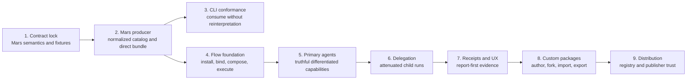
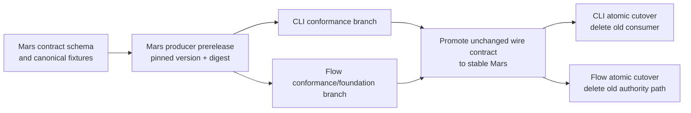
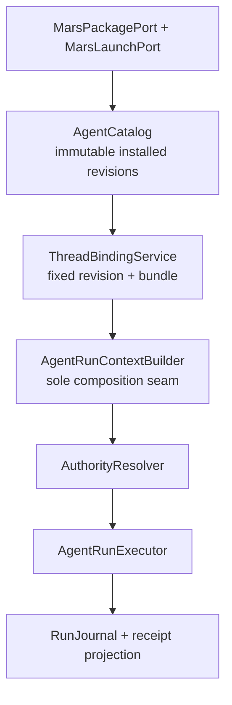

# Meridian Agent System Implementation Plan

**Status:** proposed cross-repository delivery plan
**Target:** the architecture in [Meridian Agent System Design](agent-system-design.md) and writer-facing behavior in [Meridian Flow Agent Experience](agent-ux-spec.md)
**Repositories:** `mars-agents`, `meridian-cli`, `meridian-flow`

## Delivery decision

Build the shared contract in Mars first, prove it in Meridian CLI, then replace Flow's partial agent model with one immutable install, binding, authority, and execution path. Primary agents, differentiated tool authority, child runs, receipts, and custom package authoring then arrive as end-to-end vertical slices.

Do not preserve the current Flow parser, mutable agent rows, slug precedence, prompt baking, or package sync behavior. There are no real users or data; dual reads, compatibility shims, and row migrations would make the target system harder to reason about.

The critical path is **1 → 2 → 4 → 5 → 6 → 7**. CLI conformance begins after the shared fixtures exist and must pass before Mars declares the contract stable, but Flow may develop against a Mars prerelease in parallel.

### Contract release and host cutover

Mars owns and versions the language-neutral schema, canonicalization rules, fixture corpus, serializer/formatter API, and compatibility matrix. CLI and Flow pin the exact prerelease and fixture digest in parallel. Stable promotion changes no wire semantics. Each host then cuts over atomically and removes its old semantic path in the same deployable PR. Review-sized foundation changes may live on a stacked/integration branch, but a second live authority path never lands on a deployable branch.

Rollback retains installed artifacts and repoints only future bindings to the last compatible revision; historical threads remain pinned. Generated bindings, if used, are reproduced from the stable schema and checked against the canonical fixtures in every repository.

## Release boundaries

| Release | Writer-visible outcome | Included phases |
|---|---|---|
| **Foundation** | No writer-facing claim. The shared contract is executable and inspectable in both hosts. | 1–4 |
| **Primary-agent slice** | A writer chooses a first-party agent for a new chat and gets behavior matching the advertised capabilities. | 5 and the root-run subset of 7 |
| **Delegation slice** | Eligible agents can consult named helpers; child reports and costs are visible. | 6 and the child subset of 7 |
| **Custom-agent slice** | A writer can create or fork a portable Mars agent and use/export it. | 8 |
| **Distribution slice** | Packages can be discovered and installed from a registry with publisher trust signals. | 9 |

The **complete first product** is phases 1–8. The public registry is deliberately later. A smaller first deploy may stop after the primary-agent slice, but delegation and custom agents remain designed parts of the system, not unspecified future work.

## Phase 1 — lock the portable semantics

**Outcome:** one normative vocabulary and contract that neither host can reinterpret.

### Mars changes

- Ratify `PackageName`, `PackageRevision {version,digest,lockDigest}`, `AgentLogicalId`, and `AgentRevisionId`; authored refs use logical IDs and normalized edges use revision IDs.
- Make `user-invocable` and `model-invocable` independent.
- Define `subagents` as an exact, resolved delegation roster; omitted or empty means leaf.
- Add a new versioned `capabilities` schema with required, optional, and denied constraints; every constraint carries a capability contract version and optional typed scope. Keep existing Mars `tools` as concrete target policy and require author-reviewed conversion.
- Define scope canonicalization, equality, overlap, subsumption, intersection, disjointness, and compound-tool operation mapping.
- Decide the first contract version and `requiredFeatures` behavior.
- Specify versioned normalized catalog and direct launch-bundle schemas.
- Specify provenance, warnings, contract compatibility, and definition-policy diffs.
- Separate Mars `ContractCompatibility` from Flow `BindingReadiness`; define `DefinitionPolicyDiff` versus Flow `ActivationImpact`.
- Define activation/control precedence and checkpoint semantics, child binding time, run transition/lease/reconciliation rules, and the transactional external effect/approval protocol.
- Define durable action-request, continuation suspension/wake, parent-blocking, multiple-request, and answer/expiry/cancel/terminal race semantics. `needs-input` remains a derived presentation, not a run lifecycle value.

### Evidence and gate

- Normative examples and counterexamples exist for every policy-bearing field.
- All three repository owners agree on capability scope semantics, child identity, update binding, revocation behavior, and unknown-feature behavior.
- **Stop** if a host default can silently change an explicit restrictive declaration.

## Phase 2 — build the Mars producer and conformance suite

**Outcome:** Mars compiles a package graph into deterministic, versioned artifacts that fully represent profiles and skills.

### Mars changes

- Strict safe-YAML parser and validator.
- Hosted fetch protocol: strict root-origin policy, Mars offline inspection emits exact locked dependency fetch plan, host fetches immutable coordinates, Mars validates/compiles closure offline/read-only.
- No hooks, MCP, harness, compiler network, symlink/path escape, or executable package code; enforce redirect/DNS/IP, scheme, local-file, credential-reference, and resource policies.
- Package graph, dependency, SemVer, digest, and provenance resolution.
- Normalized profile and skill catalog with qualified child edges.
- Direct-v1 skills remain instruction/reference modules only; concrete `allowed-tools` restrictions are incompatible with Flow unless a later portable narrowing contract is added.
- Direct-host launch bundle with static prompt surface and empty dynamic slots.
- Host-capability negotiation for models, capabilities, delegation, background execution, and contract features.
- Contract compatibility results: `supported`, `degraded`, or `incompatible`, each with structured reasons. Live connection/authorization/readiness remains host-owned.
- Golden positive and negative fixtures usable unchanged by every consumer.

### Required fixture families

- identity/display-name divergence and same-slug cross-package profiles
- omitted host-relative versus explicit-empty capability policy
- required, optional, and denied capability conflicts
- scope overlap/subsumption/intersection, including partial cross-disposition overlap where neither subsumes the other; compound-operation filtering; unknown capability/scope versions
- unknown required contract feature
- empty, dangling, incompatible, and locked child edges
- skill content/invocability normalization and direct-target rejection of concrete restrictive `allowed-tools`
- model route and fallback provenance
- deterministic digests and definition-policy diffs
- canonical bundle digest calculation and rejection of legacy duplicate/mismatched lock/descriptor digests
- lossless versus restrictive-lossy host projection
- malicious archive/symlink/path escape, dependency cycle/depth, oversize, resource-limit, and digest-mismatch rejection
- SSRF, redirect-to-private target, DNS rebinding, disallowed file/local origin, and dependency-plan mismatch rejection

### Evidence and gate

- Identical source and lock state produce byte-stable normalized artifacts.
- Invalid recognized values fail installation rather than becoming warnings.
- Both hosts can run the same fixture corpus without a host-owned parser.
- **Stop** if any runtime-relevant skill/profile field is missing from the normalized contract.

## Phase 3 — align Meridian CLI as the reference host

**Outcome:** the ideal CLI behavior consumes the new contract without becoming a second semantic authority.

### CLI changes

- Consume the normalized catalog/direct bundle at the existing preparation/bind seam.
- Keep task, goal, context files, prior session, credentials, and spawn metadata host-side.
- Project capabilities into concrete harness tools with explicit lossiness.
- Persist the exact definition revision, route, effective capabilities, warnings, and report provenance.
- Preserve spawn-and-report, durable lifecycle, and progressive disclosure.

### Evidence and gate

- Shared fixtures pass in CLI.
- No confidential dynamic input enters Mars source resolution or bundle construction.
- Unsupported restrictions fail closed; unsupported optional features degrade visibly.
- The legacy CLI consumer adapter is removed when the release cuts over.

## Phase 4 — replace Flow's agent foundation

**Outcome:** Flow installs immutable Mars artifacts and every run passes through one binding/composition boundary.

### Flow domain boundaries

### Flow changes

- Add a Mars adapter at the composition root; domains depend only on ports.
- Persist immutable installed package artifacts, definition revisions, compatibility, provenance, and activation state.
- Install updates as candidates, derive Flow activation impact, collect any required acknowledgement, then switch the future-binding activation pointer atomically.
- Keep package/definition enable/disable/revocation/emergency-stop controls separate from immutable content; ordinary revocation blocks later reservations, while only emergency stop blocks new dispatch in an active run.
- Bind a new chat to an exact definition revision and launch-bundle snapshot.
- Create the thread, initial writer message, `thread_works` relation, and thread-agent binding immutably in one transaction; reference the existing Project/Work and installed definition/host projection and snapshot the exact launch bundle. Mutable new-chat Agent/Work selection remains draft state and never creates an empty bound thread. Continue/replay never consults current package defaults.
- Build one `AgentRunContextBuilder` used by root runs and later child runs.
- Add the capability-to-tool-operation registry, authority resolver, model gateway port, and append-only run journal.
- Before locking the journal schema, define v1 receipt/transcript retention: persist references and redacted summaries by default, enumerate permitted detailed payloads, and fix their access and retention boundary.
- Add immutable activation pointers, checkpoint-aware deny-first artifact controls, static host projections, and recomputed writer/Project/Work readiness with launchability separate from blocking and unavailable-optional reasons.
- Add exact external approval grants and effect states; keep external consequential capabilities incompatible until that protocol is implemented end-to-end.
- Add the durable action-request and suspended-continuation/wake boundary for root runs, including the transcript-native root Attention surface. Needs input is derived from pending blocking requests and survives reconnect/background execution.
- Replace the current partial parser/schema/import/update/prompt paths atomically; no dual path.

### Evidence and gate

- Flow passes the shared Mars fixtures.
- Same-slug profiles cannot retarget a thread across packages or updates.
- An initial-send failure leaves no empty thread/binding and returns the intact instruction, Agent, Work, and current readiness reason.
- Unknown contract versions, missing required capabilities, unknown scope versions, and unenforceable denials cannot persist or execute.
- One receipt explains definition, binding, effective model/actions, warnings, and outcome; static compatibility and live readiness remain separately inspectable.
- **Stop** if a route, picker, tool handler, or model adapter can assemble policy independently.

## Phase 5 — ship truthful primary agents

**Outcome:** a writer chooses an agent by purpose and receives behavior enforced by the same capability projection shown in the UI.

### First-party package

Start with profiles that prove policy differences, not merely persona differences:

| Profile | Purpose | Native document authority | Delegation |
|---|---|---|---|
| **Writer** | Drafts and revises prose from the writer's instruction. | Read and edit | May consult Critic and Continuity |
| **Critic** | Reviews craft and returns a report. | Read only | Leaf initially |
| **Continuity** | Finds contradictions against story context. | Read only | Leaf initially |
| **Reader** | Simulates reader response and confusion. | Read only | Leaf initially |

Names and exact roster remain product copy decisions; the important acceptance condition is materially different enforced authority.

### Flow changes

- Derive catalog and picker copy from current compatibility and effective capabilities.
- Enforce user invocability in a domain resolver shared by picker and every direct API.
- Create a chat with selected agent and fixed Work; never change either in place.
- Stream through the common run executor.
- For native Yjs edits, write immediately and record change evidence/undo without approval.
- Expose the root report and compact receipt inspection.

### Evidence and gate

- Critic/Continuity/Reader never receive or dispatch edit operations.
- Writer edits through the Yjs path without an approval interruption.
- A package update affects only new bindings.
- Browser/runtime probes cover supported/degraded/incompatible contract states; ready/blocked launchability with multiple blocking and unavailable-optional reasons; replay, failure, and undo.
- Browser/accessibility probes cover the target experience at desktop and 390px, semantic picker rows and focus return, keyboard order, no-hover operation, reduced motion, throttled live-region announcements, and fixed Agent/Work copy.
- Root writer questions and scoped external confirmations survive restart/reconnect without transient prompt state; native writes never enter this path.
- **Stop** if writer-facing capability copy and dispatchable operations differ.

## Phase 6 — add delegated child runs

**Outcome:** a parent can launch only declared compatible children, each with a separate context window and attenuated authority, and receive a durable report.

### Flow changes

- Add `ChildRunCoordinator` behind a spawn/report tool exposed only when the resolved roster is nonempty.
- Resolve roster edges to exact installed definition revisions at binding time.
- At child launch, compile/bind that recorded child revision against the current direct-host descriptor, persist its complete bundle and parent-edge digest, and never consult current package defaults.
- In one transaction, atomically reserve root-tree budget and create the durable child thread/run before foreground or background execution.
- Inherit Project, fixed Work, lineage, and only the parent's structured delegable authority envelope; revalidate the same grant/account references without reacquiring broader writer grants.
- Enforce and reconcile depth, child-count, concurrency, estimated credit/token/time, timeout, and cancellation against the root ledger.
- Return the child report as the primary result; keep transcript, effects, cost, and model details inspectable.
- Extend the foundation action-request boundary with child attribution, required-child parent blocking, and independent sibling progress. Native document writes never create confirmation requests.
- Propagate parent cancellation to active descendants and reconcile interrupted background runs.

### Evidence and gate

- Undeclared, non-model-invocable, incompatible, disabled, or retargeted children cannot launch.
- A child can never gain a capability, resource scope, credential, or budget absent from the parent lineage.
- Empty `subagents` injects neither helper inventory nor spawn tool.
- A complete run tree survives restart and can be reconstructed from receipts.
- Outstanding child attention survives restart and retains its exact request, scope, expiry, and parent-blocking behavior.
- Race probes cover cancel-before-start, cancel-during-finalize, lease expiry, duplicate finalization, report-delivery failure, and terminal compare-and-set behavior.
- **Stop** if background work can exist without a durable discoverable reservation.

## Phase 7 — complete receipts and writer communication

**Outcome:** writers see what mattered before, during, and after execution without reading raw tool names or transcripts.

### Flow changes

- Project the run journal into stable root and child receipts.
- Before launch: purpose, effective capabilities, setup needs, package/source, and delegation graph.
- During launch: compact states and collapsed child task cards; auto-expand only durable requests or failures under Needs attention.
- After launch: report first, then changed documents/undo, sources/external effects, children consulted, model/cost/duration, warnings, and definition revision.
- Separate native writing evidence from external-action approval. External publishing, purchase, or destructive remote mutations may require literal action-time confirmation.
- Bind each external confirmation to an exact canonical call/account/scope hash, expiry, policy version, and single use; recheck checkpoint-aware controls/grants immediately before dispatch.
- For every external consequential effect, CAS its stable `effectId` from authorized to dispatching, create the unique attempt/idempotency key, and append the dispatch event in one transaction before the adapter call. The writer-confirmed branch also consumes the grant; the policy-authorized branch uses the same effect claim without a grant.
- Journal consequential effects as proposed, authorization decision, dispatching, confirmed/failed/unknown and never auto-retry non-idempotent unknown effects.

### Evidence and gate

- Every terminal run has a report or a structured explanation of why no report exists.
- UI status derives from durable lifecycle state, not optimistic client inference.
- Denied tool attempts and degraded capabilities are visible without overwhelming the primary report.

## Phase 8 — add portable custom-agent authoring

**Outcome:** user-authored agents are normal Mars packages, not a Flow-only type.

### Mars and Flow changes

- Create a writer-owned/private package source and provenance class.
- Structured editor writes normative Mars profile fields and Markdown body.
- Forking a built-in/package profile records its source coordinate and revision.
- Save, import, update, and export use the same Mars validation, compatibility, install, definition-policy/activation-impact, and revision pipeline.
- Exported packages run in CLI and any compatible host.
- Existing chats remain pinned when a custom profile changes.

### Evidence and gate

- A profile authored in Flow exports and passes the same fixtures/validation in Mars and CLI.
- No DB-only runtime field is required to reproduce its static behavior.
- Policy/host-risk expansion is explicit before a new revision becomes active for new chats.

## Phase 9 — add distribution after semantics stabilize

**Outcome:** discovery and publisher trust build on an already-correct executable package model.

- Add package index/discovery metadata, license, repository/homepage, and publisher identity.
- Add signatures or verified publishers only when the registry trust model warrants them.
- Compare installed and proposed artifacts atomically: capabilities/scopes, required features, delegation graph, external dependencies, provenance, and host activation impact.
- Install updates as new immutable revisions; activation and rollback move a pointer for future bindings.

## Suggested PR sequence

These are reviewable contract boundaries, not a file-by-file task breakdown.

1. **Mars semantics and fixture corpus**
2. **Mars normalized catalog and direct launch bundle**
3. **Meridian CLI consumer/conformance cutover**
4. **Flow Mars ports, immutable install, and compatibility persistence**
5. **Flow thread binding, run composition, authority, journal, and schema replacement**
6. **First-party package and primary-agent vertical slice**
7. **Delegation lifecycle and attenuated child execution**
8. **Receipt projections and complete writer UX**
9. **Personal package authoring, fork/import/export**
10. **Registry/distribution trust**, only after the earlier slices are proven

The Flow foundation may require one intentionally large schema/domain PR because splitting the old and new authority paths would create the exact parallel hierarchy the rebuild rules prohibit.

## Replacement inventory

| Delete or replace | Target |
|---|---|
| Flow-owned permissive Mars parser as runtime authority | Versioned normalized Mars consumer |
| Mutable agent overlays, slug precedence, and source-path identity | Qualified immutable installed definition revision |
| Current package reset/sync/export lifecycle | Install-new, inspect diff, activate for future bindings |
| Local agent/skill authored revisions as portable truth | Mars package source plus derived Flow install state |
| `modelTier` and other ad hoc metadata | Normative Mars routing/model policy |
| Reinterpreting current concrete Mars `tools` as portable actions | New structured `capabilities`; keep `tools` only for explicit target overrides and require author-reviewed conversion |
| Empty child lists expanding to global inventory | Empty means leaf; exact qualified roster |
| UI/catalog filtering as invocation security | Shared domain eligibility resolver |
| Skill installation implying executable tool registration | Skills compose doctrine; capabilities bind to tools separately |
| Mutable current-agent/raw baked prompt thread contract | Immutable definition/bundle binding plus run context |
| Flow dialect or mandatory privileged Mars subprocess | Transport-neutral Mars ports and shared contract |

## Verification strategy

### Contract tests

- One golden Mars fixture suite runs in Mars, CLI, and Flow CI.
- Version/feature negotiation, provenance, and diagnostics are deterministic.
- Negative fixtures prove denial-first behavior and reject ambiguity.

### Domain tests

- Pure tests for invocation eligibility and authority intersection.
- Persistence tests for immutable installs, thread bindings, update pinning, child edges, lifecycle transitions, and receipts.
- Contract tests prove model advertisement and dispatch use the same capability resolution.
- Control race tests cover package/definition revocation before reservation, ordinary revocation after reservation, revocation during approval, and emergency stop during an active run.
- Effect tests cover concurrent double-submit in both writer-confirmed and policy-authorized branches plus crashes immediately before/after a remote call; one stable effect can create only one dispatch claim.
- Action-request race tests cover answer versus expiry, answer versus cancellation, terminal result versus pending request, multiple blocking requests, restart while suspended, and argument/account/scope mutation between display and answer.

### Runtime probes

- CLI probes cover dynamic injection, harness lossiness, spawn/report, and persisted provenance.
- Flow probes use the full Portless stack and inspect HTTPS streams, server evidence, DB state, Yjs state, child lineage, and receipts.
- Native manuscript editing must complete without an approval gate and remain undoable.
- Background child interruption/restart must reconcile to a durable terminal or recoverable state.

### Browser probes

- Agent selection and capability states
- contract degradation/incompatibility and live readiness explanations
- primary and child progress
- report-first receipt inspection
- update pinning and definition-policy/activation-impact presentation
- failure, cancellation, reconnect, and undo
- 390px reflow, keyboard/focus return, no-hover operation, reduced motion, and throttled live-region state announcements

## Cross-repository stop/go gates

| Gate | Do not proceed when… |
|---|---|
| **Contract** | empty policy, child identity, or unknown restrictive semantics remain ambiguous |
| **Mars stable release** | CLI and Flow do not pass the same contract fixtures |
| **Flow persistence** | Flow still needs to parse a runtime semantic absent from Mars artifacts |
| **Primary-agent UI** | advertised capability and dispatch sets differ |
| **Delegation** | child authority can widen or background work can become invisible |
| **Custom agents** | export cannot reproduce static behavior outside Flow |
| **Registry** | capability diffs, provenance, and immutable update binding are not already reliable |

## Remaining decisions and their deadlines

| Decision | Deadline | Recommendation |
|---|---|---|
| First-party capability split and final profile copy | Before Phase 5 | One edit-capable Writer plus report-only Critic, Continuity, and Reader profiles. |
| First contract/bundle version and required-feature namespace | During Phase 1 | Independent schema versions with explicit feature IDs; never infer support from producer version alone. |
| Mars producer transport | Before host integration in Phases 3–4 | Keep ports transport-neutral; begin with a contained JSON process if no complete stable library/WASM ABI exists. |
| Capability-ID/version governance | Before third-party/custom packages depend on shared IDs | Mars owns core contracts with cross-host conformance review; packages namespace non-core capabilities. |
| Receipt/transcript retention and redaction | Before the Phase 4 journal schema is locked | Persist references/redacted summaries by default; enumerate permitted detailed payloads and gate them by host access and retention policy. |
| Registry signatures/publisher verification | Before Phase 9 public registry | Decide from the actual registry trust model; content digests/provenance are mandatory earlier. |

External approval classes should be added only with the first real external integration, using the exact approval/effect protocol already fixed by the architecture.
