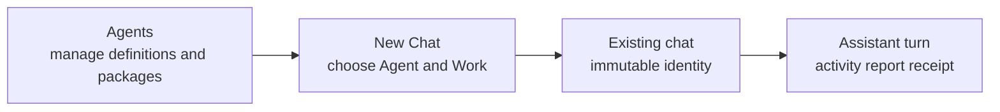

# Meridian Flow Agent Experience

**Status:** target UX for implementation
**Audience:** implementation lead, product reviewer, and designers extending Flow
**Related:** [system design](agent-system-design.md), [data model](agent-system-data-model.md), [implementation plan](agent-system-implementation-plan.md)

## Decision

Agent launch is a small choice inside **New Chat**. Agent management is a separate **Agents** destination. Existing chats show their bound Agent and Work as quiet facts, and execution evidence stays inside the assistant turn.



The relationship is deliberately one-way. A definition/version may become a chat binding only through New Chat. An existing binding never becomes a selector. The Agents area never becomes a launchpad or live-run dashboard.

## Surface ownership

| Surface | Owns | First question answered | Must not contain |
|---|---|---|---|
| **New Chat** | draft Agent, draft Work, first instruction, atomic first send | “Who should begin this chat, and in which Work?” | package management, definition editing, a launch gallery, or a separate start-agent CTA |
| **Agents** | installed packages, agent definitions/revisions, compatibility, authoring, import/export, install/update/activation | “What collaborators are available, what do they do, and how do I maintain them?” | Start chat, Run agent, live runs, queues, helper activity, or receipts |
| **Existing chat** | immutable Agent and Work identity, ordinary conversation | “Which collaborator and context does this chat use?” | selectors, switch controls, package settings, or launch actions |
| **Assistant turn** | run state, exceptional attention, report, changes, undo, evidence | “What is happening or what changed?” | task-center chrome, global progress, raw tool transcripts, or native-write approval |
| **Install/update review** | future package configuration and trust | “What will become available for new chats?” | live-run permission prompts or retroactive chat changes |

A package, agent definition, active definition revision, thread binding, and run are distinct concepts. Writer copy may use “agent” for a collaborator, but management UI must name package/source/version facts separately from definition/purpose/behavior facts.

## 1. New Chat is the only launch boundary

The writer arrives at a normal blank transcript and composer, ready to type. Agent and Work selection stay in the composer footer, using the existing quiet control position and popover grammar.

```text
┌────────────────────────────────────────────────────────────┐
│ What would you like to work on?                             │
│                                                            │
│ Writer ▾       Book One ▾          Draft            Send   │
└────────────────────────────────────────────────────────────┘
             Agent and Work are fixed after the first send.
```

- A sensible ready definition and the current/default Work are preselected and always named.
- There is no full-page collaborator chooser, binding review dialog, or **Send and start chat** ceremony.
- The normal Send action persists the initial writer message and creates the thread, `thread_works`, and exact definition binding atomically. Draft selection creates no empty thread.
- A single low-contrast sentence communicates immutability before first send. It does not repeat after the chat exists.
- A late readiness failure preserves the message, Agent, and Work and places the concrete recovery beside the Agent control. It never substitutes a definition, revision, Work, model route, or capability set.

### Agent picker

The Agent control opens a composer-anchored, viewport-bounded popover. It contains selectable installed definitions, not packages.

Each row contains only:

1. name;
2. one-sentence purpose;
3. honest current availability.

Rows are whole-row selection targets without nested buttons. Search appears when the inventory needs it. Management-grade facts—capability inventory, boundaries, source, versions, helpers, instructions, dependencies, and provenance—belong in Agents.

```text
Search agents

Writer
Develops and revises your serial
Ready

Continuity
Checks story facts across this Work
Available with limits: research is unavailable

Researcher
Needs setup: connect a research account

Manage agents…
```

- Ready and ready-with-limits rows select and close the popover.
- A blocked row opens the direct setup destination without creating a chat.
- Incompatible definitions are hidden behind **Show unavailable agents**.
- **Manage agents…** navigates to Agents; it does not select or launch anything.
- When no selectable definition exists, retain the draft, disable Send, and provide a concrete setup/install route.

### Work picker

Work uses the same compact popover grammar. It lists Works the new chat may bind and does not create or edit Works. Work management remains its own product concern. Agent and Work draft choices remain independent until the first send commits both.

## 2. Agents is an inventory and workshop

The Agents destination is a calm management surface, not a gallery of launch cards. On desktop it uses a flat list/detail layout descended from Flow’s shelf and Settings patterns. On mobile it becomes a routed list → detail → editor/review stack.

### Top-level structure

```text
Agents                                  [Install package] [New agent]
[Search agents]

YOUR AGENTS
  Writer                         Ready
  Scene Partner                  Draft

FROM PACKAGES
  Continuity                     Storycraft Essentials
  Critic                         Storycraft Essentials

PACKAGES
  Storycraft Essentials          2.4.0        Update available
```

- Agent definitions are the primary list because they are what writers understand and what New Chat selects.
- Package stewardship remains visible as a separate grouped list/view because packages own distribution, source, version, dependencies, and included definitions.
- Search spans agent names, purposes, and package names. Filters may cover ownership, availability, and updates, never running/queued execution.
- **New agent**, **Install package**, and optional **Import Mars YAML** are management actions. None creates a chat or run.
- The current Home **Agent Packages** launch cards move into this management/discovery area or are deleted. Home must not launch package-shaped projects.

### Agent definition detail

Selecting an agent opens its stable detail pane. The header gives identity and management actions, not launch:

```text
Writer                                      [Edit] [Duplicate] [Export]
Develops and revises your serial.
From My agents, revision 4. Used by new chats.
```

Information order:

1. **Purpose and availability**: ready, available with limits, needs setup, or incompatible with the exact reason.
2. **What it can do**: effective writer-language abilities.
3. **What it cannot do**: declared boundaries and unavailable optional abilities.
4. **Helpers**: bounded definitions it may consult and their limits.
5. **Behavior**: instructions and attached skills, summarized before source detail.
6. **Versions and source**: active revision for new chats, lineage, package, publisher/provenance, validation.

Actions:

- **Edit** for writer-owned definitions; saving creates an immutable revision.
- **Duplicate** for a writer-owned fork with visible lineage, including package-provided definitions.
- **Export** produces package-compatible Mars YAML.
- **Use revision [x] for new chats** changes only the future activation pointer.
- **Set as default for new chats** is permitted as management of the New Chat default. It is not a launch action.

There is no **Start chat**, **Run**, **Test agent**, or interactive picker preview. A read-only preview may show how name, purpose, and availability will appear in New Chat, without a Choose action.

### Structured authoring

New/edit agent uses a structured form:

1. Identity: name and purpose.
2. Abilities: required and optional portable capabilities in writer language.
3. Boundaries: denied abilities and scopes.
4. Helpers: declared child definitions and budgets.
5. Behavior: instructions and skills.
6. Advanced: route/hints, Mars source, import/export.

Validation is continuous and saving creates an immutable revision. Flow does not create a database-only custom agent path. Mars YAML remains the exchange/distribution medium, not the default editor.

### Package detail, install, and update

Package views are source/version-first and show:

- publisher/source and proposed/installed version;
- included agent definitions and their purposes;
- required/optional capabilities;
- external connections and dependencies;
- delegation summary;
- compatibility and setup state;
- provenance and validation.

Install/update review belongs inside Agents as a focused dialog, sheet, or routed review. It never appears in New Chat or a transcript.

Updates group material changes under **Abilities**, **Helpers**, **How it works**, **Dependencies**, and **Source**, followed by host impact. The fixed sentence is **Existing chats keep their current agent version.** Authority or provenance expansion requires one acknowledgement beside the visible changed facts. Compatible routine updates add no ceremony. Rollback reads **Use version [x] for new chats**.

## 3. Existing chats remain quiet

### Bound identity

Reuse the existing behavior: the composer’s Agent control becomes a non-interactive fact after first send. Remove caret/button chrome so it does not resemble a disabled broken selector. Where space permits, chat context may show one quiet line such as **Writer in Book One**.

- No agent selector appears in the chat header, context dock, receipt, or assistant turn.
- The normal **New chat** action may carry the current Work as a draft default, but it never mutates the existing chat.
- Definition/package inspection navigates to Agents as a secondary information route; it never carries a launch action back into the chat.

### Active run

A run remains inside the originating assistant turn and reuses Flow’s low-contrast activity disclosure:

```text
Read Chapter 12, edited 1
  Revising the confrontation
  Consulting Continuity
```

- Show one durable state or concrete activity frontier, not a card/dashboard.
- Detailed activity is collapsed by default.
- **Cancel** appears only while meaningful. **Continue in background** is a quiet text action, not a persistent global status system.
- Successful helpers resolve into compact activity/report evidence.
- Only a durable writer question, scoped external confirmation, failure/unknown effect, or blocking credit boundary expands one transcript-native **Needs attention** block.
- Native manuscript edits never enter confirmation.

Needs input remains presentation derived from durable action requests and suspended continuations, not an `agent_runs` lifecycle state. Root and child requests use the same action-request boundary; child attribution does not create a second chat surface.

### Report and receipt

The assistant’s unboxed report leads. Flow’s existing compact edit receipt follows:

```text
The confrontation now turns on Lian’s withheld oath; the outcome is unchanged.

Edited 1 document                                      Undo
Chapter 12: tightened the confrontation

Sources and effects
Helpers consulted
Run details
```

Changed documents and precise undo stay immediately discoverable. Sources/effects, helpers, model route, credits, duration, warnings, revision, and provenance are progressive disclosures. Expand sources/effects only for external, failed, or unknown outcomes; expand helper evidence only when attention/failure remains. An outcome banner appears only when it changes the writer’s next action.

## Visual system

### Preserve from current Flow

- viewport-locked writing desk, warm tonal shell, 48rem reading column, and 16px mobile gutters;
- pinned manuscript-toned composer and its subordinate left-side control position;
- current compact `AgentPicker`/thread-switcher popover scale, searchable bounded list, neutral row selection, focus return, and loading/error/empty states;
- disabled existing-chat agent fact, assistant prose, quiet activity disclosure, and compact change receipt with Undo;
- Settings’ list/detail/form language for management, while fixing its current mobile width defect;
- jade only for live/focus/primary management action and scarce cinnabar for destructive/negative evidence.

### Delete from the rejected direction

- full-page or large modal **Choose a collaborator** launch surfaces;
- separate binding-review dialog and **Send and start chat** CTA;
- agent launch actions in Agents, packages, existing chats, receipts, or context dock;
- Home package cards that create projects/chats;
- large active-run headers, helper card stacks, global run indicators, or task-center rails;
- management-grade capability/version/provenance content inside New Chat;
- interactive “picker preview” actions inside agent authoring;
- desktop-width dialogs or offscreen popovers preserved on mobile.

## Responsive behavior

| Surface | Desktop | Narrow/mobile |
|---|---|---|
| New Chat Agent/Work | compact composer-anchored popovers | bottom sheet or full-width picker above keyboard; 44px targets; returns focus to footer control |
| Agents inventory | flat list plus detail pane | routed list → detail with preserved search/scroll |
| Definition editor | detail pane/full page with stable actions | full-width route and safe-area save bar |
| Package review | content pane or fitting dialog | full-width routed review or true viewport-bounded sheet |
| Existing identity | quiet composer/header fact | one compact text line or details disclosure; no carets |
| Run/receipt | inline in reading column | same one-column hierarchy; controls wrap semantically |

Every status has text, controls remain keyboard reachable, sheets trap and return focus, live regions announce only throttled meaningful state changes, and reduced motion preserves every state. No surface may horizontally overflow at 390px.

## Acceptance criteria

- New Chat is the only surface that chooses an Agent or Work and the normal first Send commits both with the initial message.
- Agent choice is subordinate to writing: the default blank composer is primary and the picker stays compact.
- Agents contains no launch/run actions and fully supports inspect, edit/fork, revision management, import/export, package install/update, and truthful capability/readiness understanding.
- Home no longer presents package cards as project/chat launchers.
- Existing chats show immutable Agent/Work identity without selectable or disabled-button affordance.
- Active runs and helper attention remain inside the assistant turn; no global task center or management-page runtime UI exists.
- Native document writes happen without approval and produce current-style receipts with precise undo.
- Package/version changes state that they affect new chats only.
- Custom agents use the normal Mars package/revision path.
- Desktop and 390px screenshots demonstrate the same ownership and hierarchy without clipping, nested transcript scroll, or hover-only meaning.

## Evidence

This PR packages the reviewed target rather than the work item's investigation logs. The target was grounded in a multi-file source map, a live desktop/mobile probe of current Flow, a Flow pattern audit, and the recorded correction that separates management from launch. Their implementation-relevant findings are carried into this specification and the replacement inventory in the [implementation plan](agent-system-implementation-plan.md).
