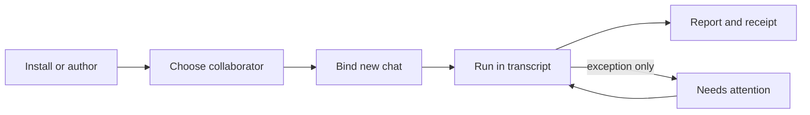

# Meridian Flow Agent Experience

**Status:** target UX for implementation
**Audience:** implementation lead, product reviewer, and designers extending Flow
**Related:** [system design](agent-system-design.md), [data model](agent-system-data-model.md), [implementation plan](agent-system-implementation-plan.md)

## Decision

Agents are collaborators bound to a new chat, not modes that can be switched on an existing chat. The writer chooses one by purpose and effective abilities, supervises only exceptional root or helper needs, and receives a report whose first proof is what changed and how to undo it.

The experience is one lifecycle with five surfaces:



The UX extends Flow's existing chat rather than adding an agent dashboard. Assistant work remains prose in the transcript. Activity remains a quiet disclosure. Native document changes remain trusted Yjs writes with receipts and undo, never approval gates.

## Writer contract

The interface must answer four questions without exposing host machinery:

1. **Who is this collaborator for?** Name and purpose.
2. **What can it do here?** Effective abilities and unavailable limits, evaluated for this host and writer now.
3. **What is happening?** Durable run state, one readable activity line, and exceptional root or helper needs.
4. **What happened?** Report, changed documents, undo, unresolved attention, then evidence.

`Agent definition`, `agent revision`, `host projection`, `thread binding`, and `agent run` remain distinct system objects. The product may call all of them “agent” in context, but it must never make their mutability or authority appear interchangeable.

## Information hierarchy

| Surface | First | Second | On demand |
|---|---|---|---|
| Choose | name, purpose, availability, choose/setup action | up to three effective ability facts | boundaries, helpers, package source, revision |
| Bind | Agent, Work, fixed-for-chat notice | first instruction | revision and full capabilities |
| Run | current activity, elapsed time, cancel/background controls | helper summary and needs attention | technical activity, sources, costs |
| Report | outcome, report, changed documents, undo | unresolved next attention | sources/effects, helper reports, run details |
| Install/update | source, version, purpose, included agents, material changes | host impact and existing-chat behavior | complete policy/dependency/provenance diff |
| Author | identity, purpose, abilities, boundaries, validation | helper graph, behavior, picker preview | Mars YAML and advanced contract fields |

Raw tool names, schemas, provider payloads, hidden context, prompts, and chain-of-thought are not normal writer-facing evidence. The durable evidence surface is capabilities, sources, effects, changes, lineage, cost, revision, and journal-derived status.

## 1. Choose a collaborator

The composer opens a viewport-bound **Choose a collaborator** picker before a thread exists. It is searchable and purpose-first. The new-chat draft also exposes an explicit Work selector; Agent and Work remain mutable draft facts until the initial writer instruction and binding transaction succeed together.

### Ordering and states

1. Ready and fully supported.
2. Ready with optional abilities unavailable.
3. Blocked by a solvable live prerequisite.
4. Incompatible definitions behind **Show unavailable agents**.

| State | Writer language | Behavior |
|---|---|---|
| Ready | “Ready to start a chat.” | selectable |
| Ready with limits | “Available with limits. Research search is unavailable here.” | selectable; missing optional ability remains visible |
| Blocked | “Needs setup: connect a research account.” | opens recovery; does not preselect or create a chat |
| Incompatible | “Not available in Meridian Flow. It requires terminal control.” | discoverable only through explicit disclosure |
| Disabled/revoked | not shown in ordinary discovery | a deep link explains unavailability without a stale Choose action |

An agent row is a semantic list item or article, not one large interactive container. It contains name, one-sentence purpose, no more than three practical ability facts, then its availability sentence and sibling controls: the state-specific primary action and **View details**. Each control has an agent-specific accessible name. Opening details moves focus into the viewport-bound sheet; closing it returns focus to the invoking control. “Can” means effective and dispatchable now. “Cannot” is a hard definition boundary. “Unavailable here” means an optional ability is missing. “Needs setup” means a required live prerequisite blocks launch.

Do not claim “fast,” “cheap,” or “safe” without a measurable product definition. Do not translate capabilities into raw tool inventory.

### Details

Agent details disclose, in order:

1. What it can do.
2. What it cannot do.
3. What is available with limits.
4. Helpers it can consult.
5. Package details.

## 2. Bind a new chat

Agent and Work are chosen together before the initial send and frozen atomically with the thread.

```text
New chat
Agent: Writer
Work: Book One
First instruction: Strengthen the confrontation without changing its outcome.

This choice is fixed for this chat.
To use another agent or Work later, start a new chat.
```

The draft composer holds the temporary Agent, Work, and first writer instruction. **Send and start chat** creates the thread, persists the initial writer message, and creates the `thread_works` relation and `thread_agent_binding` in one transaction. The binding references an already-installed definition revision and host projection and snapshots the exact launch bundle. No empty bound chat exists. The root run may be reserved after that transaction commits. A late readiness failure returns to binding review with the draft intact and the actual reason. It never substitutes another definition, revision, Work, model route, or capability set.

Existing chats display identity as a fact: **Writer in Book One**. The action is **Start new chat**, never “Switch agent.” A new chat may carry an explicitly selected summary or documents as ordinary starting context, but it does not mutate the original binding.

## 3. Run inside the transcript

The active run occupies the normal assistant turn position. It is not a modal, task center, or permanently open inspector.

### Primary run surface

- agent name and durable state;
- one concrete activity line such as “Revising Chapter 12” or “Consulting Continuity”;
- elapsed time;
- **Cancel run** while queued, preparing, or running;
- **Continue in background** while running;
- helper count and any attention state.

The durable execution lifecycle is `queued → preparing → running → finalizing → terminal`, with `cancelling` as the stop path. **Needs input** is a derived presentation, not an `agent_runs` lifecycle value. A blocking durable action request suspends its recorded continuation and makes that continuation ineligible for worker reconciliation until a wake event resolves the request. Connectivity is another separate presentation condition. A disconnected client says **Still working. Reconnect to see live progress.** It never invents completion.

Cancellation submits intent immediately. Its confirmation says **Stop this run? Work already recorded will remain in the report.** The resulting state is **Stopping after current work is recorded.** A terminal result may win before cancellation. Partial work still receives a receipt.

**Continue in background** changes presentation, not authority. It closes the foreground run surface, preserves an in-app indicator, and does not alter the run, its budget, or its effects.

### Attention and helper supervision

A transcript-native **Needs attention** block follows the live activity frontier whenever the root run has an outstanding request. The same block is nested under and attributed to a helper when a child run owns the request. Root and child requests use the same question, scope, expiry, and response controls; a root request never needs a synthetic helper card.

Helper work is a bounded child task, not another peer chat. A collapsed helper row contains helper name, task, state, elapsed time or duration, and reserved/actual credits. Successful helpers collapse under **Helpers consulted**.

Only exceptional conditions auto-expand and move under **Needs attention**:

- a writer question;
- a consequential external effect requiring scoped confirmation;
- failure;
- an unknown non-idempotent external effect;
- approaching the run-tree credit limit;
- exhausted credits when more work is required.

Native manuscript edits never enter confirmation. External confirmation is literal and scoped to one proposed effect, target, account, and expiry. A failed child retry creates a new child run and reservation. An unknown non-idempotent effect is checked, not automatically retried.

The budget warning begins at an 80% forecast. It remains informational unless completion requires more credits. Any increase action shows the exact addition and new total.

## 4. Report first, receipt as proof

Terminal runs replace live activity with a report-first receipt in this order:

1. Outcome banner only for stopped, incomplete, failed, unknown-effect, or warning outcomes that change the writer's next action.
2. Writer-facing report.
3. **Changed in this run**, with one row per document or context artifact.
4. **Next attention**, when unresolved work exists.
5. Disclosures for Sources and effects, Helpers consulted, and Run details.

Each changed-document row contains the document name, a concrete description, **View change**, and **Undo changes**. Undo requests the recorded change receipt. It is recovery, not approval. When concurrent changes make the precise undo unavailable, the interface says what cannot be undone and navigates to the recorded change rather than reverting a broader document state.

Sources and effects expand by default only when an external effect occurred, failed, or is unknown. Helpers expand by default only when attention or failure remains. Run details contain model route, credits, duration, warnings, capability losses, exact revision, and provenance.

## 5. Install and update

Install and update are package trust/configuration decisions. They do not grant live run authority and do not mutate existing chats.

The review shows source and publisher, version, included agents and purposes, required and optional abilities, external connections, delegation summary, compatibility, and the host-owned activation impact.

Updates group material changes as **Abilities**, **Helpers**, **How it works**, **Dependencies**, and **Source**. The key fixed sentence is **Existing chats keep their current version.** A policy expansion or provenance change requires one acknowledgement beside the visible change: **I reviewed the new abilities and source.** Ordinary compatible updates do not add ceremony.

Rollback means **Use version [x] for new chats**. Failed validation leaves the current active version unchanged.

## 6. Author and distribute a custom agent

A writer-owned agent follows the same Mars package, validation, compatibility, activation, revision, and binding path as every other agent. Flow does not create a parallel database-only agent type.

The default authoring experience is structured:

1. Identity: name and purpose.
2. Abilities: required and optional capabilities in writer language.
3. Boundaries: explicit denied abilities and scopes.
4. Helpers: bounded child definitions and budgets.
5. Behavior: instructions and attached skills.
6. Advanced: routes, execution hints, source, import/export.

Validation is continuous. A picker preview shows how availability and abilities will be communicated. Save creates an immutable revision; activation changes only the future default. **Fork** creates writer-owned source lineage. **Export Mars YAML** is the exchange/distribution action, not the primary editor.

## Visual system

### Preserve from Flow

- viewport-locked writing desk with shelf, paper transcript, and context dock;
- 48rem desktop reading column and 1rem mobile gutters;
- warm tonal boundaries rather than heavy separators;
- unboxed assistant prose and lightly outlined user prompts;
- quiet activity timeline and compact edit receipts;
- pinned manuscript-toned composer;
- one warm ink, jade for focus/live/primary action, and scarce cinnabar for destructive or negative evidence.

### New patterns

| Pattern | Role | Boundary |
|---|---|---|
| Composer-attached collaborator picker | choose before binding | viewport-bound; never rendered offscreen |
| Binding review strip | make immutable Agent + Work explicit | present before first send only |
| Run frontier | show one current activity and controls | transcript-native; no nested scroller |
| Helper disclosure | bounded child supervision | compact by default; exception expands |
| Attention block | answer or confirm an exceptional root or child need | not used for native writes |
| Report receipt | result plus recovery/evidence | report and changes lead; mechanics fold away |
| Package review | install/update diff and host impact | configuration surface, not run permission prompt |
| Structured agent editor | author portable Mars profile | YAML behind Advanced/import/export |

### Responsive rules

At 390px, the transcript remains full width with 16px gutters. Pickers and review surfaces become viewport-bound sheets or full-width routed views. Controls wrap into meaningful rows; no desktop dialog survives wider than the viewport. Navigation/context drawers must not be copied as clipping behavior. Every status has text and every action is reachable without hover.

## Required durable additions

The visual design depends on a durable action-request boundary. Add an `agent_run_action_requests` concept and journal events rather than deriving attention from transient stream text. A request records:

- run and optional child run;
- type: writer input, external confirmation, budget increase, or outcome check;
- literal question or proposed effect;
- for external confirmation, the immutable proposed `effectId`, capability operation, canonical argument/resource hash, target, account/connection, scope, policy version, and expiry;
- whether the parent may progress independently;
- a suspended continuation/checkpoint reference and wake condition when the request blocks execution;
- pending, answered, declined, expired, or resolved state;
- response evidence, actor, and resulting approval grant or effect reference.

The action request is the source of truth for the derived **Needs input** presentation. A blocking request releases the worker lease only after its continuation checkpoint is durable; ordinary reconciliation cannot resume it. Answer, decline, or expiry appends one compare-and-set wake outcome. An answer resumes only when the run remains nonterminal and uncancelled. Cancellation can close a pending request without waiting for an answer, and terminal finalization closes any remaining requests. If answer, expiry, cancellation, or terminal result race, one request-state revision wins and the journal explains the outcome.

Multiple requests remain individually visible. A run presents **Needs input** while any blocking request is pending. It resumes a continuation only after that continuation's required requests resolve. A parent presents **Waiting for your answer** only when a required child request blocks the parent; other root or sibling work may continue.

An external-confirmation answer compare-and-sets the exact request and creates, or moves, its proposal-specific approval grant to **granted**. The resumed executor consumes that still-live grant only inside the later effect `authorized → dispatching` claim transaction. Any change to arguments, resource, target, account, scope, policy version, or expiry closes the old request and creates a new proposal/request. This preserves reconnect, background execution, audit, and exact confirmation scope.

## Acceptance criteria

- A writer can distinguish ready, limited, blocked, and incompatible agents without seeing tools or schemas.
- A new chat makes its Agent and Work binding explicit and immutable.
- The writer can explicitly change either draft selection before **Send and start chat** atomically persists the initial message and binding; no empty bound chat is created.
- The active run remains understandable with one line and survives backgrounding/reconnect.
- Native writes happen without approval and always resolve into durable receipts when recorded.
- Exceptional root and helper needs are visible without turning every helper into a second chat.
- A terminal result leads with the report and changed documents; undo is immediately discoverable.
- Install/update copy distinguishes static package policy, host impact, and existing-chat immutability.
- A custom agent exports/imports through Mars rather than a Flow-only definition path.
- Desktop and mobile use the same hierarchy without clipping, nested transcript scroll, or hover-only meaning.
- Picker sheets trap focus while open and return it to the invoker; keyboard order follows the visual hierarchy and rows never contain nested interactive controls.
- Live regions announce throttled meaningful state changes, not every activity token; reduced-motion preserves every state and action without animation.

## Settled tradeoffs

| Decision | Rejected alternative | Why |
|---|---|---|
| Fixed per-chat binding | switch agent in place | preserves reproducibility, Work semantics, and receipt identity |
| Effective ability language | raw tool/permission list | accurate across hosts and meaningful to writers |
| Transcript-native run | separate agent operations dashboard | preserves writing focus and one conversation locus |
| Exception-only helper attention | expose every child transcript | supports supervision without babysitting |
| Report-first receipt | activity/audit first | answers the writer's question before implementation evidence |
| Structured authoring with YAML exchange | YAML-only editor or DB-only custom agent | portable without making source syntax the product UX |
| Durable action request | transient prompt card | supports reconnect, audit, background work, and scoped confirmation |

## Evidence

The `implement-agents` design work item retains the Flow pattern audit, behavior research specification, live visual baseline, and UX consistency audit used to derive this target. This PR commits the converged design and rendered acceptance evidence rather than duplicating the research corpus.
